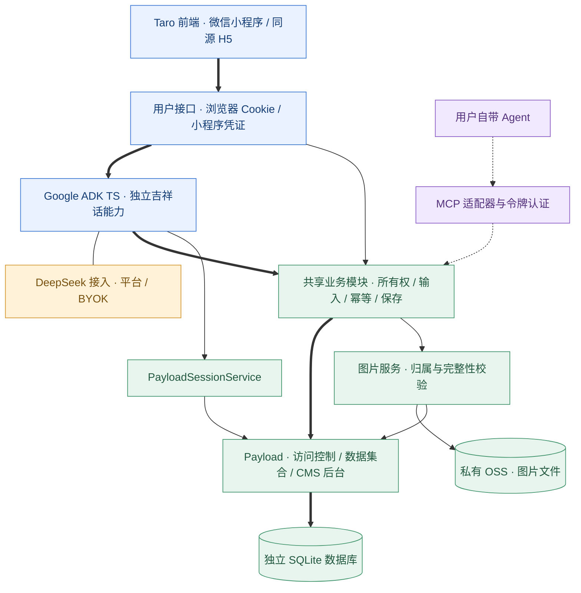

# Hello Agent · 好人阿 J / a jOKer

输入文字、图片或组合材料，阿J陪用户换一个可信的积极角度，顺带一句吉祥话，通过同一业务模块保存到 Payload CMS。首版只呈现一条连续对话，不暴露会话管理。此项目是独立、可本地运行的架构学习应用，不修改官网数据，也不连接真实微信群。

人设在 `src/agent/persona.ts`，回复任务和工具契约在 `src/agent/instruction.ts`，当前版本 `aj-v2.1`。指纹测试防止无意改写；真实评测检查身份、日常、挫折、悲伤、危险、注入和图片，不能用静态测试替代内容评阅。

## 启动

要求 Node.js 20.19+（已在 Node 24 验证）、pnpm 10.2；下方已有数据库增量迁移脚本使用 Node 24 内置 SQLite。

```sh
pnpm install
pnpm --filter @cfp/hello-agent-miniapp build
pnpm --filter @cfp/hello-agent dev
```

打开 <http://127.0.0.1:3310>，进入同源 Taro 对话式 H5 预览；CMS 是 <http://127.0.0.1:3310/admin>。真正的微信小程序源码与导入说明在 [hello-agent-miniapp](../hello-agent-miniapp/README.md)。默认仅绑定本机，使用明确的 IPv4 地址避免 `localhost` 在不同浏览器中的 IPv6 解析差异。若改变访问地址，需同步配置 `HELLO_ORIGIN`。

也可 `pnpm --filter @cfp/hello-agent build` 后运行 `pnpm --filter @cfp/hello-agent start`。后者只在本地数据库尚未建立时显式建表，再启动生产构建；已有本地数据库不会被这个初始化命令改写结构。开发时使用 `dev` 的结构同步；ECS 部署禁用结构同步，使用 `src/cms/migrations` 中的版本化迁移，变更前必须备份。

平台模式需要在 `apps/hello-agent/.env.local` 设置 `DEEPSEEK_API_KEY`；参考 [.env.example](./.env.example)。默认模型为 `deepseek-flash`，可用 `HELLO_MODEL` 更换为支持图片和工具调用的模型。没有凭证会明确拒绝，不会返回固定吉祥话冒充真实模型。

2026-09-29 核对了 DeepSeek 官方的[图片输入](https://api-docs.deepseek.com/guides/vision/)与[工具调用](https://api-docs.deepseek.com/guides/tool_calls/)文档，默认使用支持图文的 `deepseek-flash`。模型请求仅发往 `https://api.deepseek.com/chat/completions`，关闭思考模式，不接入 Gemini。Google ADK 是运行框架，不限定模型供应商；本例通过 `BaseLlm` 适配器连接 DeepSeek。

BYOK 无需平台密钥：选择「我的密钥」，输入自己的 DeepSeek API Key。密钥经本应用服务端发往 DeepSeek，仅存于当前请求内存；提交后页面清空，不写入 Cookie、localStorage、Payload 或提示词。运行在可信的本机环境，上线必须 HTTPS。

模型更换、提示词和 SDK 升级都需要重新执行真实模型评测，不能只看编译通过。

## 创建 CMS 管理员

本机当前按用户要求设置了 `HELLO_ADMIN_BOOTSTRAP=true`，可直接打开 `/admin` 注册首个管理员。没有创建默认用户或密码；已有管理员后，匿名创建第二个仍被拒绝。新环境默认关闭，需在自己的 `.env.local` 显式开启，注册后建议设回 `false` 并重启。不要在尚未初始化时把这个入口暴露到公网。

如果不希望开放网页初始化，也可设置本地环境变量后使用命令行：

```sh
pnpm --filter @cfp/hello-agent cms:admin
```

变量为 `HELLO_ADMIN_EMAIL`、`HELLO_ADMIN_PASSWORD`（至少 12 位）。脚本只允许第一个管理员，已有管理员不会被覆盖。`PAYLOAD_SECRET` 与数据库配置应与运行中的应用相同。初始化、评测和独立客户端会读取本项目 `.env.local`，显式进程环境变量优先；不要把真实密码放进提交或聊天记录。

建立管理员后，集合里的会话、输入、吉祥话及 ADK 事件都可查看；业务集合禁止绕过领域规则直接修改。

## 三种模式

| 模式       | 谁运行 Agent            | 谁调用模型             | 如何保存                                                            |
| ---------- | ----------------------- | ---------------------- | ------------------------------------------------------------------- |
| 平台助手   | 服务端 Google ADK       | 平台 DeepSeek 账户     | ADK 的 `save_greeting` 工具 → 共享业务模块 → Payload                |
| BYOK       | 同一个服务端 Google ADK | 用户当次 DeepSeek 密钥 | 相同工具和业务模块                                                  |
| 自带 Agent | 用户的客户端            | 用户自己的模型账户     | 远程 MCP `hello_save_greeting` → 同一个业务模块；完全不经过平台 ADK |

三种模式共享用户、祝福会话及吉祥话产物。外部模型生成是客户端的来源声明，平台无法仅凭 MCP 参数证明它真的调用过某个模型，CMS 和 UI 均明确标注。

聊天页先恢复文字历史和记忆血条，再独立加载每张图片；图片失败只显示对应占位。小程序图片下载共用最多三个并发位，给其他业务请求留出连接。生成接口已返回保存成功后，即使随后刷新历史失败，也保留刚收到的回复，不把已发送内容退回草稿。

## 前后端模块



目录对应：

```text
../hello-agent-miniapp/ Taro 对话界面、三种模式与会话历史
src/app/(site)/        跳转到 Taro 编译的同源 H5 预览
src/app/(payload)/     Payload CMS 管理界面与原生接口
src/app/api/hello/     浏览器与小程序业务入口
src/app/api/mcp/       标准 Streamable HTTP MCP 入口
src/server/           身份、请求检查、MCP 适配
src/agent/            独立指令、ADK Runner、PayloadSessionService
src/models/           DeepSeek 官方协议与默认模型；不依赖 ADK / Payload
src/domain/           输入契约、生成轮次与统一保存规则
src/storage/          私有 OSS 图片文件适配
src/cms/              Payload 集合和受控数据访问
scripts/              集成测试、真实评测、独立外部客户端
skills/hello-greeting/ 外部 Agent 使用说明
```

`apiKey` 从请求中取出后只传给本轮 DeepSeek 适配器，不修改全局环境变量。协议层只负责请求与响应，ADK 适配器只负责类型转换；不把提示词或业务保存逻辑塞进模型接入层。`@google/genai` 留作 ADK 的内容类型依赖，并不实例化其模型客户端。工具调用不接受 owner、session 或数据库任意字段；当前用户和轮次由服务端闭包绑定。

## 会话与产物为什么直接存 Payload？

- `sessions`：后台的祝福会话容器，兼容已有多条记录；首版客户端自动续接最近一条，不向用户展示新建、列表或编号。
- `greetings`：一轮原始输入、使用方式、执行状态和最终吉祥话；失败也保留记录，但没有伪造产物。
- `adk-sessions`：ADK 每轮运行的状态和事件，通过自定义 `BaseSessionService` 适配到 Payload。不是把 ADK 内存服务当持久化。
- `media`：校验、缩放并清除元信息后的输入图片；最多 3 张。配置 OSS 后只保存归属、格式和私有对象引用，旧 base64 图片仍可读取，迁移回读校验后才清空旧字段。本地未配置 OSS 时保留数据库演示模式。
- `credentials`：浏览器访客、小程序设备和 MCP 令牌的哈希及有效期，不存原文密钥。小程序令牌和浏览器身份为 30 天；MCP 令牌七天过期，可以单独撤销。小程序凭证不能直接调用 MCP。
- `session-locks`：同一会话一次只执行一轮；数据库唯一键协调，崩溃后锁三分钟失效。

### 私有图片存储

服务端设置 `HELLO_MEDIA_STORAGE=oss`、`HELLO_OSS_BUCKET`、`HELLO_OSS_REGION`（如 `oss-cn-shenzhen`）、`HELLO_OSS_ACCESS_KEY_ID`、`HELLO_OSS_ACCESS_KEY_SECRET`；ECS 与桶同地域时可设置 `HELLO_OSS_INTERNAL=true`。密钥只放服务端私密配置，不进入镜像、源码或客户端；配置缺失及 OSS 故障会明确失败，不偷偷写回数据库。

小程序/H5 继续使用 `/api/hello/media/:id`，服务端先检查所属访客再读取 OSS；后台缩略图通过独立管理员鉴权接口读取，Agent 和 MCP 共用同一图片服务。不开放桶、不返回公共或签名下载链接，无需新增小程序下载域名。

先备份 SQLite 并验证完整性，再在新版本配置下执行 `HELLO_IMAGE_MIGRATION_BACKUP_CONFIRMED=true pnpm db:images`。逐张上传、回读检查 SHA-256 与字节数后，才以一次数据库更新保存引用并清空旧字段；可重复执行，中途失败的记录保持原样。数据库提交结果不明时保留对象，宁可留下可清理的孤立对象也不误删已引用的图片。迁移后的回退需要兼容对象引用的代码，或在停止写入时恢复迁移前的数据库备份，不能只切回旧镜像。

### 类型与跨端协议

Payload 集合配置生成 `src/payload-types.ts`，通过 `GeneratedTypes` 增强 Local API。修改集合后运行 `pnpm generate:types`，将生成文件一并提交；`pnpm typecheck` 会先检查生成文件是否过期。生成命令不初始化数据库，也不使用运行环境的密钥。

- Repository 的集合名、创建字段、更新字段与读取结果相互关联，访客仓库不能操作凭证或管理员集合，也不能传入其他 owner。`repository.typecheck.ts` 是只编译、不执行的反例检查；退回宽泛类型会令这些检查失败。
- JSON 字段不退化为任意对象：灵感输入、记忆、OSS 引用复用 Zod 推导的类型，ADK 快照复用 SDK `Session`。JSON 的运行时校验仍在原业务入口执行；类型声明不能替代数据验证。
- `packages/hello-agent-contracts` 是 H5、小程序、HTTP 和外部 Agent 共用的协议，不依赖 Payload、ADK 或 Node。前端保留本地展示类型，网络响应先校验再使用；服务端业务返回类型与相同契约对齐。可空字段按 Payload 的实际结果处理。客户端解析时丢弃未声明字段，不等于服务端已从网络响应中移除这些字段。
- 保留 `unknown` 的地方是尚未校验的 HTTP/MCP/JSON 输入、异常对象和后台兼容旧数据的展示入口；它们必须经过校验或收窄。不能用 `as Session`、宽泛 `Row` 或 `request<T>` 代替验证。
- Repository 仅在注入 owner 后保留两处具体的 SDK 参数断言：TypeScript 无法证明泛型 `Omit` 再补字段等于原类型。这两处不扩大调用者权限、不强转返回结果，由反例类型检查和真实数据库集成测试共同保护。通用 Payload 迁移回调到 SQLite 的适配也仍保留明确的 SDK 类型转换。

构建与部署源码包需包含 `packages/hello-agent-contracts` 及其共享配置 `packages/eslint-config`、`packages/typescript-config`；预览 Dockerfile 已同步复制并安装这些工作区依赖。本次仅增强类型与协议校验，不改变数据库列，也不需要数据迁移。

### 事务与失败重试

SQLite 适配器显式设置 `transactionOptions: {}`，不依赖默认值。结构迁移必须经过 Payload 的迁移执行入口，每个迁移文件的 SQL 与成功记录在同一事务内完成；单次 Local API 写入及其钩子失败也会回滚。不是整个迁移批次共用一个事务：之前已经成功的迁移仍保留。已发布迁移不改名、不另建副本强制重跑。

图片搬迁不把 OSS 请求放进数据库事务：先上传并回读校验，最后由 Payload 在事务内保存对象引用、清空旧内容。保存期间失败则保留旧数据库记录；已上传对象可能暂时没有引用，重试使用相同对象名，不新增图片记录。这不是 OSS 与数据库的分布式事务，也不代替备份。`down()` 仍拒绝危险的自动逆迁移；失败时的事务回滚与上线后的版本回退是两回事。

`test:integration` 已包含两条事务回归入口，也可单独运行：

```sh
pnpm --filter @cfp/hello-agent exec tsx scripts/image-schema-check.ts
pnpm --filter @cfp/hello-agent exec tsx scripts/oss-storage-check.ts
```

前者使用真实 SQLite 故障触发器和独立进程验证中途失败、回滚、重试与迁移去重；后者使用真实 Payload 写入与公开钩子注入失败，仅模拟 OSS。测试使用临时数据库，不需要云端凭证。

外部 MCP 保存使用 `requestId` 和输入、输出内容指纹保持幂等。若完成写入在钩子中失败并回滚，相同请求可重新取得会话锁，补完原来的 `running` 记录；成功后重试返回同一产物，不同内容不能覆盖。`scripts/external-retry-check.ts` 通过真实 MCP 客户端与 Payload 写入后故障验证这个边界。该恢复规则只适用于已经由外部客户端生成的产物，不自动重启平台或 BYOK 的模型执行。

产品历史是来源事实，ADK 事件是执行轨迹，二者用途不同。每个内置生成轮次有自己的 ADK 执行会话，加载当前摘要与尚未压缩的已完成对话；达到记忆预算时停止新生成，等待用户整理。历史读取按 ID 分页，不再局限于早期 100 轮；执行会话列表最多 1000 条仍是本地限制。

## 记忆血条与看广告整理

- 血条表示对话记忆预算的剩余比例，预算为 18,000 个估算 tokens（中文与 ASCII 使用不同权重）；不是模型的精确上下文上限或计费余额。当前输入图片、系统指令和模型内部开销不包含在这个历史预算里。预算保留了最长两轮与摘要的空间，避免空间耗尽却无可整理记录的死路。
- 点击血条打开「给记忆回回血」。至少三轮已完成对话后，可以完整观看一次广告，将更早内容整理成摘要，保留最近两轮原文。原始 `greetings`、图片和历史不会删除。
- 摘要与覆盖位置、压缩次数、观看资格统一存在 Payload 的 `sessions.memory`。并发生成与压缩使用同一数据库锁；完整摘要校验、确认节省空间后一次更新记忆并消耗资格。失败保留旧上下文与观看资格，15 分钟有效期内重试不用重看。网络重试使用同一资格 ID，不重复调用模型。
- 压缩提示词独立为 `src/agent/summary-instruction.ts`（`memory-v1`），不混入阿J人设；摘要仍作为不可信素材传给回复模型。摘要可能遗漏细节；没有把单元测试当作语义质量保证。
- 平台模式和自带 Agent 在页面触发的整理使用平台密钥；BYOK 整理使用当次填写的密钥，发送请求后清空。外部 Agent 通过 `hello_get_context` 获取同一摘要与血条，但不能替用户看广告。平台无法控制外部客户端自行保留的上下文或压缩行为。

本地默认是清楚标注的 5 秒「演示广告」，不是商业广告、不产生收入。`HELLO_AD_MODE=disabled` 关闭；配置 `HELLO_AD_MODE=wechat` 和自己的 `WECHAT_REWARDED_AD_UNIT_ID` 后可在微信端联调 `createRewardedVideoAd`，仅 `isEnded === true` 视为完整播放。H5 不伪装支持微信广告。

### 测试版恢复出口

正式广告回执未接入服务端验证前，远端仍禁用广告奖励。测试部署可由开发者显式设置 `HELLO_MEMORY_RECOVERY=preview`，页面显示「测试版免费整理」，通过独立的 `context/preview-compact` 入口整理记忆，不调用广告完成接口、不生成观看资格。预览 Compose 和配置生成脚本已开启该设置；其他环境默认关闭，客户端不能自行开启。免费指无需观看广告，摘要仍会使用平台或 BYOK 的模型额度。

测试版整理沿用原有归属检查、数据库执行锁、摘要校验和历史保留规则；请求编号与记忆版本绑定，同次重试不重复摘要，旧版本请求重放被拒绝。外部 Agent 不能代用户发起此入口，但用户整理后，三种方式都能继续原对话。失败保留原记忆；最近两轮仍保留原文。新的 JSON 记忆记录兼容读取旧广告记录，不改变 SQL 列；启用新入口后若回退旧程序，应恢复发布前数据库备份，不能假定旧版本能读新记录。

### 断网与身份失效

- 回复请求与状态查询分开：`GET /api/hello/sessions/:sessionId/requests/:requestId` 只读当前用户的提交状态，不调用模型。成功响应丢失后先确认结果；仍未确认的同内容重试沿用原编号，已完成的不再生成，执行中的只等待，明确失败后才允许新一轮。
- 「确认上次发送」不要求重新填写 BYOK 密钥；不会重复扣模型额度。待确认编号只在当前页面保留，没有新增离线发送队列；退出后仍通过已保存的聊天历史恢复，不自动重发。
- 小程序遇到身份接口的 `401` 会显示明确提示，并提供「重新开始」确认框。取消不改变本机身份；确认后才申请新凭证，成功后清空旧页面状态。申请失败不覆盖原凭证。旧聊天不删除，但新身份没有访问权，这不是账号找回或正式微信登录。

定向回归：`pnpm exec tsx scripts/preview-recovery-check.ts`，以及小程序的 `tests/history-recovery.test.ts`、`tests/identity.test.ts`。所有模型和云资源在测试边界模拟。

**尚未生产接入广告：** 本地演示完成声明、微信客户端回调都不构成可信的服务端观看证明；没有广告服务端验签、正式广告位或真机广告验收。因此非本地 `HELLO_ORIGIN` 一律禁用此奖励入口，不能直接上线此商业机制。此限制不能靠开启一个生产假回调开关绕过。

已有本地数据库应先停止本项目服务，再执行 `pnpm --filter @cfp/hello-agent db:memory`。脚本在数据库旁生成一致性 `.before-memory-*.bak` 备份，只新增可空的 `sessions.memory`；重复运行不改数据，不执行 schema push。新库仍由 `db:init` 初始化。

不需要 Redis、向量记忆库或独立 ADK DatabaseSessionService。若以后有长时间暂停、多执行器、跨服务恢复，再引入专用任务编排器；业务产物仍归 Payload，不能用聊天记录替代。

数据库在 `.data/hello.db`，本地自动生成的 CMS 密钥在 `.data/secret`，均被 Git 忽略。数据在重启后保留。停止进程的未完成轮次保留 running 记录；不会假装已经恢复模型执行。平台和 BYOK 在锁过期后使用新请求 ID 重试；外部保存按上述同指纹规则恢复，完成过的请求仍幂等。

## 自带 Agent / MCP

在网页「自带 Agent」页生成令牌，配置支持 Streamable HTTP 与静态 Bearer 请求头的客户端：

```json
{
  "mcpServers": {
    "hello-agent": {
      "url": "http://127.0.0.1:3310/api/mcp",
      "headers": { "Authorization": "Bearer <仅放入客户端安全配置>" }
    }
  }
}
```

不同客户端字段可能不同，以上仅表达地址及请求头要求。此版本不是 OAuth 服务，不宣称兼容只支持 OAuth 的宿主；云端 Agent 也不能直接访问你电脑的 localhost。远程使用需自行部署 HTTPS、账号认证与限流后再连接。

工具：`hello_list_sessions`、`hello_create_session`、`hello_get_context`、`hello_get_history`、`hello_upload_image`、`hello_get_image`、`hello_save_greeting`。生成前读取 `hello_get_context`，完整历史工具用于查档；不要把完整档案重新拼回模型以抵消压缩。提示：`hello_greeting`。可按客户端约定加载 [Skill](./skills/hello-greeting/SKILL.md)；未自动安装到个人环境。

项目还提供一个独立外部客户端，直接使用用户的 DeepSeek 账户和 MCP SDK，不导入平台 ADK 或 Payload：

```sh
# 在本地设置 DEEPSEEK_API_KEY 与 HELLO_MCP_TOKEN 后运行。
pnpm --filter @cfp/hello-agent external-agent '今天窗台的小番茄红了'
pnpm --filter @cfp/hello-agent external-agent '' /absolute/path/to/photo.png
# 验证独立客户端真实生成与 MCP 保存；使用单独测试身份，结束时撤销令牌。
pnpm --filter @cfp/hello-agent test:external
```

外部客户端默认查询并续接最新记录，无记录时才创建。`HELLO_SESSION_ID` 仅供开发者显式定位测试记录，不要求普通用户填写。外部客户端读取自己的图片后直接发给自己的模型，再调用 MCP 保存产物；模型费用归调用方，服务端仅处理业务与存储。

## 验证

首次运行的通过项、凭证阻塞项及测试数据边界见 [验证记录](./docs/verification.md)。

```sh
pnpm --filter @cfp/hello-agent typecheck
pnpm --filter @cfp/hello-agent lint
pnpm --filter @cfp/hello-agent test
pnpm --filter @cfp/hello-agent test:integration
pnpm --filter @cfp/hello-agent build
# 构建后自动在 3311 端口启动隔离实例，验证 HTTP 与标准 MCP 客户端。
pnpm --filter @cfp/hello-agent test:e2e
# 针对已经启动的 3310 实例检查（会留下明确标注的测试数据）。
pnpm --filter @cfp/hello-agent test:http
# 必须提供真实 DeepSeek 密钥，将进行八次付费模型调用。
pnpm --filter @cfp/hello-agent eval
# 可选 Promptfoo：首次会下载锁定的 CLI 版本，运行完整生成链路。
pnpm --filter @cfp/hello-agent eval:promptfoo
```

单元测试检查输入契约与来源；集成测试使用真正的 ADK Runner、Payload SQLite 和 MCP SDK，仅把模型替换为 `scripts/scripted-model.ts`。生产模块不导入它，也没有假数据开关。HTTP 测试保存的产物明确写明测试来源，不能视为真实模型效果。

项目加入仓库现有校验入口：`pnpm verify` 会执行本项目的静态检查、单元覆盖率、集成测试和构建；PR 的 affected E2E 会自行启动隔离实例。没有修改部署目标，也不会自动部署这个学习应用。集成测试另外启动独立 Node 进程，检查重启后的持久化。

真实评测使用独立临时数据库，缺少凭证退出码为 2，不算通过。Promptfoo 检查产物结构和保存成功；联想贴切程度、困难情绪处理及不作承诺仍需人工评阅，不用几个关键词宣称完全安全。

## 当前边界

### ECS 公网测试（不是微信正式上线）

增加了独立预览部署能力：`Dockerfile.preview`、`deploy/compose.preview.yml`、
`scripts/ecs-preview.mjs`。使用阿里云 CLI 的云助手发送源码、运行命令，不要求增加 SSH 公钥。
服务器目录固定隔离在 `/opt/cfp-hello-agent`；Compose 项目为 `cfp-hello-agent`，
服务仅映射到服务器的 `127.0.0.1:3310`，由单独的 Nginx HTTPS 站点转发。
不复用官网容器、数据库、域名记录或生产流水线。

- 2026-10-01 按用户要求开放产品入口，不再限制 Wi-Fi、手机流量或 VPN 出口；管理后台和原始 Payload API 仍使用管理员网络白名单。微信体验成员限制只作用于微信入口，不能阻止其他人直接访问公开 H5 或业务 API。当前未实现微信身份登录，不应称为「仅微信授权用户可访问的服务」。
- 公网配置模板为 `deploy/nginx-public.conf.template`：显式放行首页、`/chat/`、`/api/hello/`、`/api/mcp`、`/api/ready`，其余路径默认继承管理员白名单。业务写入按真实来源 IP 限制为每分钟 30 次、允许短时突发 20 次，同 IP 最多 5 个并发业务连接；保留应用内设备身份、所有权和限流检查。限流不是身份认证，也不是消费金额上限。初始化脚本仍默认生成全站白名单，必须明确授权后才改用公网配置。
- 地址能打开不代表已完成微信合法域名配置、类目资质或微信正式发布审核。后台换网络仍需要更新管理员白名单，不能通过伪造转发头绕过。
- `HELLO_DEPLOYED=true` 时强制显式数据库位置和 CMS 密钥、禁用 schema push，通过 `src/cms/migrations` 执行已记录的正式迁移。只用于独立新库；不要把该开关直接加到原有开发数据库。
- 全新数据库不复制本机聊天和账号；管理员采用随机密码、关闭匿名初始化。密码只写入本地被忽略的 `.data/ecs-preview/access.txt`，不出现在源码、日志或聊天中。
- 模型凭证及证书私钥不进入源码归档或镜像；使用目标机器的临时传输公钥加密后送达。远程配置和数据文件限制访问权限。
- 构建限制为 2 GB 内存、1.25 CPU；运行限制为 1 GB、1 CPU，日志限额。部署不运行全局镜像清理，不重启官网。
- 健康检查 `/api/ready` 读取实际业务表；必须在就绪、HTTPS、管理员权限和模型调用验收后才算部署完成。
- 远程广告整理仍按原安全边界禁用；没有接入真实广告服务端验证，不以演示回调发放生产奖励。

本机迁移验收：`NODE_ENV=production pnpm --filter @cfp/hello-agent exec tsx scripts/verify-preview-db.ts`。
新迁移生成：`pnpm --filter @cfp/hello-agent db:migration <英文变更名>`。
归档必须用明确白名单，不能把整个工作目录或 `.data` 打进镜像。
根 `.dockerignore` 同时排除所有 `.data`，保护直接从本地工作目录构建镜像的路径。`scripts/image-context-check.mjs` 检查实际排除规则；CI 以 `--docker` 使用无敏感内容的临时夹具执行真实 Docker COPY，确认私密路径未进入构建而必需源码仍保留。此测试不读取或传送真实凭证。
当前预览采用手动发布，不会因为 Git push 或官网部署而自动更新。

再次部署前，为独立 SQLite 创建一致性备份，保留旧镜像和配置；变更数据库后不能只切旧镜像冒充完整回滚。
证书续期必须重新传输并验证 Nginx reload；本次没有修改服务器的证书自动续期任务。

- 本地开发示例，不是已加固的公开 SaaS：浏览器是访客 Cookie，小程序是设备访客令牌，没有伪装成已完成微信登录；清缓存或凭证过期后不能自动找回。两端访客账号独立，正式使用需微信登录、跨端绑定和数据删除策略。
- 公网测试已有 HTTPS、Nginx 按来源限流、应用单进程限流、记录式迁移、私有 OSS 和手动备份，但仍没有微信身份验证、用户消费配额或全局金额熔断；扩大开放范围前需补足正式认证、共享配额和自动备份。
- SQLite 自动同步 schema 仅限这个独立示例，不能用于已有生产库。没有改动 `apps/website` 的 Payload 配置或库。
- 真实生成依赖用户配置模型账户；未配置时页面明确提示。CMS 管理员也由用户初始化，不预置默认密码。
- 未实现跨设备 OAuth、通用长任务恢复或任意模型网关；BYOK 仅支持 DeepSeek。外部 Agent 可用自己的其他模型，但平台仅记录来源声明。

## 参考

- [Google ADK TypeScript](https://github.com/google/adk-js)：本项目实际检查并使用 `@google/adk@2.1.0` 的类型和接口。
- [Payload Local API 访问控制](https://payloadcms.com/docs/local-api/access-control)：普通业务读写显式关闭权限绕过；只有私有凭证仓库和管理员初始化提升权限。
- [MCP SDK](https://github.com/modelcontextprotocol/typescript-sdk)：此项目使用官方 SDK 的 Web Standard Streamable HTTP 适配，不另外暴露通用 CMS CRUD。
