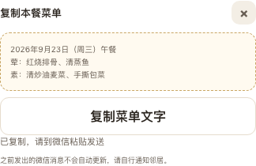

# #359 菜单复制验证

2026-09-21，PR9/T018、T019。基于 #358 `93a111e`（PR #372），依赖尚未合并；本记录不代表用户验收、微信真机或上线。

## 原型与成对截图

沿用固定原型 `ideal/docs/kith-inn/yao/prototype-implementation/prototype-taozi/index.html`（`cb71b2e84ac0665a288b1634096438c19b743918`）的周菜单、文字预览框、次按钮、关闭按钮及说明文字。先查看原型周菜单及原生复制文案组件，再实现。原型的订单/拒接文案不进入MVP；未复制手机壳、状态栏或讲解区。

左为原型组件，右为实际实现，均324px内容宽、DPR1、同一份餐次文字。原型没有MVP单餐复制页，因此仅在浏览器内把已有 `.copy-preview` 的文字替换为同一测试快照，保留其CSS；未修改原型源文件。图片仅裁切、并排组合，不做内容修图。此图证明预览组件样式一致，不冒充原型存在完整的MVP复制流程。

两边计算样式一致：10px字、16px行高、12px内距、1px虚线边框、12px圆角，文字 `#675d53`，背景 `#fffaf0`，边框 `#c9a665`。菜单基础布局沿用 [周菜单视觉证据](week-design-qa.md)。新增未保存/读取失败/复制失败状态使用现有说明和按钮样式。

预览打开时暂停日期切换和底部编辑操作，关闭后恢复；避免面板被收起后找不到关闭入口，或sticky按钮遮住复制结果。复制按钮须主动点击。376/390px手机无横向溢出，1280px桌面业务宽480px。原始截图和样式测量在本机 `/tmp/kith-copy-visual/`，包括原型原始文案、手机/桌面、未保存状态。

## 验证边界与复现

- `formatMealText(MealSnapshot)`只格式化本次重新读取且通过共享schema校验的保存快照；不查最新菜池，不修改输入。停餐无入口；0分类/隐藏汤不输出。日期、跨年/闰日、Unicode等9项文字单测通过，另在UTC、上海、洛杉矶验证。
- `pages/week`每次预览GET最新保存周；dirty时先保存或明确放弃，取消或读取失败保留稿，读取失败没有旧缓存文字可复制。复制不增加菜单版本、确认时间或分享记录。
- 微信分支调用 `Taro.setClipboardData`；H5调用原生 `navigator.clipboard.writeText`，因为安装的Taro4.2 H5适配忽略`execCommand`的false返回值。两者均等待成功才显示“已复制，请到微信粘贴发送”；失败保留文字重试。
- 前端51项单测、lint/typecheck通过；14条H5回归通过。`menu.spec.ts`从原week测试扩展，覆盖空菜池录入→生成→换菜去汤→确认→历史重开→复制→再编辑保存复制，以及缺菜/重排取消/保存未知/冲突/GET503/非法响应/剪贴板拒绝。HTTP和会话受控，剪贴板Promise注入失败/成功，不能当微信证据。
- 独立代码审查提出日期切换隐藏关闭入口，修复并补回归后复核通过。截图检查修复底部按钮遮挡结果提示；原有去汤测试补等待异步结果，避免过早读取旧DOM。
- 真实API+PG17联调使用独立 `cfp_kith_copy_browser_test`，UI3335/API3337，仅替代微信身份与本地HTTP传输。从空库经UI录入9菜，生成、换菜去汤、确认及历史重开；两次复制文字分别对应保存快照，真实浏览器剪贴板读回一致，纯复制阶段仅一次GET、无PUT，页面错误0。测试脚本 `/tmp/kith-copy-browser.mts`、`/tmp/kith-copy-browser-check.mjs`，证据 `/tmp/kith-copy-visual/evidence.json`。不接触用户3317/3319环境或共享数据库。

复现：Node22.23.2、pnpm10.2.0、TZ=UTC，运行 `pnpm --filter @cfp/kith-inn-miniapp test` 和 `E2E_PORT=3336 pnpm --filter @cfp/kith-inn-miniapp test:e2e`。根 `pnpm verify`使用本任务独立 `cfp_kith_copy_test`、`cfp_weekly_copy_test`、`cfp_website_copy_test`，日志 `/tmp/kith-copy-final-verify.log`；包含H5/weapp构建。视觉测量脚本 `/tmp/kith-copy-visual-check.mjs`。

仍待真实AppID、合法request域名、桃子身份绑定与微信真机剪贴板证据；H5真实剪贴板也不能替代微信。已发微信内容不会自动更新，界面明确提醒桃子自行通知邻居。所有Issue验收框保持未勾选。
