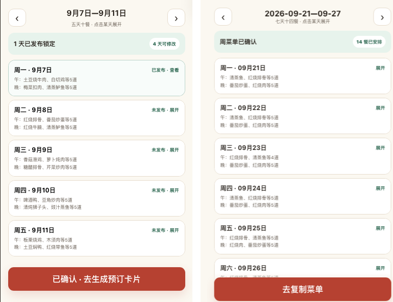
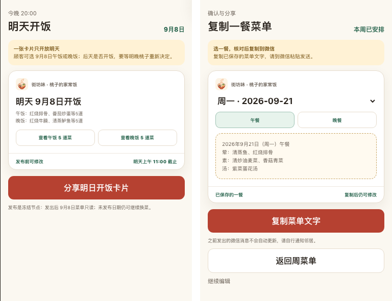
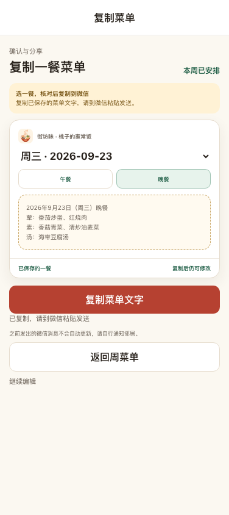

# #359 确认后进入复制菜单

2026-09-21，PR9/T018、T019。本记录覆盖用户反馈返工后的完整流程；未替代用户验收、微信真机或上线。基线依赖 #358 `93a111e`，上一版复制提交 `057fe50`。

## 原型流程与同尺寸对照

依据固定原型 `ideal/docs/kith-inn/yao/prototype-implementation/prototype-taozi/index.html`（`cb71b2e84ac0665a288b1634096438c19b743918`）第869、891行：确认后的主按钮进入独立“确认与分享”界面。先查看并操作原型完整流程，再落实如下MVP适配：

确认周菜单 → 主按钮“去复制菜单” → 独立复制状态 → 选择本周已安排日期、午晚餐 → 新鲜GET预览 → 主动复制 → 提示到微信粘贴；可以返回周菜单或继续编辑。逐餐入口复用同一状态，不再以内嵌小框作为唯一下一步。

左原型、右实现，均376×590业务视口、DPR1；实现使用376×648视口裁去58px H5标题，原型只取screen-body区域。截图仅裁切并排，未改原型源文件或做内容修图；没有手机壳、状态栏、讲解区。两组对应确认和分享状态，测试日期/菜名不同，原型五天及旧预订卡片文案不能视为MVP要求。

复用原型detail-head、黄色规则说明、带品牌的share-card、午晚餐控件、文字预览、红色主按钮和说明文字。品牌logo来自相邻真实资源，等比缩小至48px供24px展示，未重新绘制；卡片14px内距、16px圆角及阴影，17px日期标题，9px餐次控件，10px/16px预览文字等沿用原值。H5用原生select保证键盘选择，微信用Picker。确认主按钮吸底由-15px修正至0，消除视口底部13px裁切。

必要业务差异：七天十四餐，只提供已安排日期/餐次；输出保存菜单文字，无订单卡片、价格、截止时间或发布锁。已复制仍可编辑，提醒自行通知邻居。原型的概览卡适配为可选择日期、午晚餐与文字预览，底部提供返回周菜单及继续编辑。

## 验证与边界

- 18条H5回归通过：原完整主流程及异常覆盖保留；新增390×844和1280×900确认后主按钮无需手动滚动即100%位于视口、复制主按钮100%可见、独立状态/返回编辑、仅可选已安排日/餐次、每次切换GET、所选餐被另一处停餐及整周停餐恢复。
- 未保存进入/切换不GET、不出预览；先保存或明确放弃。取消、读取失败保留草稿；保存结果未知保留原key/body重试；GET503/非法schema不使用旧文字；剪贴板拒绝保留文字重试。复制不写version或confirmedAt，重新保存复制得到新菜名。
- 代码审查发现“所选日被停餐后select值不在选项中”，已修复为选择仍安排的一餐或空状态、清除文字并明确要求重新预览，不把成功GET报成读取失败。针对性回归已通过。
- 真实API+PG17（本任务 `cfp_kith_copy_browser_test`，3335/3337）验证确认→主入口→周三午/晚餐→复制→返回→继续编辑，原生浏览器clipboard读回等于快照，页面错误0。只替代微信身份与本地HTTP传输，非微信真机证据。脚本 `/tmp/kith-copy-flow-shot.mjs`，证据 `/tmp/kith-copy-flow/real-evidence.json`；未触碰用户3317/3319、用户数据或浏览器tab2。
- Node22.23.2/pnpm10.2/TZ=UTC；前端51、API93、契约37项测试及根 `pnpm verify`、H5/weapp构建。根门禁使用本任务 `cfp_kith_copy_test`、`cfp_weekly_copy_test`、`cfp_website_copy_test`。日志 `/tmp/kith-copy-rework-verify.log`、`/tmp/kith-copy-rework-e2e-final.log`。

复现：`pnpm --filter @cfp/kith-inn-miniapp test`，`E2E_PORT=3336 pnpm --filter @cfp/kith-inn-miniapp test:e2e`，配置自己独立_test库后运行根 `pnpm verify`。原始手机、桌面、原型截图和成对图脚本位于 `/tmp/kith-copy-flow/`、`/tmp/kith-copy-flow-pairs.mjs`。

H5调用原生clipboard Promise以正确报告失败，微信沿用Taro.setClipboardData。真实AppID、合法域名、桃子绑定及微信真机剪贴板仍待验证；H5不能代替真机。Issue验收框未勾选，不声明用户验收或上线。
