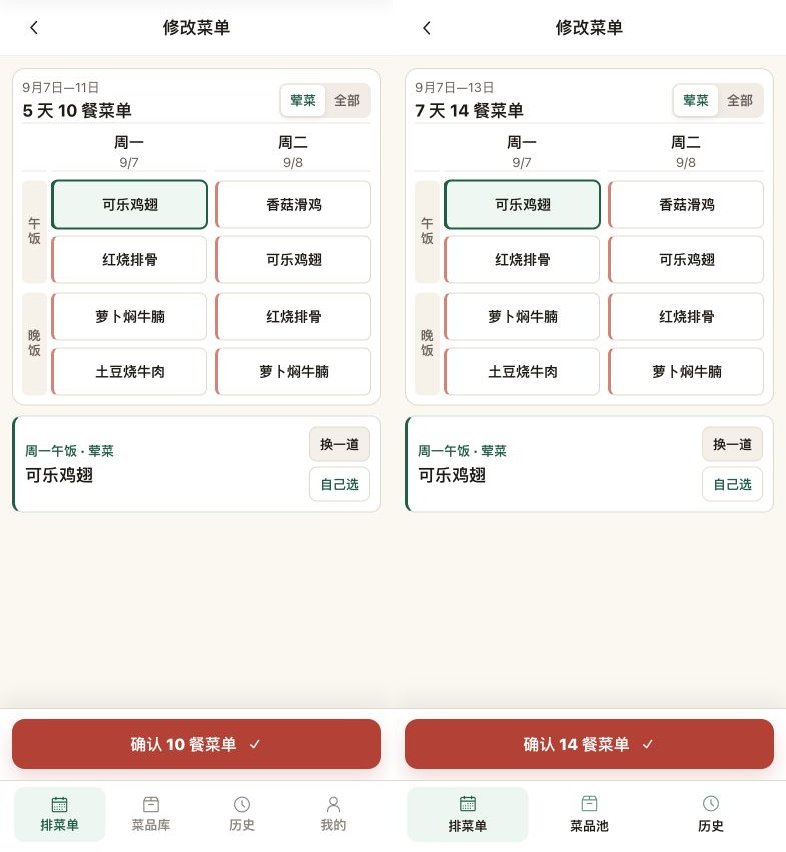
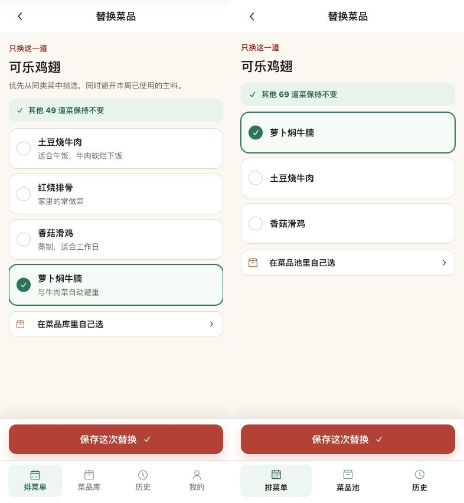
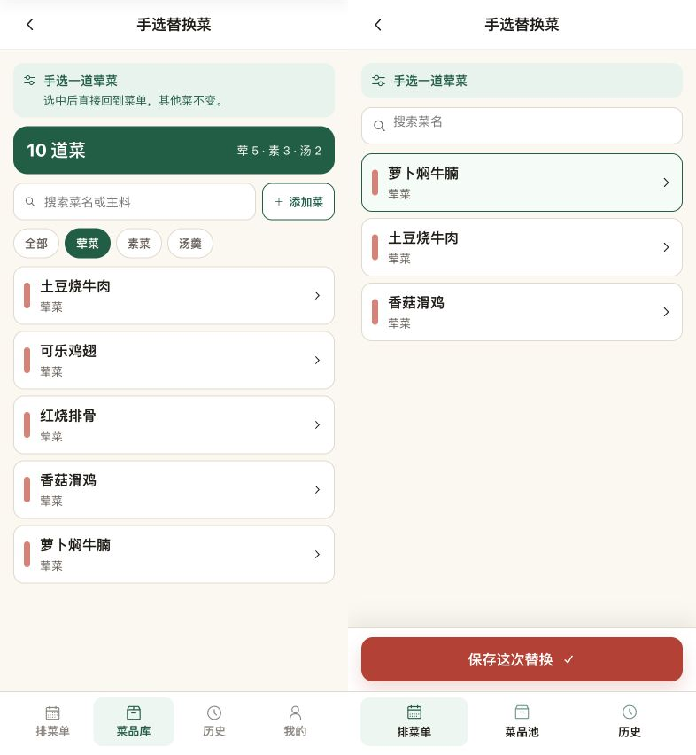
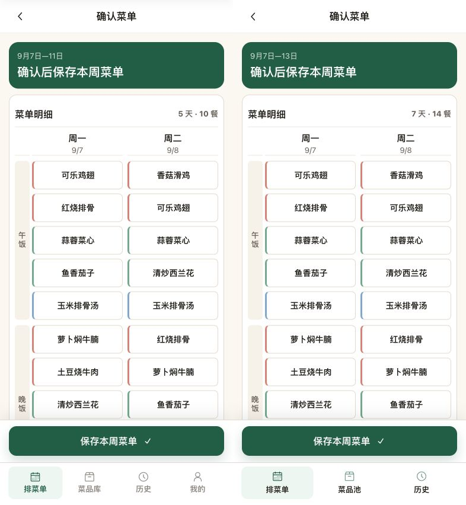

# 街坊味：编辑流程逐项校正

2026-09-21，#358，新增切片基线 `06aeb6c`。**撤回前轮将多余编辑操作、滚动条、文案及样式偏差列为“允许差异”并宣称无P2问题的结论。** 本记录及下列最终构建截图替代旧视觉结论；前轮证据仅保留在Git历史。

## 视觉依据与尺寸

- 权威来源：ideal `c85602462cb57ce1e72579c5840ff6e41cf916ab`，`3.3-meal-mind/prototype-implementation/src/App.jsx` 的MenuEditor/SwapScreen/LibraryScreen/ReviewScreen及其styles.css。只读工作树 `/Users/miyin/code for people/ideal-worktrees/paihaocai-engineering-latest`，服务3395。
- 用户目标图：`/var/folders/f7/0tfdpjzs0yz9lw9zfh1mjc780000gn/T/codex-clipboard-846bd380-8a8a-4653-aaf3-46888fe658a2.png`；旧实现图同目录 `codex-clipboard-fab46489-a51e-4aac-a714-3b74774f62e5.png`。两图均已打开，但缩放与内容宽度不同，不能直接据此改变字号。
- 本轮重新捕获：参考viewport393×896，`[data-phone-screen]`实测x0/y44/393×852；实现viewport393×852。原型仅裁去44px工具栏，原始截图像素393×896与393×852，不缩放，成对图786×852。两侧同一393px内容宽度，按CSS像素1:1比较。
- 状态：9月7日已保存周，周一午饭可乐鸡翅选中，2荤2素1汤；swap/pick均选中萝卜焖牛腩；review未应用替换、未保存。前五天原型和独立API种子菜名相同，MVP增加周末。独立H5 3358/API3360/PG `cfp_kith_engineering_browser_test`，只有测试身份与传输桥接，业务读取是真API。
- 原始截图：`/tmp/editor-fidelity-qa/reference-{edit,swap,pick,review}.png`、`implementation-{edit,swap,pick,review}.png`。四张最终合成图均已打开逐项检查；全文宽度已是1:1，表格/卡片/按钮文字清晰，未另用缩放后的局部图冒充测量。

## 最终成对证据（左原型，右实现）

## 发现、修正与复核

| 原问题 | 修正及最终证据 |
| --- | --- |
| P1 普通菜位卡片额外堆叠操作 | 卡片只保留换一道/自己选；逐餐去汤/恢复只在汤位上下文出现。复制使用首页独立入口，周设置、保存草稿及放弃调整也在首页操作，编辑底部仅确认N餐进入review |
| P2 文案、日期及视觉密度偏离 | 删除“当前选择”和正常状态的额外解释，改周一午饭·荤菜及9月7日—13日；表头17px/700、菜格14px/850、标签13px/850、选中名称17px/700、选菜按钮13px/900均对应源码值 |
| P2 滚动条与边界/字形样式不同 | 真实滚动容器隐藏bar，保持强制吸附与原有鼠标/触摸/取消保护；午饭轴vertical-rl、2px字距、line-height1；选中格外侧1px描边阴影，墨色#1e1b16、线色#e1d9cd |
| P2 dock与关联页面结构不同 | editor12px、swap/review15px边距；主按钮50px高、13px圆角、原阴影与17pxCheckIcon。swap保留只换这一道/真实剩余菜数及Archive+ChevronRight入口；pick改类别色标、菜名/类别、箭头列表；review标题为确认后保存本周菜单，日期opacity .84、计数13px/750 |

最终编辑DOM实测：表格x12/y68/369×337.5；选中卡x12/y415.5/369×97；右操作按钮61×35、13px/900；dock y708/393×72；真实横滚区320×266，未因滚动条增加高度。截图显示卡片与dock间保留原型留白，确认按钮与图标居中。字体栈、色彩、圆角、行距、控件清单与布局均逐项复核，没有将前轮多余操作当作可接受差异。

资产均直接复用工程原型依赖的Radix SVG路径（Check、Chevron、Archive、Mixer、MagnifyingGlass），仅导出目标颜色以适配Taro Image；沿用 `src/assets/nav-icons-LICENSE.txt` 的MIT声明。没有自绘替代图标或新增品牌图片。

## 仍存在且属于既定业务范围的差异

- 编辑/检查为七天十四餐，日期结束在周日；原型为五天十餐。三项导航继续使用街坊味菜品池命名，没有“我的”。汤位额外保留真实去汤/恢复能力，普通荤素位无此操作。
- swap省略没有实现的食材避重承诺，以及数据库没有的菜品note；排除本餐已占菜，合法候选数量与API排序不同。因此行内备注缺失、列表整体高度与原型不同，不声称完全相同。
- pick只展示同类合法候选并保留显式应用，选中样式给出当前选择；没有原型全菜库统计、跨类别过滤和添加菜，也没有“选中后直接返回”的错误承诺。上下文/搜索/色标列表采用来源样式，但这不是原型全菜库页面的完整复刻。
- 长菜名仍完整显示在选中区和只读表，必要时只读行扩高；错误、重排确认、冲突核对和离开保护只在对应业务状态出现，不新增正常页面解释。

## 行为验证

- 最终根 `pnpm verify`、H5/WeApp构建通过，日志 `/tmp/editor-fidelity-verify-complete.log`；独立测试库沿用engineering隔离库。28条浏览器回归通过 `/tmp/editor-fidelity-e2e3.log`，新增13餐CTA断言的完整链路定向回归通过（`/tmp/editor-fidelity-cta-e2e.log`）；远端结果以最终提交CI为准。
- 原型验收断言覆盖普通菜位按钮清单、短日期/选中标签、动态13/14餐CTA及图标、真实滚动元素不占bar高度、卡片95–98px/dock72px与实际边界；旧06aeb6c存在额外按钮、旧标签/日期和可见bar，不能通过这些检查。
- 保留检查页0写入/返回留稿/最终一次PUT、草稿保存、未知写入原键原正文重试、409核对、失效候选、重排取消及缺菜不改旧稿、多汤恢复、设置草稿复制保护、历史分页失败和滚动取消/末尾/菜格拖动不误选等反例。按新入口更新测试步骤，没有删除这些业务断言。
- 对照期间只读取隔离API固定周，无保存操作，浏览器error日志为空；未修改3317/3319、用户菜池/菜单或原型服务。用户视觉接受、微信真机触摸/剪贴板仍待后续；不以编译或H5模拟替代真机证据。

final result: passed
