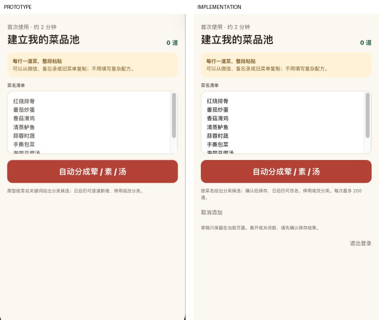
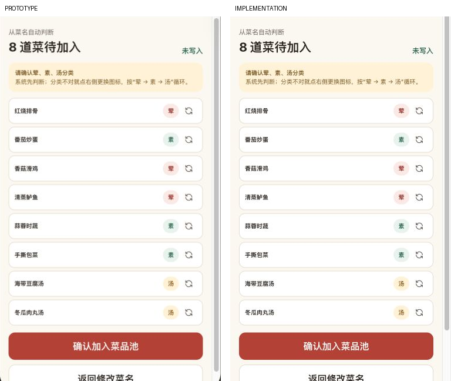
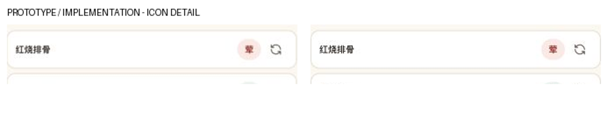

# 街坊味菜池原型对照验收

日期：2026-09-20。范围：#357 / PR #367 的菜池页面。最终结果仅表示本轮 H5 可见内容和交互对照通过，不代替用户验收、微信真机或完整 MVP。

## 依据与尺寸

- 原型：`ideal/docs/kith-inn/yao/prototype-implementation/prototype-taozi/index.html?step=dishes`，固定提交 `cb71b2e84ac0665a288b1634096438c19b743918`；本地原文件与该提交无差异，文件 blob 为 `3bf6fd4bbcf0202befbedd6cf1bd4a8acc47b170`。
- 来源完整画面：Codex 内置浏览器，1280×1100 CSS px，DPR 1。手机内业务 `.screen-body` 位于 x=760.640625、y=221，大小376×648；取顶部376×620排除外壳底部圆角。未修改原型文件或原型已有本地改动。
- 实现：同一内置浏览器，376×706 CSS px、DPR 1；裁掉58px H5标题栏，取376×620内容。使用同样8道菜、相同分类与未提交状态。输入页346px内宽；溢出的预览页由滚动条占15px，两侧实际内宽均331px。
- 原始截屏与各轮比较在本机 `~/.codex/visualizations/2026/09/20/01a0be10-fd82-72e0-bf62-477f83d19536/prototype-alignment/`。最终成对图随代码保存，左原型、右实现；不是用两个不同视口的单图推断一致。
- source visual truth path：该目录 `reference-input.png`、`reference-preview.png`；implementation screenshot path：`implementation-input-final-full.png`、`implementation-preview-final-full.png`。原始全截图保存为JPEG字节（工具返回），裁切及合成统一导出PNG，不做内容修图。

## 成对证据

## 比较与修复历史

1. 初始版本 `1158f0e`：P1，自行设计的大品牌区、绿色按钮、外层面板和字号布局取代了原型。`input-comparison-before.png` 已按相同菜名捕获；重排为原型 detail-head、menu-rule、输入框、红色CTA和白色分类行，移除额外品牌区。
2. 第一轮实现：P2，Taro运行时把背景覆盖为白色；图标aspectFit横向偏移，只剩半个图标；输入框多出内层边框及拖动角；固定滚动槽使输入内容窄15px。证据 `input-comparison-v1.png`、`preview-comparison-v1.png`。明确业务容器背景，正方形原始SVG使用scaleToFill，规范H5原生textarea的边框/内距/resize，滚动改为auto。
3. 第二轮：背景、图标与输入框修复通过，但Taro后插入的同权重规则仍覆盖overflow-y；证据 `input-comparison-v2.png`、`preview-comparison-v2.png`。用页面现有双类选择器提高局部优先级，未使用全局!important。
4. 最终重新构建并捕获上述两张成对图：输入页宽度回到376/346，预览保持与原型相同滚动密度；两名独立于UI作者的审查者分别打开成对图复核，无未收敛P0/P1/P2。
5. 行为审查另发现P2：首次保存成功后的GET失败会隐藏重读按钮。已在确认写入后设loaded=false；新增回归覆盖POST201→GET503→人工重读成功，并断言只有一次POST。

## 五项视觉检查

| 项目 | 检查结论 |
| --- | --- |
| 字体 | 原系统字体栈；标题21px/700、副字11px、规则10px/15px行高、输入11px/17.6px、主按钮16px/850；标题区51.5px和按钮46.5px与原型实测相同 |
| 布局 | 内容15px内距、规则区50px、textarea128px；分类行、圆角、间距及同状态折行一致。另检查390×844和1280×900，均无横向溢出，桌面业务区最大480px |
| 配色 | 原型#fbf8f1背景、#b64131主按钮、#fff2d5规则区及荤素汤色组；成功/错误/维护沿用同一套颜色 |
| 资产 | 原始RefreshCw SVG逐字复用，完整显示且尺寸14px；放大检查无裁切或占位图标；未复制设备外壳/系统图标 |
| 文案 | 录入、预览、纠正顺序和主要文案匹配；移除“原型/weekly-menu”的工程说明，增加生产所需限制和状态提示，详见下方差异 |

## 范围允许的差异

- 原型示例菜不预填到真实输入框，避免误保存；截图比较时人工填入相同8道菜。
- 增加200道限额、取消/退出和未保存提醒，保留未知写入保护、失败留稿和冲突处理；这些文字不替换原型主内容。
- 原型未提供本版全部维护/异常状态，列表、编辑、成功和错误使用原有dish、kind、tiny-action、success等组件语言；不恢复配送、订单、公布锁。
- 不绘制原型展示页、手机外壳、状态栏、微信胶囊；WeApp使用原生导航，H5提供普通标题栏。
- 来源截图存在亚像素x坐标与JPEG编码，字符抗锯齿可能有轻微像素差；验收不是逐像素完全相等的承诺。

## 功能与运行验证

- Node22.23.2、TZ=UTC下根 `pnpm verify` 通过，含33个前端测试、67个真实PG API测试、37个契约测试及H5/WeApp构建；未变更的包按现有Turbo规则复用缓存，数据库测试实际执行。
- 最终6条H5交互回归通过，包含新增保存后重读失败用例；日志 `/tmp/kith-prototype-e2e-final.log`，根门禁日志 `/tmp/kith-prototype-verify.log`。
- 内置浏览器连接真实API和独立PG17，验证分类纠正返回保留、批量保存8道菜、刷新读回、改名/停用/恢复；数据库核对8道全部启用。只注入本地测试微信身份和传输，未替换业务API或数据库。无浏览器console error。
- 已检查列表和编辑截图 `implementation-list-final.png`、`implementation-edit-final.png`，以及390px/1280px截图。额外控件可滚动访问；导航与编辑逻辑有效。
- 微信真机样式、真实登录/双设备仍需既有小程序配置后验收，不能用H5代替。

## 实施检查单

- [x] 指定原型视觉约束写入PRD、handoff、spec及T015。
- [x] 按源还原录入/预览并复用图标。
- [x] 修复运行时视觉覆盖与保存后重读回归。
- [x] 相同状态成对截图及独立复核。
- [x] 本地根门禁、6条浏览器回归、真实API/PG联调。
- [ ] 用户视觉验收与微信真机验收。

无需要阻止本轮交付的P3事项。

final result: passed
