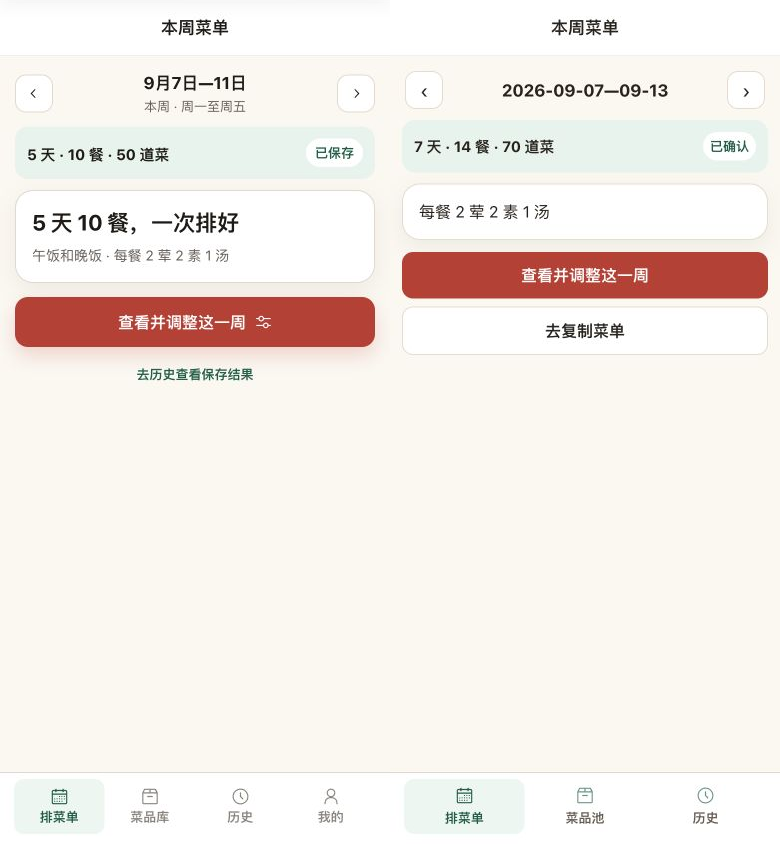
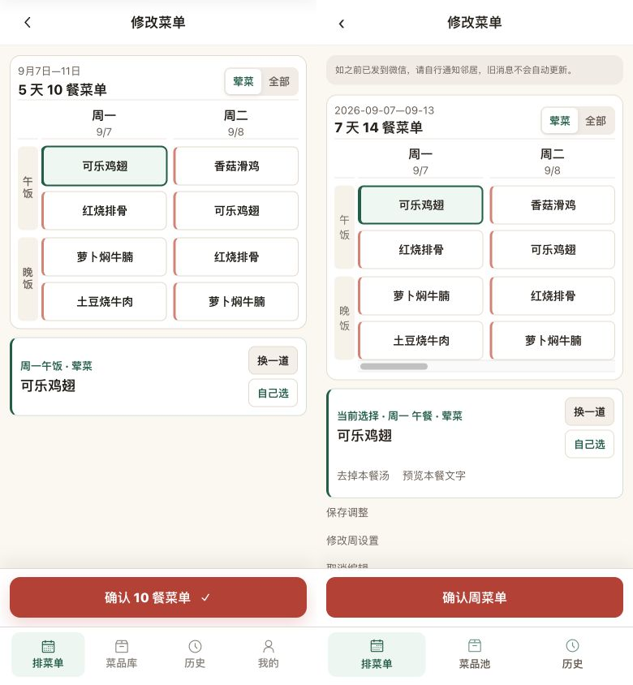
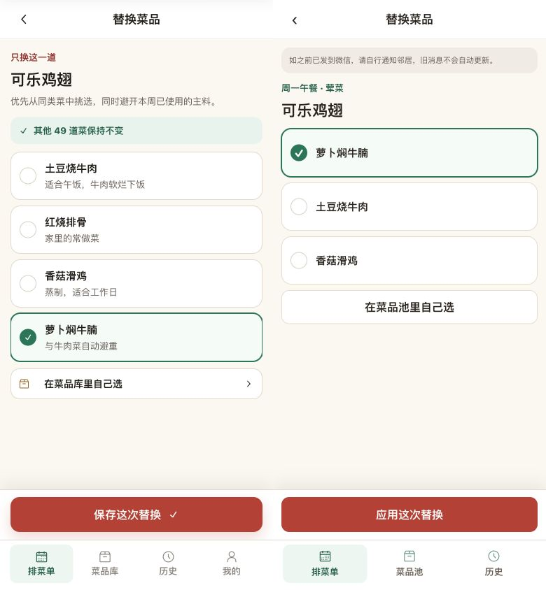
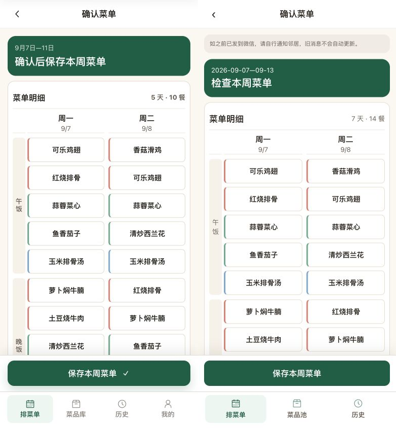
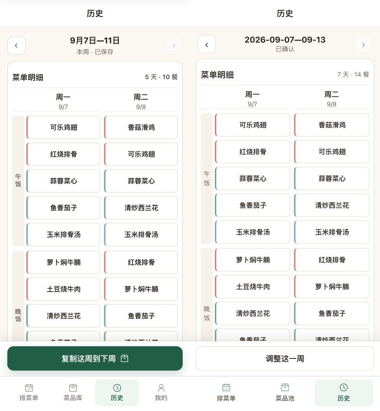
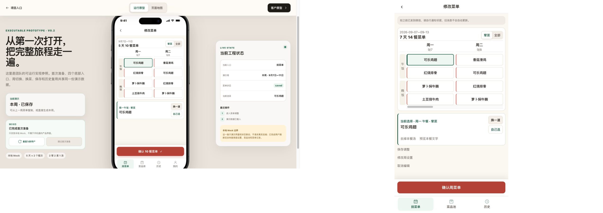
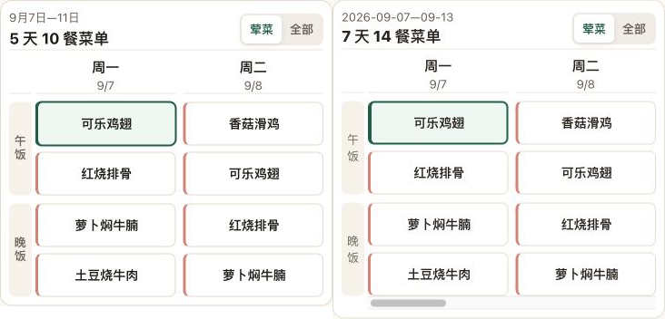
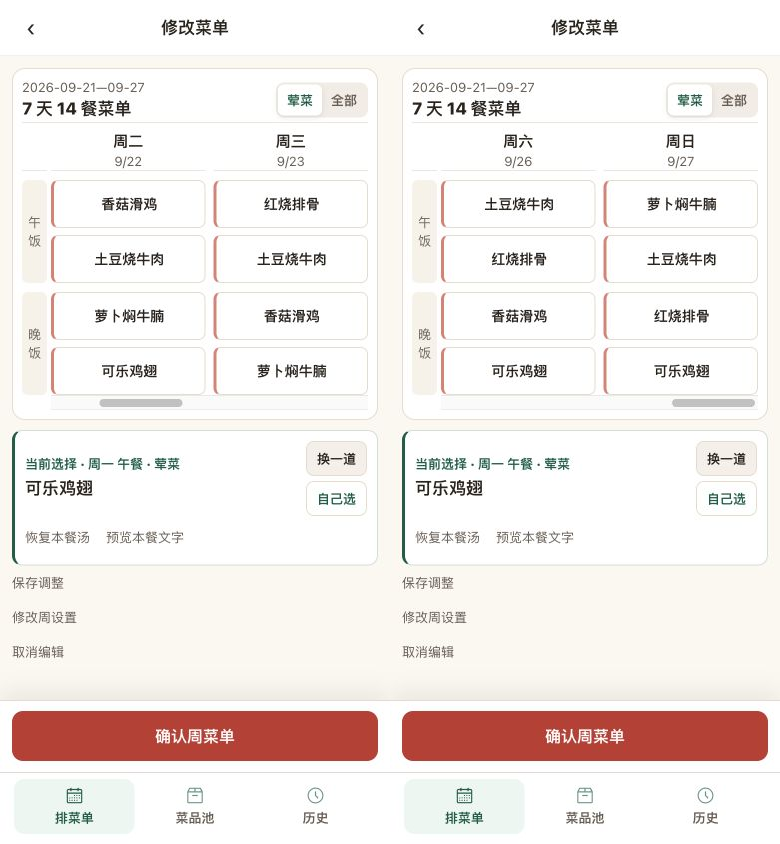

# 街坊味：最新工程原型校正验收

2026-09-21，#358 / #359 增量，基线 `7ca12b5`。本记录替代上一轮客户原型视觉结论；旧图仍可从 Git 历史查阅。本轮开发验收通过，用户验收及微信真机验收未完成。

## 依据与证据规格

- source visual truth：ideal 提交 `c85602462cb57ce1e72579c5840ff6e41cf916ab`，`3.3-meal-mind/prototype-implementation`；只读工作树 `/Users/miyin/code for people/ideal-worktrees/paihaocai-engineering-latest`，参考服务3395。客户原型不再作为本轮依据。
- 实现：本应用，独立H5 3358 → 真实API 3360 → PG17 `cfp_kith_engineering_browser_test`。仅测试身份与本地传输桥接，业务接口没有mock。
- 手机状态：2026-09-07已保存周，2荤2素1汤，选中周一午餐“可乐鸡翅”，候选选中“萝卜焖牛腩”；前五天菜名与工程原型完全一致，MVP增加周末。
- 原型viewport390×888，屏幕区域从y=44开始、390×844；实现viewport390×844。标准浏览器截图分别390×888和390×844，原型仅裁去44px展示栏，按CSS像素1:1合成为780×844，不缩放内容。原始截图 `/tmp/engineering-qa/reference-{home,edit,swap,review,history}-raw.png`、`implementation-{home,edit,swap,review,history}.png`。
- 桌面viewport双方1280×900；工具返回原型1265×889、实现1280×900，原像素并排2545×900，原型设备框自动缩放，因此桌面图只判断布局与溢出，字体依据手机1:1图。实现业务区最大480px，body无横向溢出。
- 局部图从手机编辑截图裁取同宽366px表格，保持原像素；比对列宽、8px间距、48px单元格和14px字，不把功能提醒造成的整体位移误认为表格差异。

## 成对图（左最新工程原型，右实现）

## 修正与比较结论

上一轮错误采用客户版三列与独立餐卡总览，属于P1来源/布局偏差。本轮改为工程版首页→两列编辑→独立候选→只读横向检查→最终保存；历史默认最新已保存周并在本入口切周。上述七张合成图均已实际打开比较，未发现剩余可执行P0/P1/P2视觉问题。

| 检查面 | 结果与明确允许的差异 |
| --- | --- |
| 字体 | 系统中文字体，日期表头15px/日期13px，菜格14px/48px，选中标签13px/菜名17px；两列的视觉密度、粗细与换行接近来源。编辑长名称两行，选中区及只读表完整显示；只读行按最长名称扩高并跨日对齐 |
| 布局 | 两日期列、8px间距、午晚餐轴、绿色选中区及右侧竖排换菜按钮。纵向内容与底部操作dock分离，七天表只在内部横滑；固定主操作和导航不被长表覆盖。桌面保持480px业务区，无仿设备外壳 |
| 色彩 | 米色背景、白色边框卡片、红主操作、深绿检查/保存及荤素汤类别色条沿用工程来源；选中候选绿边框、实心勾选与未选空心状态清晰 |
| 资产 | 继续复用来源Radix Calendar/Archive/Clock SVG及MIT声明，图标清晰；不重画设备状态栏与外壳，复制流程保留已有品牌资产，无新增图像 |
| 文案 | 不恢复用户否定的装饰性描述。首页仅状态、每餐结构和操作；候选显示原菜与目标餐，不承诺食材避重。保持街坊味菜品池及复制入口，导航仅排菜单/菜品池/历史，无“我的”或跨周复制 |

必要功能差异：七天十四餐代替五天十餐；编辑保留微信旧消息提醒、去汤、预览、保存草稿和设置；候选排除本餐已有菜，故不展示原型中的重复红烧排骨；选择后需应用，不能点击候选即替换。检查页进入/返回不写入，最终“保存本周菜单”才确认；历史底部为调整本周，不实现跨周复制。提醒造成整体下移及表格横向滚动条为真实业务/浏览器差异，不影响列密度或固定操作。

## 功能检查和迭代记录

- 协调审查发现P2：周设置有未保存修改时复制可能用最新快照覆盖设置。已将settingsDirty纳入复制保护，取消与读取失败保留设置，提供返回周设置；新增回归通过。
- 协调审查发现P2：历史“调整这一周”绕过微信旧消息提醒。统一进入编辑函数补齐提醒，历史回归覆盖通过。
- Node22根 `pnpm verify` 通过（API93、前端51、契约37，以及其他工作区门禁、H5/WeApp构建），日志 `/tmp/engineering-verify.log`。独立库 `cfp_kith_engineering_ui_test`、`cfp_weekly_engineering_ui_test`、`cfp_website_engineering_ui_test`。
- 最后代码修改后27条H5 E2E通过，日志 `/tmp/engineering-e2e-final.log`：新增检查页0写入/返回保留/最终一次PUT、候选取消/搜索/重新校验停用及改类、历史分页失败保留/重入刷新、设置草稿复制保护；保留未知写入原键原正文重试、409、多汤、零类别、停餐、20道及60字菜名与dock边界回归。此次恢复验收未再修改代码，未重复执行已通过检查。
- 真实浏览器：新周生成14餐→独立候选应用可乐鸡翅→周一午餐去汤→只读检查→返回再检查。保存前只读SQL仍仅有8月31与9月7两个version1周；最终保存后9月21为version1/已确认/14餐/首餐soupOmitted=true。去复制菜单→复制菜单文字，页面显示成功，完整日期和对应荤素内容正确；复制后版本仍为1。
- 历史默认9月7，上一保存周到8月31，仍处历史导航；固定对照周均保持version1。浏览器error日志为空，桌面body宽度等于viewport1280；手机及桌面成对截图已核对。未修改共享3317/3319或用户数据。
- 真微信登录、微信剪贴板、双设备真机与用户视觉接受仍待既有后续验收；不以本地H5测试代替。

- [x] 最新工程原型五个关键状态及桌面/局部对照。
- [x] 独立真实API/PG生成、调整、检查、最终保存、历史与复制闭环。
- [x] 根门禁、27条浏览器回归、H5/WeApp构建通过。
- [ ] 用户视觉验收与微信真机验收。

## 2026-09-21 用户反馈定向修正

- P2：横滑停在半列。共享WeekBoard的真实H5滚动元素改为强制CSS吸附，鼠标拖动参考工程原型，松手恢复吸附；微信scroll-view按七列宽度对齐最近日期，最多从周六开始，使用scrollend及180ms滚动空闲收尾。触摸取消同样清除按住状态；鼠标无按键移动会结束残留拖动。
- 按用户新指令删除编辑顶部及复制页重复的微信旧消息说明，历史进入编辑也无此说明；此前截图及关于必须提示的记载仅为历史证据，本节覆盖。保存、复制、失败/草稿/重排保护不变。
- 390×844实际鼠标从x290拖到178后，scrollLeft=162.5，周二/周三边界分别[51,205.5]与[213.5,368]；滚动到末尾scrollLeft=812.5，周六/周日同样完整覆盖[51,368]。截图已打开逐列检查，无半列裁切、无顶部旧消息提示。
- 新增行为回归从未选中的可点击菜格开始真实mouse拖动，断言原选中菜位不变，再通过CDP触摸滑动/取消、横向wheel验证列边界；编辑、检查、历史均能到达完整周末，覆盖小于5px移出后外部松开再无按键移回，且历史编辑/复制均无删除的文案。全28条H5 E2E通过；随后加强菜格拖动断言的定向用例也通过（`/tmp/engineering-snap-cell-e2e.log`）。全量日志（`/tmp/engineering-snap-e2e-final2.log`）。
- 根verify通过、H5/WeApp构建通过（`/tmp/engineering-snap-verify-final.log`）；检查微信产物存在scroll-left、bindscrollend及bindtouchcancel。微信真机手势尚未验证，不把H5触摸模拟视为真机证据。首次并行构建覆盖共用dist导致测试环境失败，已串行重建并在干净测试端口完成上述最终回归。
- 本轮只定向核对滚动与删文案，不重复前轮五状态联调；未修改共享入口或用户数据库。无剩余P0/P1/P2。

final result: passed
