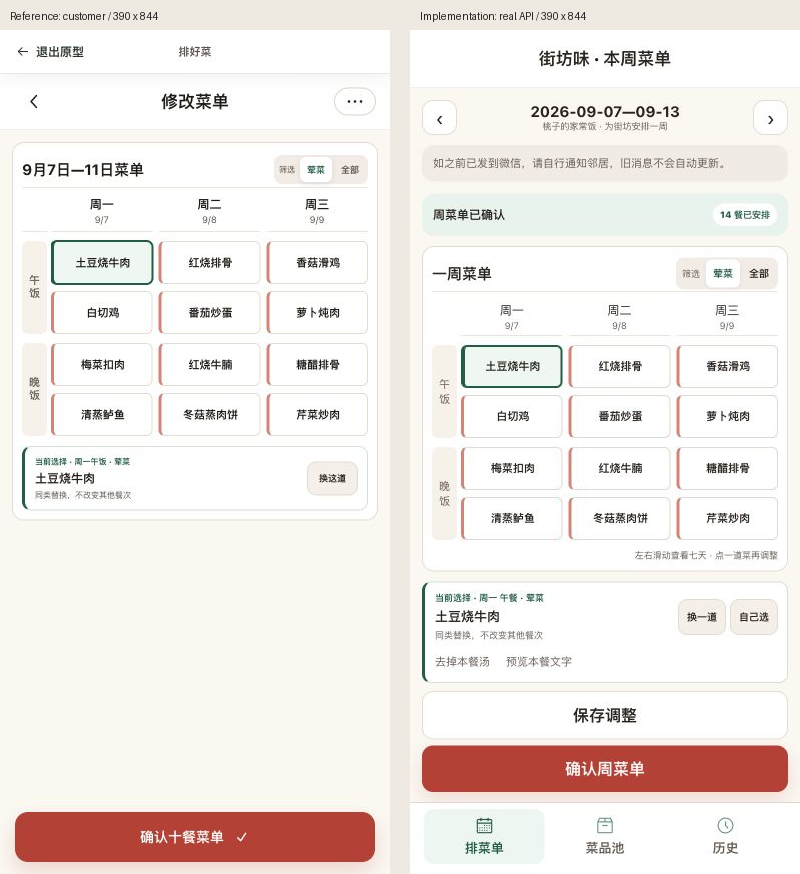
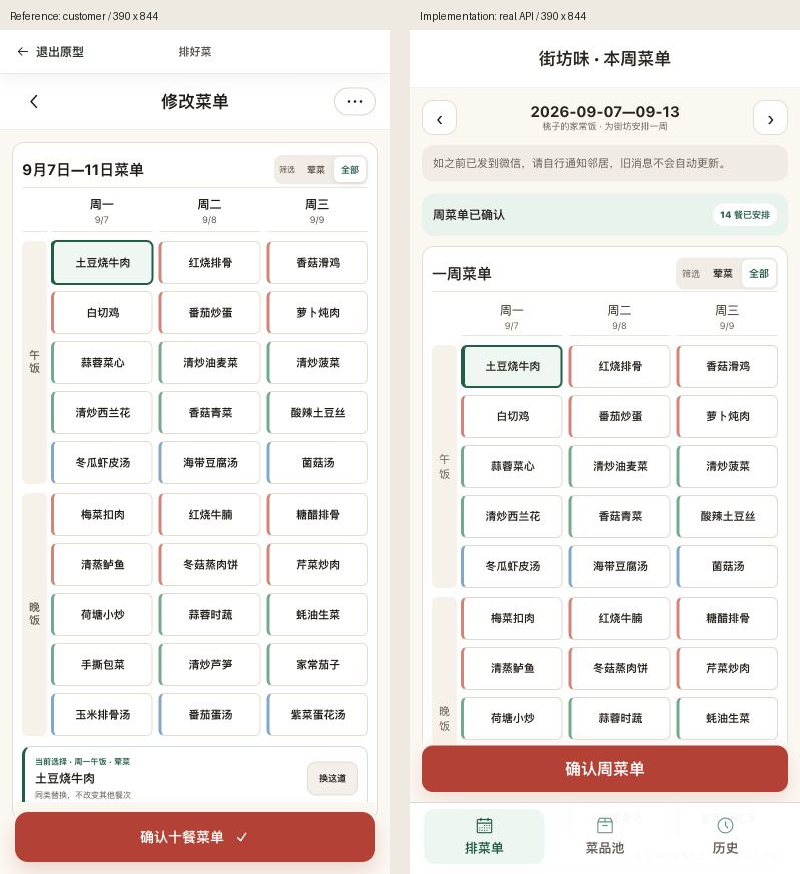
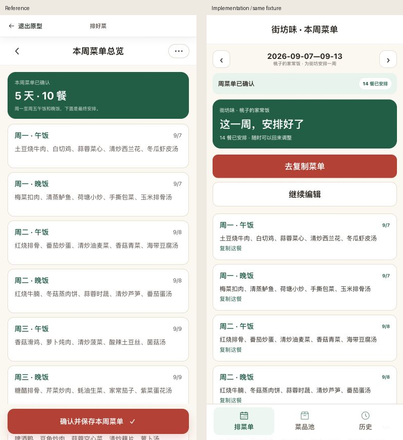
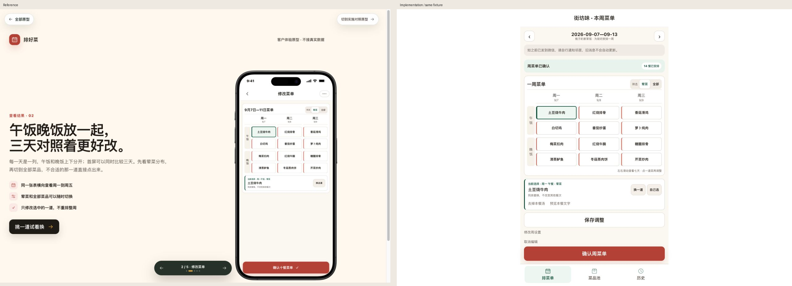
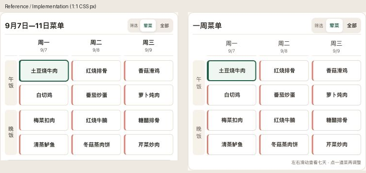
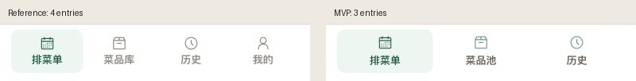

# 街坊味：排好菜界面对照验收

2026-09-21，#358 / #359 增量迭代，基线 `b385ec1`。本轮 H5 可见界面与交互通过；不代表用户验收、微信真机验收或上线。

2026-09-21 后续用户反馈：不要擅自增加描述性文案。已移除“这一周，安排好了”整块重复说明卡、日期下方的标语及本轮新增的登录欢迎语，保留上方确认状态、已安排餐数和原有操作。下方成对图是前一轮留档，其中绿色说明卡和新增标语不再作为当前界面要求；本次仅删除文案及其无用样式，保存和复制逻辑不变。

## 依据、状态与尺寸

- source visual truth：`ideal-worktrees/paihaocai-prototype`，提交 `ab27256`，`排好菜/prototype-customer/src/App.jsx` / `styles.css` 的菜单与总览；`prototype-implementation` 的日常入口和固定导航。只读源码，在自行新开的浏览器页交互，未修改原型文件。
- 实现：本工作树 `apps/kith-inn-miniapp`，临时 H5 `3348` → 真实 API `3350` → 独立 PG17 `cfp_kith_pai_browser_test`。本地测试身份和传输桥接，业务读写没有 mock。
- 同一菜单状态：2026-09-07 周一午餐第一道“土豆烧牛肉”选中，2荤2素1汤，前五天逐道采用客户原型数据；MVP另保留周六、周日。荤菜、全部、已确认总览分别成对捕获。
- 手机双方 CSS viewport 为390×844。浏览器截图 API 输出均390×844像素，原型屏幕在DPR2下由工具归一到CSS像素，实现DPR1；原始返回为JPEG，合成时统一转PNG，无内容修图。桌面双方 CSS viewport 为1280×900，原型输出1265×889（工具去除滚动边缘），实现1280×900；全图并排保持原像素，不据桌面设备外壳的缩放判字体差异。
- 原始 source / implementation screenshot path：本机 `/tmp/pai-ui-qa/reference-{menu,all,overview}-mobile.png`、`implementation-{menu,all,overview}-mobile.png`；桌面 `reference-menu-desktop.png` / `implementation-menu-desktop.png`。以下随代码保存的成对图包含全部原始可见内容。

## 成对视觉证据

## 检查与修复历史

1. 初次真实生成的浏览器截图发现 P2：设置页滚动位置带入菜单，标题被裁在首屏之外；长表取消编辑也会停留在下方。生成和载入保存快照后回到顶部；最终23条回归包含20道长表取消后“去复制菜单”完全在视口内。上述最终手机图重新捕获，标题、表格和固定操作均可见。
2. 初次手机截图发现 P2：运行时15px滚动槽让表格比原型窄，固定按钮右边缘与内容不齐。保留纵向滚动能力并隐藏滚动槽；复捕表格双方366px宽，三列、6px列间距、25px餐次轴对齐。上方最终局部成对图可逐行核对。
3. 协调者独立静态审查发现 P2：候选未关闭时切换菜位，旧target可能替换旧餐次。选择新菜位同时关闭候选与旧餐次的汤重选；反例验证周一面板→周二菜位→候选只改周二，周一保持原样。
4. 最终比较包含字体、布局、颜色、资产和文案，无未收敛 P0/P1/P2。早期CDP截图出现截断/缩放，已丢弃；验收使用浏览器标准截图并核对实际图像尺寸，不拿缩放错误当产品缺陷。

## 五项视觉结论与允许的差异

| 项目 | 结论 |
| --- | --- |
| 字体 | 系统中文字体栈、表头15px、菜名11px/850、43px菜格、绿色选择标签；局部图显示行列、菜名密度相近。长菜名最多两行，选中区和总览显示完整名称 |
| 布局 | 手机第一屏三天，横向七天；午晚餐等高行对齐。桌面业务区最大480px。所有数量均可纵向滚动，固定确认和导航预留底部空间；全部模式下下方餐次需滚动，属于额外导航与真实状态提示的明确差异 |
| 配色 | 背景#fbf8f1、主操作#b64131、选择#1e5d45、荤/素/汤左色条及白底边框沿用来源；原生键盘焦点可见、禁用按钮不可触发 |
| 资产 | 导航逐字复用原型Radix Calendar/Archive/Clock SVG，保留MIT许可；三个图标完整清晰。复制页继续使用街坊味现有logo，不绘制手机外壳、状态栏或系统胶囊 |
| 文案 | 街坊味/桃子、七天十四餐；明确荤菜/全部、换一道/自己选、去汤/恢复、未保存与错误。无家庭人数、推荐库、跨周复制或“我的”空页面 |

确认是现有的一次原子保存，总览展示已保存结果；“去复制菜单”在首屏、继续编辑次之，所以不复制原型总览底部再次保存。每餐独立卡片保留原型绿色标题/日期/完整菜名，新增单餐复制入口。首用只引导建立自有菜池→餐次与结构；已建菜池直接进入排菜单。菜池批量录入/维护沿用已验收流程，导航离开须处理未保存输入。

## 验证与边界

- Node22.23.2 / TZ=UTC 根 `pnpm verify` 通过：API93、前端51、契约37条，其他工作区门禁也通过。隔离数据库 `cfp_kith_pai_ui_test`、`cfp_weekly_pai_ui_test`、`cfp_website_pai_ui_test`；日志 `/tmp/pai-ui-verify.log`。
- 最后视觉/选择修复后重跑小程序 lint、typecheck、WeApp构建和全部23条H5浏览器回归；日志 `/tmp/pai-ui-weapp-final.log`、`/tmp/pai-ui-e2e-final.log`。覆盖导航取消留稿与未知写入冻结、原键原正文重试、历史重新进入刷新、换菜定位、跨菜位关闭旧面板、多汤恢复、零类别、停餐、20道/60字、复制每次读最新/失败无旧文字/保存后复制。
- 浏览器真实API联调：9月21日生成14餐→随机与手选换菜→周一去汤→一次确认→历史返回→单餐复制成功。SQL核对该周version1、confirmed=true、14餐、周一“白切鸡/豉汁蒸鱼”、soupOmitted=true；复制未增写。对照周9月7日另有独立固定数据。
- 最终浏览器 Runtime/Log 事件无异常或console error；390与1280 DOM检查业务区无横向溢出，横向滚动仅发生在七天表格内。
- 本轮自建3346/3348/3350临时服务在交付前停止；不修改共享3317/3319、用户九道菜或其他工作树。真实微信登录、微信剪贴板与双设备真机仍交由后续既有验收，不以H5代替。

- [x] 三列七天菜单、定点换菜、去汤、设置、确认总览和复制连续可用。
- [x] 三入口固定导航、首次准备和历史刷新，草稿及未知写入保护回归通过。
- [x] 手机/桌面同状态成对图、局部字体/色条/图标比较、真实API/PG验证。
- [ ] 用户视觉验收与微信真机验收。

final result: passed
