# 街坊味：编辑流程逐项校正

2026-09-21，#358，新增切片基线 `06aeb6c`。**撤回前轮将多余编辑操作、滚动条、文案及样式偏差列为“允许差异”并宣称无P2问题的结论。** 本记录及下列最终构建截图替代旧视觉结论；前轮证据仅保留在Git历史。

## 视觉依据与尺寸

- 权威来源：ideal `c85602462cb57ce1e72579c5840ff6e41cf916ab`，`3.3-meal-mind/prototype-implementation/src/App.jsx` 的MenuEditor/SwapScreen/LibraryScreen/ReviewScreen及其styles.css。只读工作树 `/Users/miyin/code for people/ideal-worktrees/paihaocai-engineering-latest`，服务3395。
- 用户目标图：`/var/folders/f7/0tfdpjzs0yz9lw9zfh1mjc780000gn/T/codex-clipboard-846bd380-8a8a-4653-aaf3-46888fe658a2.png`；旧实现图同目录 `codex-clipboard-fab46489-a51e-4aac-a714-3b74774f62e5.png`。两图均已打开，但缩放与内容宽度不同，不能直接据此改变字号。
- 本轮重新捕获：参考viewport393×896，`[data-phone-screen]`实测x0/y44/393×852；实现viewport393×852。原型仅裁去44px工具栏，原始截图像素393×896与393×852，不缩放，成对图786×852。两侧同一393px内容宽度，按CSS像素1:1比较。
- 状态：9月7日已保存周，周一午饭可乐鸡翅选中，2荤2素1汤；swap/pick均选中萝卜焖牛腩；review未应用替换、未保存。前五天原型和独立API种子菜名相同，MVP增加周末。独立H5 3358/API3360/PG `cfp_kith_engineering_browser_test`，只有测试身份与传输桥接，业务读取是真API。
- 原始截图：`/tmp/editor-fidelity-qa/reference-{edit,swap,pick,review}.png`、`implementation-{edit,swap,pick,review}.png`。四张最终合成图均已打开逐项检查；全文宽度已是1:1，表格/卡片/按钮文字清晰，未另用缩放后的局部图冒充测量。

## 最终成对证据（左原型，右实现）

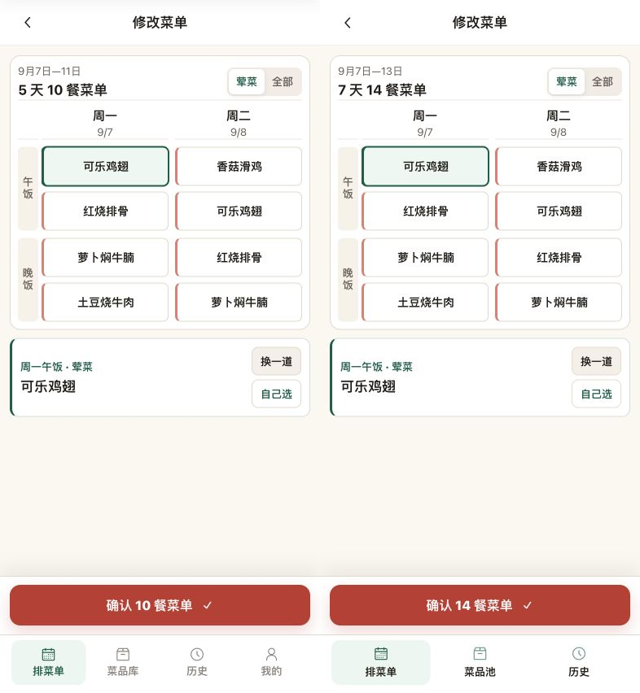
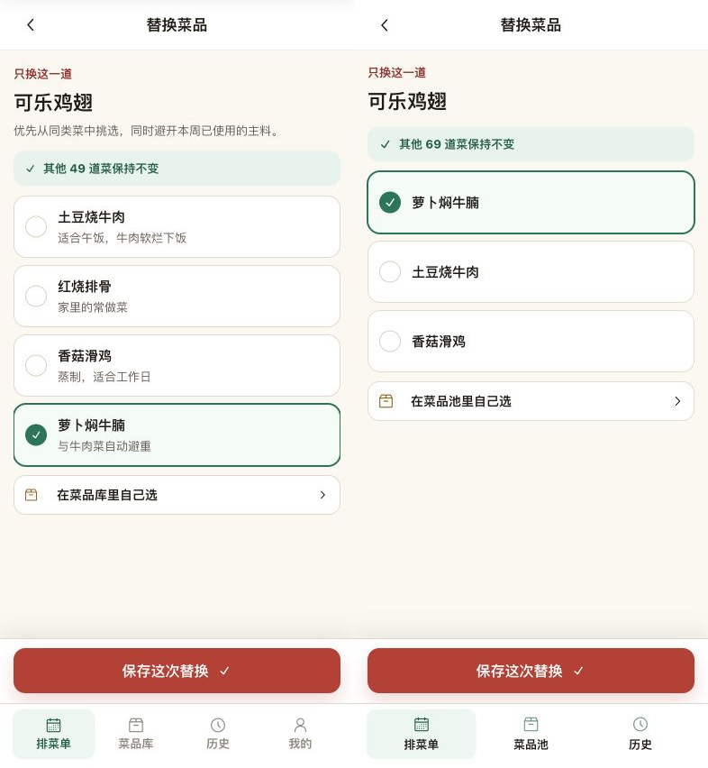
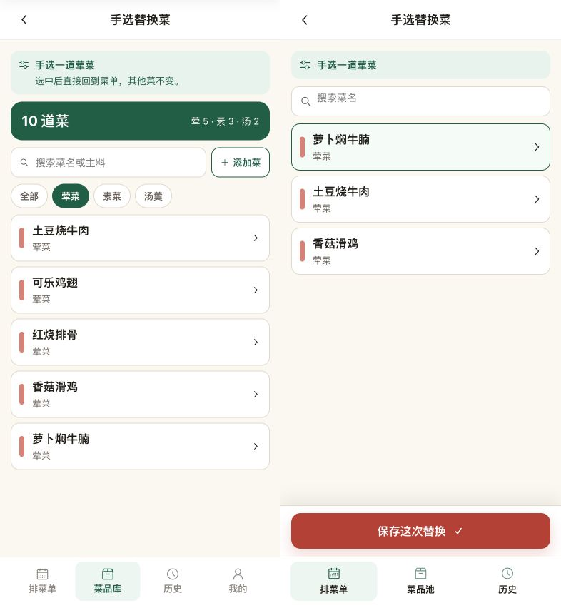
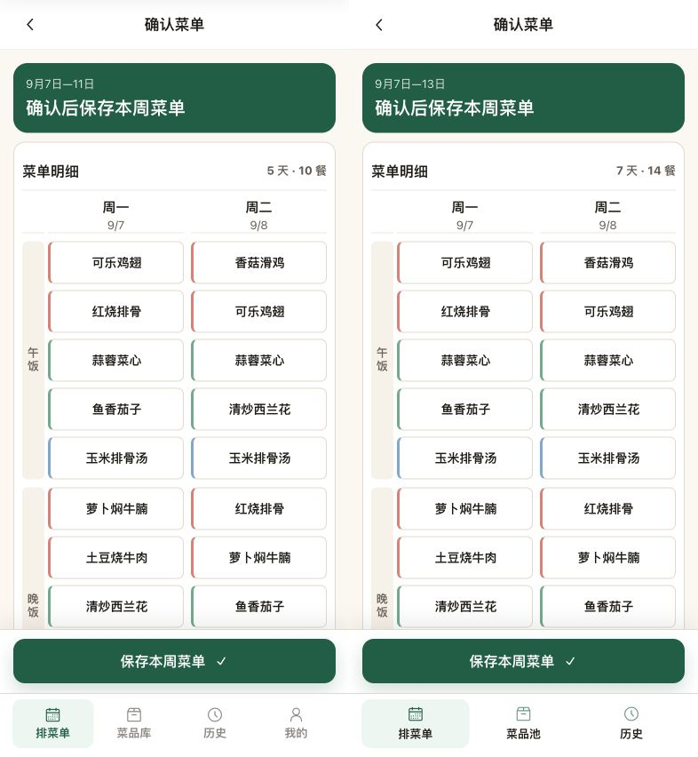

## 发现、修正与复核

| 原问题 | 修正及最终证据 |
| --- | --- |
| P1 普通菜位卡片额外堆叠操作 | 卡片只保留换一道/自己选；做不做汤只在保存菜单的“调整某一餐”页面决定，整周汤位不再显示去汤/恢复。复制使用首页独立入口，周设置、保存草稿及放弃调整也在首页操作，编辑底部仅确认N餐进入review |
| P2 文案、日期及视觉密度偏离 | 删除“当前选择”和正常状态的额外解释，改周一午饭·荤菜及9月7日—13日；表头17px/700、菜格14px/850、标签13px/850、选中名称17px/700、选菜按钮13px/900均对应源码值 |
| P2 滚动条与边界/字形样式不同 | 真实滚动容器隐藏bar，保持强制吸附与原有鼠标/触摸/取消保护；午饭轴vertical-rl、2px字距、line-height1；选中格外侧1px描边阴影，墨色#1e1b16、线色#e1d9cd |
| P2 dock与关联页面结构不同 | editor12px、swap/review15px边距；主按钮50px高、13px圆角、原阴影与17pxCheckIcon。swap保留只换这一道/真实剩余菜数及Archive+ChevronRight入口；pick改类别色标、菜名/类别、箭头列表；review标题为确认后保存本周菜单，日期opacity .84、计数13px/750 |

最终编辑DOM实测：表格x12/y68/369×337.5；选中卡x12/y415.5/369×97；右操作按钮61×35、13px/900；dock y708/393×72；真实横滚区320×266，未因滚动条增加高度。截图显示卡片与dock间保留原型留白，确认按钮与图标居中。字体栈、色彩、圆角、行距、控件清单与布局均逐项复核，没有将前轮多余操作当作可接受差异。

资产均直接复用工程原型依赖的Radix SVG路径（Check、Chevron、Archive、Mixer、MagnifyingGlass），仅导出目标颜色以适配Taro Image；沿用 `src/assets/nav-icons-LICENSE.txt` 的MIT声明。没有自绘替代图标或新增品牌图片。

## 仍存在且属于既定业务范围的差异

- 编辑/检查为七天十四餐，日期结束在周日；原型为五天十餐。三项导航继续使用街坊味菜品池命名，没有“我的”。做不做汤已移到独立单餐页，整周编辑各菜位均无去汤开关；已不做汤的占位明确显示“本餐不做汤”。
- swap省略没有实现的食材避重承诺，以及数据库没有的菜品note；排除本餐已占菜，合法候选数量与API排序不同。因此行内备注缺失、列表整体高度与原型不同，不声称完全相同。
- pick只展示同类合法候选并保留显式应用，选中样式给出当前选择；没有原型全菜库统计、跨类别过滤和添加菜，也没有“选中后直接返回”的错误承诺。上下文/搜索/色标列表采用来源样式，但这不是原型全菜库页面的完整复刻。
- 长菜名仍完整显示在选中区和只读表，必要时只读行扩高；错误、重排确认、冲突核对和离开保护只在对应业务状态出现，不新增正常页面解释。

## 行为验证

- 最终根 `pnpm verify`、H5/WeApp构建通过，日志 `/tmp/editor-fidelity-verify-complete.log`；独立测试库沿用engineering隔离库。28条浏览器回归通过 `/tmp/editor-fidelity-e2e3.log`，新增13餐CTA断言的完整链路定向回归通过（`/tmp/editor-fidelity-cta-e2e.log`）；远端结果以最终提交CI为准。
- 原型验收断言覆盖普通菜位按钮清单、短日期/选中标签、动态13/14餐CTA及图标、真实滚动元素不占bar高度、卡片95–98px/dock72px与实际边界；旧06aeb6c存在额外按钮、旧标签/日期和可见bar，不能通过这些检查。
- 首轮CI的27/28通过；末条测试在历史跳转完成前判断返回入口，截图证实停在编辑页等待首页复制按钮。补上“返回本周菜单”可见断言等待路由完成，保留滑动及复制检查；完整28条重跑通过（`/tmp/editor-fidelity-e2e4.log`）。此修正只涉及测试同步，未修改产品。
- 保留检查页0写入/返回留稿/最终一次PUT、草稿保存、未知写入原键原正文重试、409核对、失效候选、重排取消及缺菜不改旧稿、多汤恢复、设置草稿复制保护、历史分页失败和滚动取消/末尾/菜格拖动不误选等反例。按新入口更新测试步骤，没有删除这些业务断言。
- 对照期间只读取隔离API固定周，无保存操作，浏览器error日志为空；未修改3317/3319、用户菜池/菜单或原型服务。用户视觉接受、微信真机触摸/剪贴板仍待后续；不以编译或H5模拟替代真机证据。

final result: passed

## 供餐时单餐调整（追加范围）

本周已保存菜单 → 调整某一餐 → 日期/午晚餐 → 本餐做汤开关 → 保存本餐调整。默认选中中国日期的今天且已启用的餐，否则选本周首个启用餐。开关只修改草稿，保存成功后仍留在该餐，可直接复制该餐已保存文字。整周修改页只改菜品，不再承担做不做汤的决定。

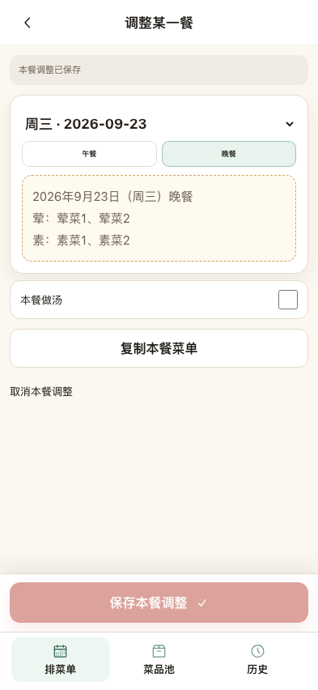

- 393×852 浏览器交互截图；周三晚餐、荤素菜、本餐做汤未选中、保存成功及复制入口同时可见。控件复用既有日期/餐次选择、卡片和底部按钮；不改变工程原型其他页面布局。H5复选框使用原生可访问名称，小程序使用原生Switch。
- 单餐必须从新读取的保存快照启动；未保存菜单、整周/设置草稿不能进入。切餐/退出遇到本地调整需明确放弃，取消不写入。停餐从选择器排除，无汤/全周停餐不能做无效修改。
- 保存以保存快照拼装，只允许目标餐 soupOmitted/必要恢复汤列表改变；confirm=false、rebuild=false，使用原周版本/幂等机制。保存后清原确认状态，不生成或重新确认整周。
- 浏览器用例断言全部14餐及周结构无旁路修改、保存前0新增写入、复制无汤、重新进入回看和恢复；覆盖失效多汤选齐、延迟读取时取消不可用、同页成功后再次调整清成功提示、409保留草稿、未知写入原键原正文重试，以及旧整周重排失败/复制保护。
- 截图及上述交互来自受控API浏览器测试，不冒充用户数据或微信真机证据。用户视觉确认和微信真机开关/剪贴板仍待验收。

验证记录：34条H5 E2E通过（`/tmp/single-meal-e2e-guards.log`）；追加已不做汤占位断言定向通过（`/tmp/single-meal-placeholder.log`），最终控件截图链路通过（`/tmp/single-meal-screenshot.log`）。根 `pnpm verify` 9/9通过，含H5/WeApp构建（`/tmp/single-meal-verify.log`）。

## 2026-10-03：H5 与微信开发者工具逐页对照

本节是本次平台差异核验，前文为不同日期的原型验收记录。不能用本节代替手机完整验收。

基线 `f2443a3`，使用 release 工作树的同一源码及本轮修复。微信开发者工具 Stable 2.02.2608060、基础库 3.17.3、iPhone 12/13 (Pro)、390px 内容宽；H5 独立构建在 3323。原生端读取 staging，H5 使用同一 API 的只读快照：5 道启用菜、2026-09-28 已确认周、1荤1素1汤、周三午餐不做汤。所有 H5 写请求被拒绝；原生端仅浏览和编辑未保存草稿，没有提交新增、删除、替换、生成或保存。

原始截图与完整自包含 HTML 报告保存在本机 `kith-inn-deployment-plan/visual-audit-2026-10-03/`。H5 viewport 390×809，成对图裁去56px标题；原生截图裁出390×753内容区，包含34px安全区。只为统一内容宽度按开发工具89%模拟比例还原；没有将不同数据或不同视口直接当像素对照。JPEG与颜色配置差异不作逐像素色差结论。

| 覆盖状态 | 结果 |
| --- | --- |
| 首页、荤菜编辑、全部编辑、换菜推荐、手选候选、搜索无结果 | 内容和主要操作对应；候选搜索框已修正。原生首屏更短，滚动末行仍待真机复验 |
| 确认菜单、长菜名气泡 | 内容/入口对应；气泡能展开完整名称并关闭，未执行最终保存 |
| 已保存周设置、餐次展开、新一周设置 | 数量输入框越界、过高及垂直偏移已修复并截图复核 |
| 单餐复制、不做汤草稿 | 示例输入框尺寸已修复；复用同一Switch及主题色；关闭汤会同步删去草稿文字、禁用复制，恢复后回到原状态，未保存 |
| 菜品列表、荤菜筛选、编辑、删除确认、批量添加、分类确认 | 列表/分类对应；批量输入框越界和取消对齐已修复；删除确认取消，分类草稿放弃 |
| 历史、历史复制目标选择 | 原生表格多余底部空白和禁用周切换箭头已修复，未复制到新周 |

共3条页面路由、21个界面状态；不是所有业务分支或全部手机尺寸。

### 根因与修复

1. Taro编译将HTML `input`、`textarea`、`button`选择器改写成 `.h5-*`；原先原生元素盒模型补丁仍遗漏这些控件。统一使用现有组件类设置border-box，并把单行输入框的垂直padding去掉，避免原生文字下移。编译后的WXSS已核对类规则确实保留。
2. 原生横向ScrollView依赖自动高度时，多出约40px底部空白；按表头和既有行数明确高度，荤菜/全部及历史复测。没有修改列宽、滑动吸附算法或菜格大小。
3. H5“本餐做汤”原为普通checkbox，原生为默认绿色Switch。复用菜品启停已在用的Taro Switch和同一主题色；使用其nativeProps保留H5内部checkbox的可访问名称。
4. 共用文字按钮明确左对齐，禁用按钮继承文字色，搜索Input改用跨端保留的类选择器。

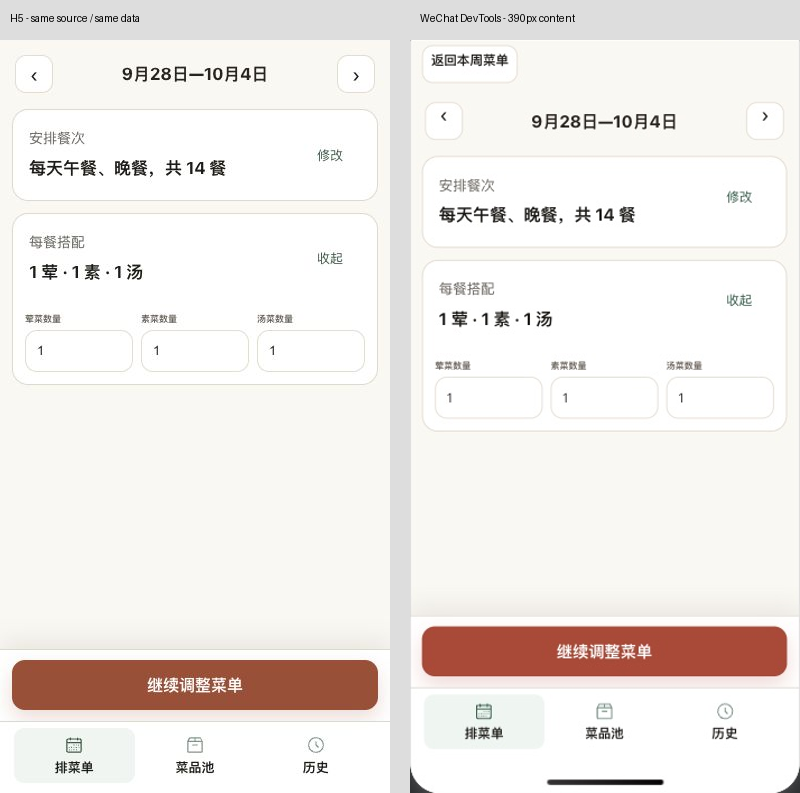
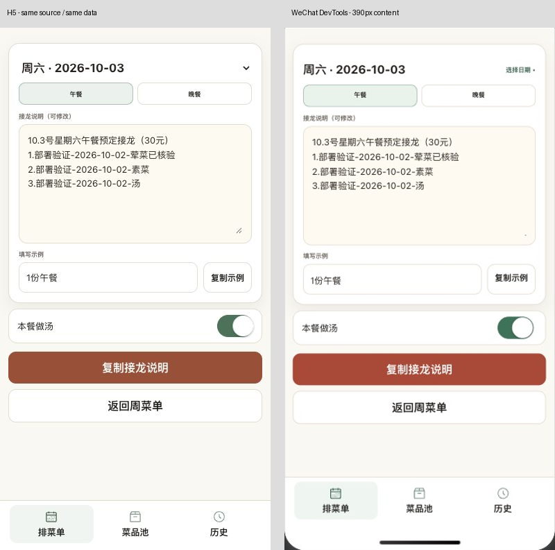
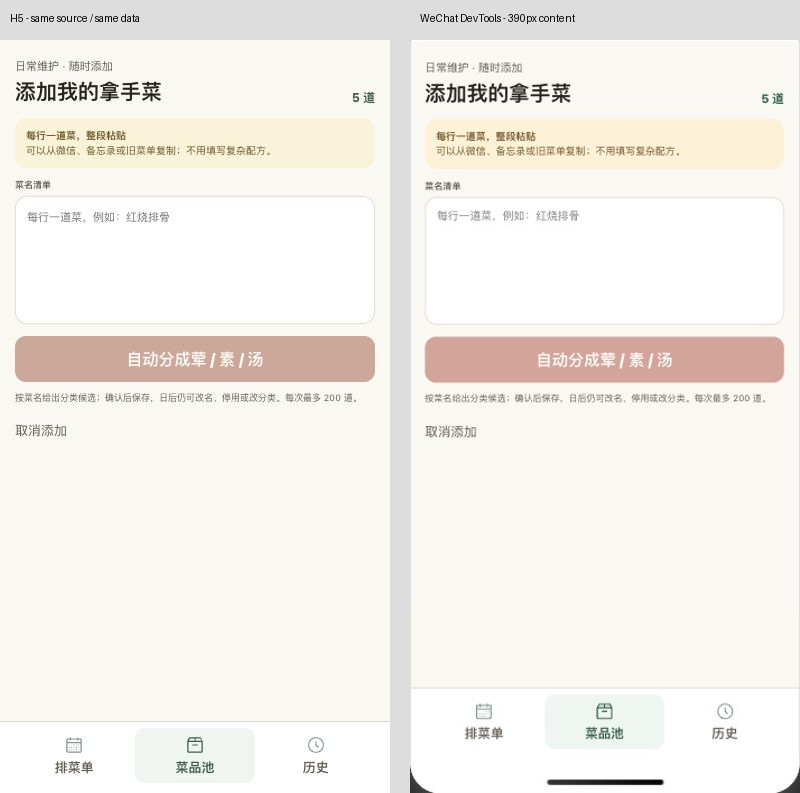
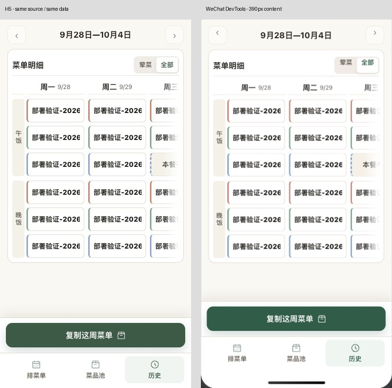

修复前证据：[设置](docs/visual-qa/weapp-h5-08-settings.png)、[复制](docs/visual-qa/weapp-h5-10-copy-meal.png)、[添加](docs/visual-qa/weapp-h5-15-dish-add.png)、[历史](docs/visual-qa/weapp-h5-17-history.png)。

### 检查通过与剩余范围

- miniapp lint/typecheck、62项单元测试、H5/WeApp构建通过。本轮没有运行完整E2E；前文旧E2E数量不作为本轮结果。
- 已保留原AppID、私有项目配置、staging HTTPS、按需组件加载；未上传新手机预览、体验版或正式发布，未改云端后端。
- 小程序子流程保留单独返回行，H5返回位于标题中；原生底部安全区、日期选择器、删除弹窗仍与H5不同。未为追求截图重叠而改造导航或增加产品文案。
- 原生手势自动化返回“窗口不可用”，本轮不能宣称触摸横滑吸附、纵向滚到最后一行已验证；真实iOS/Android键盘与剪贴板仍待测。菜池只有5道，没有复测第二页；登录、空菜池/空历史、网络失败也未做成对截图。
- 原来的3319本地预览、数据库和其他未提交文件未改；3323仅用于相同版本、相同数据的只读视觉对照。

## 2026-10-05：以 H5 为基准统一小程序页面

用户明确 H5 是开发视图，小程序页面须以它为准。本节接续 `01a4868`，替代上节“单独返回行、日期提示、确认弹窗仍有差异”的当前结论；上节保留为历史记录。本轮没有新增产品说明文案。

### 修改与依据

- 三条路由共用 `PageHeading`。WeApp 使用自定义导航，增加系统状态栏留白；标题、返回入口与 H5 共用结构。移除原生额外返回行，历史标题统一为“历史”。微信系统胶囊和底部安全区仍保留。
- 复制页日期入口沿用已有箭头资产，移除原生多出的“选择日期”提示；日期选择面板仍使用平台 Picker。原生按钮共用样式补足垂直居中，修复确认按钮文字靠上；文字按钮仍保持左对齐。
- H5 继续使用现有 Taro 确认弹窗。WeApp 的共享确认组件按实际 H5 弹窗尺寸、字号、遮罩及按钮布局实现；保留原有确认/取消语义。页面隐藏或卸载按取消处理，避免悬挂的确认操作。
- H5 不设置 `navigationStyle`，保持原有单个标题及内容宽度；仅 WeApp 配置 `custom`。过程中捕获过 H5 多余标题/滚动条问题，最终已修正并重新截图，不把那一版当作验收证据。

### 本轮截图

仍采用上节的 staging 数据和只读 H5 快照。H5 viewport 为 390×763；原生为同一 iPhone 12/13 Pro 模拟器，裁去47px系统状态区和34px底部安全区，按开发工具89%缩放还原为相同内容宽度，保留自定义标题与系统胶囊。原始截图同时保留；不以压缩、字体栅格和颜色配置差异宣称逐像素一致。

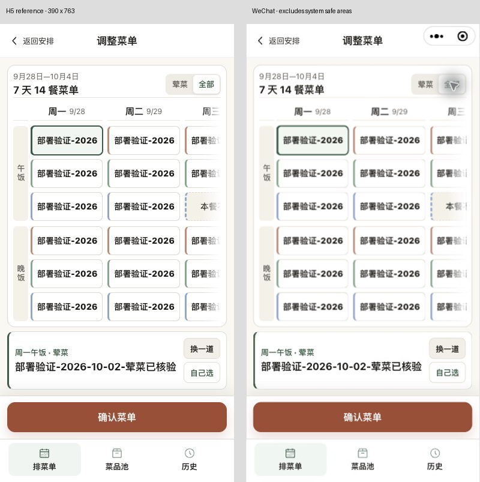
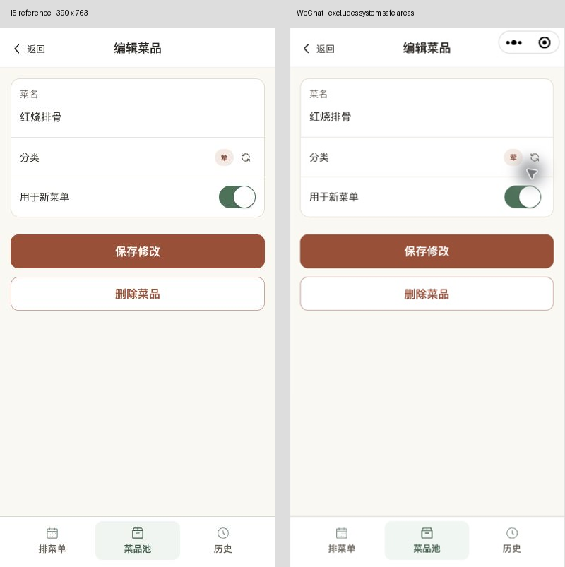
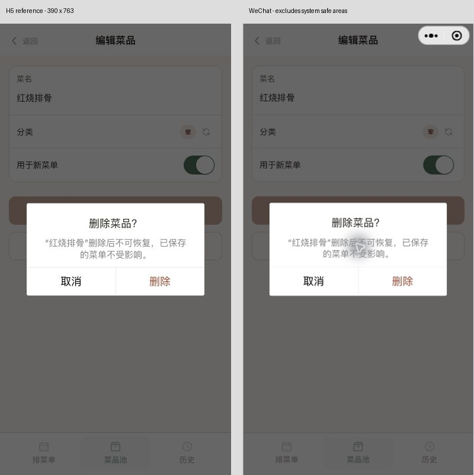
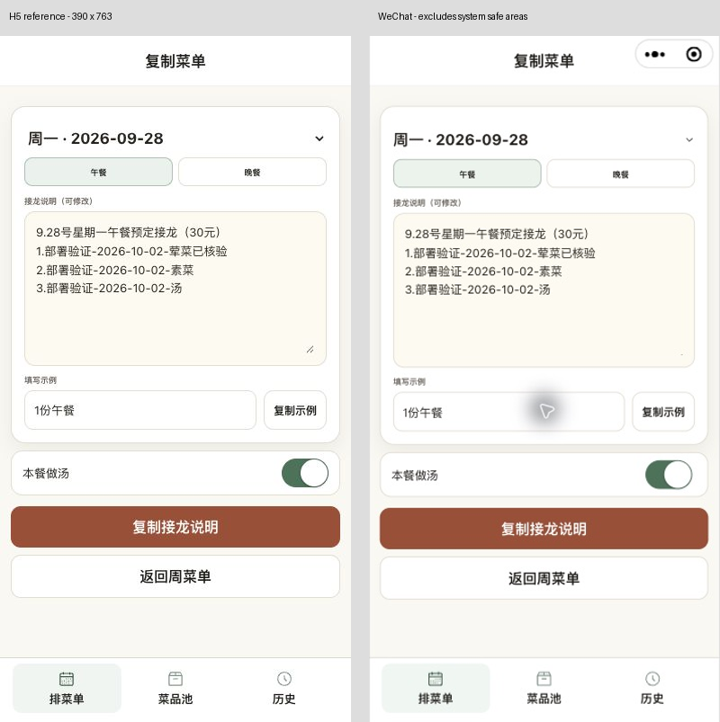
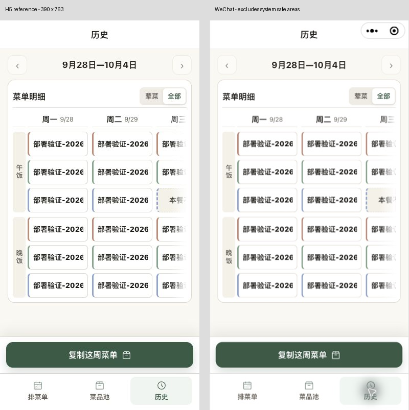

完整20组双端截图、自包含 `report.html` 及两张实际手势结果保存在本机 `kith-inn-deployment-plan/visual-align-2026-10-05/`；当前本地对照入口为 `http://127.0.0.1:3323/audit.html`。覆盖：首页、荤菜/全部编辑、推荐/手选、确认菜单、新周设置/餐次展开/已保存周设置、菜池/分类筛选/编辑/删除确认/放弃修改/批量添加/分类确认、历史/复制目标、复制一餐/不做汤草稿。

### 实际验证与限制

- miniapp typecheck、lint、62项单元测试及 H5/WeApp 构建通过。没有将旧记录中的全仓库验证或 E2E 数量计入本轮。
- 小程序实际操作：删除取消后仍有原5道菜；改菜名后“继续编辑”保留草稿，“放弃修改”恢复原列表；添加分类草稿可放弃；汤开关修改草稿文字并禁用复制，恢复后返回。未提交云端新增、删除、生成或保存。
- 开发者工具本轮已能执行手势：编辑表格横向拖动松手后对齐周二日期列；历史复制目标展开后纵向拖动可见表格最后一行，底部操作栏保持固定。这补足上节“窗口不可用”导致未测的两项，不能替代真机手势验收。
- 未上传新手机预览/体验版，未发布，未改后端。真实 iOS/Android 键盘、剪贴板仍待测；菜池第二页、登录、空数据及网络异常未在本轮成对截图。3319旧预览及其数据保持原状。

### 同日追加：精简添加流程

根据用户截图反馈，删除添加页的宣传式副标题、重复大标题、现有菜池数量、黄色说明卡和底部常驻解释。标题直接为“添加菜品”，输入框旁只保留“每行一道，最多200道”，主按钮为“下一步”；取消入口在导航左侧，沿用原有未保存草稿确认。分类确认页也去掉重复解释，仅保留待添加数量和更改分类的方法。首次空菜池的直接录入入口保持不变。

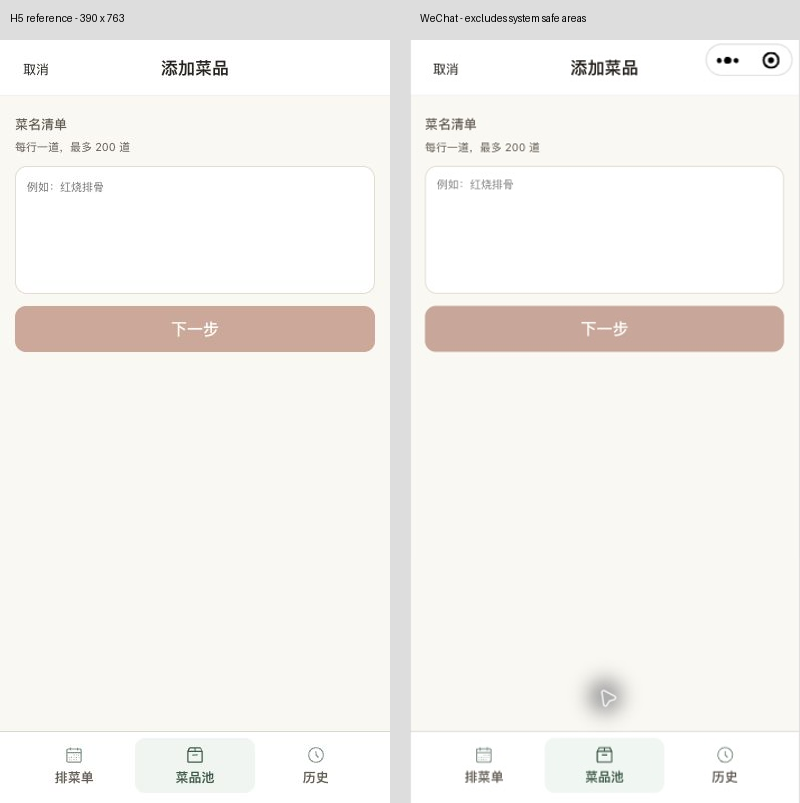
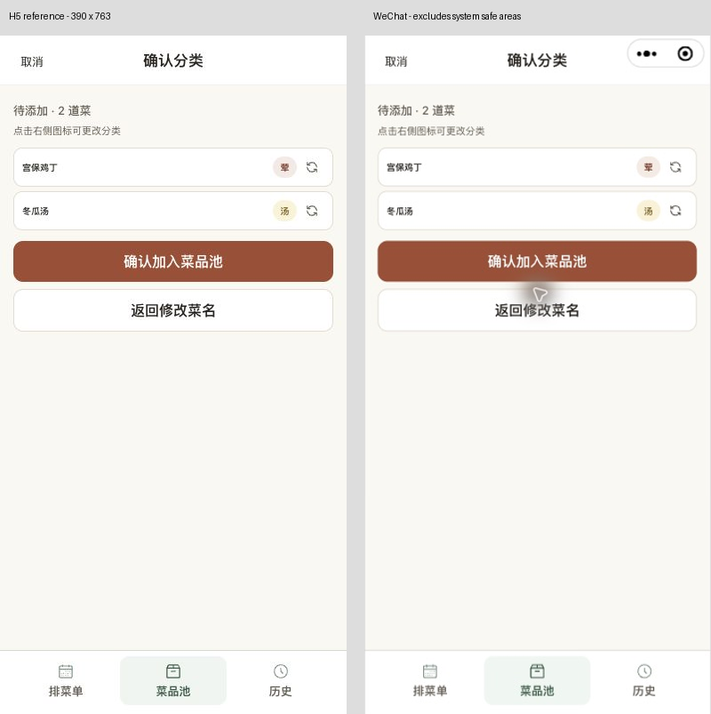

两端构建、miniapp typecheck/lint通过；实际进入添加、输入两道菜、下一步分类、取消后继续编辑、返回修改保留原文、确认放弃回到原5道菜列表均已复核。没有保存测试菜品。现有E2E选择器随标题/按钮/占位符更新，本追加未重跑全量E2E，不引用上一轮62项测试作为新增测试结果。完整报告第14、15组图片已更新，手机旧预览包仍需重新上传。

### 2026-10-05 追加：返回语义与全页面文案检查

本节更新同日上一节“取消入口”和“首次空菜池直接录入”的说明。范围为三个路由、17个新截图状态；完整报告在本机 `kith-inn-deployment-plan/copy-audit-2026-10-05/report.html`，检查入口 `http://127.0.0.1:3323/audit.html` 已替换为本轮报告。此前20组双端报告仍在 `visual-align-2026-10-05/report.html`，属于历史证据。

依据用户标准：只保留当前状态、输入规则、操作后果和错误处理。删除宣传欢迎语、重复大标题、流程旁白、常驻成功解释；保留分类方法、数量限制、未保存/删除确认、版本冲突和未知保存结果处理。

- 参考 [WeUI Navigation](https://wechat-miniprogram.github.io/weui/docs/navigation.html)、[Vant Weapp NavBar](https://github.com/youzan/vant-weapp/blob/dev/packages/nav-bar/README.md) 的左侧返回机制，以及 [腾讯零售小程序地址编辑页](https://github.com/Tencent/tdesign-miniprogram-starter-retail/blob/main/pages/user/address/edit/index.wxml) 的表单＋保存布局。后者取消用于标签输入弹窗，而非表单底部再放退出说明。这支持本项目的返回层级选择，不代表全行业统一强制规则。
- 输入页顶部箭头＋返回退出到菜品池，有草稿才询问是否放弃；分类页顶部返回菜名输入，保留原文和已选分类，删除重复的底部返回。临时历史选餐面板的取消保留。
- 修复空菜池无法真正退出添加的问题：列表不再自动变成输入页；首次周菜单的“添加菜品”显式携带 `add=1`，仍直接进入录入。退出录入显示“暂无菜品”，而非再次打开表单。
- 菜品编辑删除常驻草稿说明；登录只留授权登录要求及H5限制；首次使用只留无启用菜品状态和添加入口；读取失败不叠加第二条未读取提示。
- 周菜单保存统一使用 `Taro.showToast`，成功提示2秒自动消失，下一操作清除旧提示；“保存这次替换”改为“替换”，如实表示仅应用到草稿；其他简化见下表。

| # | 页面状态 | 本轮结论 |
| --- | --- | --- |
| 01 | 菜品池列表 | 保留菜名、分类、启停状态和分页操作 |
| 02 | 添加菜品 | 改箭头＋返回，保留输入规则 |
| 03 | 确认分类 | 返回上一步，去掉底部重复入口 |
| 04 | 编辑草稿 | 删除常驻草稿解释，保留离开确认 |
| 05 | 本周菜单主页 | “查看并调整这一周”改“调整菜单” |
| 06 | 复制／调整一餐 | “接龙说明”去括号解释，保存结果用toast |
| 07 | 调整菜单表格 | 保留现有必要信息 |
| 08 | 推荐换菜 | “保存这次替换”改“替换” |
| 09 | 自行选菜 | 标题“选择菜品”，保留分类上下文 |
| 10 | 确认菜单 | 保留只读表和保存入口 |
| 11 | 周设置 | “汤菜数量”改“汤数量” |
| 12 | 历史菜单 | 保留状态和操作 |
| 13 | 历史复制目标 | 保留临时面板取消 |
| 14 | 未登录 | 删除厨房欢迎语及找回介绍 |
| 15 | 无启用菜品 | 删除“首次准备1/2”等流程旁白 |
| 16 | 历史为空 | 保留必要空状态 |
| 17 | 菜品池读取失败 | 去掉重复未读取说明 |

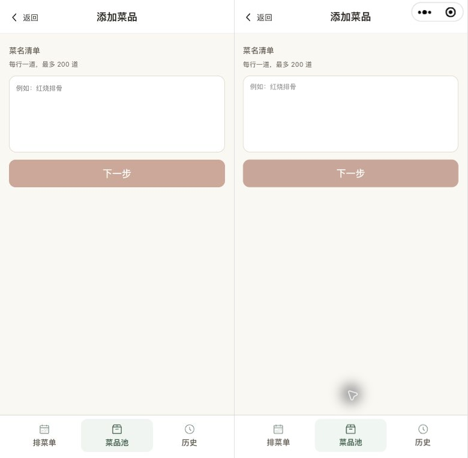
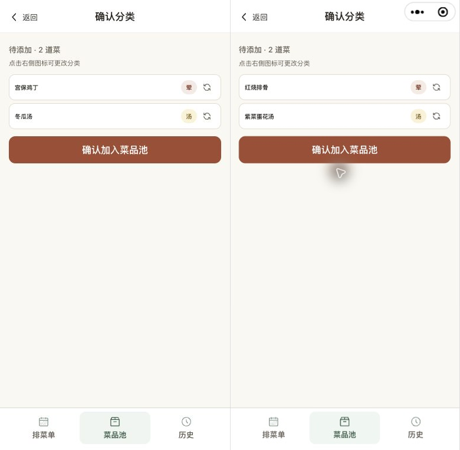
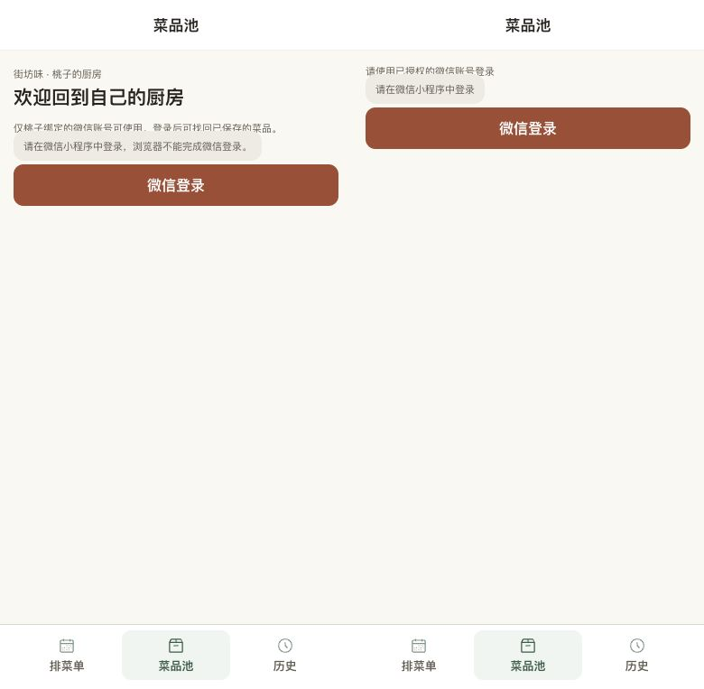
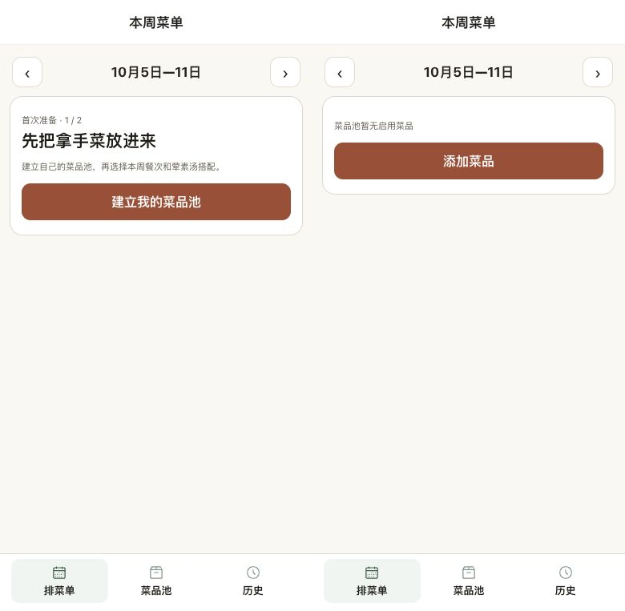

证据与验证：

- 本轮H5新截图17个状态及修改后截图；H5为390×763。原生沿用同一模拟器，裁去系统状态区和底部安全区，按89%比例还原390px内容宽；H5和原生各自输入两道菜，菜名不同，仅比较布局与返回语义，不声称逐像素相同。
- 微信开发者工具实际执行添加两道草稿→分类→返回保留菜名→退出→继续编辑→退出→放弃修改，最终仍原5道菜。没有提交新增、删除或其他云端业务写入。
- H5本地空数据响应验证首次添加和返回空列表；本地保存响应验证“本餐调整已保存”出现后自动消失。测试响应仅作用于本机3324，不改变云端数据；登录/错误/空数据也为本机受控状态。
- miniapp typecheck、lint、H5及WeApp构建通过。已有E2E入口/文案选择器同步，本轮未重跑全量E2E，不引用此前测试数量。未上传手机体验包，尚不等同于真机完整验收。

### 同日追加：设置折叠箭头

按用户反馈，“安排餐次／每餐搭配”的“修改／收起”文字改为下／上箭头，复用 `next.svg` 旋转，44×44点击区域保持可用。动态读屏名称为“展开／收起安排餐次”“展开／收起每餐搭配”，同时保留 `aria-expanded`；隐藏文字兼容小程序无障碍树。原有设置内容和展开默认值不变。

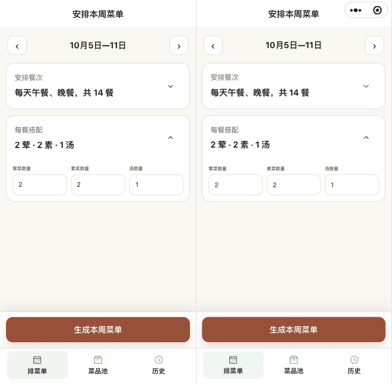

H5实测两项展开收起、7天餐次显示及44×44按钮尺寸；小程序实测每餐搭配收起再展开后2荤2素1汤保留。miniapp typecheck/lint、H5及WeApp构建通过。现有E2E选择器随读屏名称同步，未新增测试框架或重跑全量E2E；未生成、保存云端菜单或上传手机预览。

### 同日追加：小程序横向滑动末尾回弹

复现历史菜单滑到最右端后回弹，周日只显示半列。共用 WeekBoard 原生吸附只计算整列起点，未将实际滚动末尾作为停靠位置。一次显示2.5天，末尾不在整列起点；例如内容874px、可视311px，末尾563px会被旧算法吸回504px。H5使用浏览器CSS吸附，未出现相同回弹。此前原生验收只覆盖中间列，遗漏了最右端边界。

改为读取实际可视宽度，在整列起点与最右端之间选择最近停靠点；保持H5逻辑。微信开发者工具实测历史、编辑、确认页末尾都完整显示周六／周日，历史切换“荤菜／全部”仍保持末尾。只进入编辑和确认，没有保存菜单或写入云端数据。

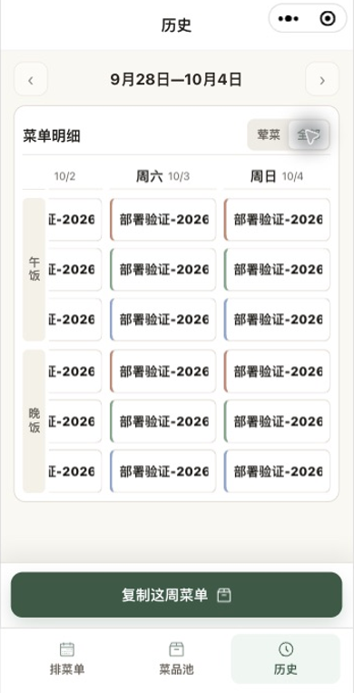
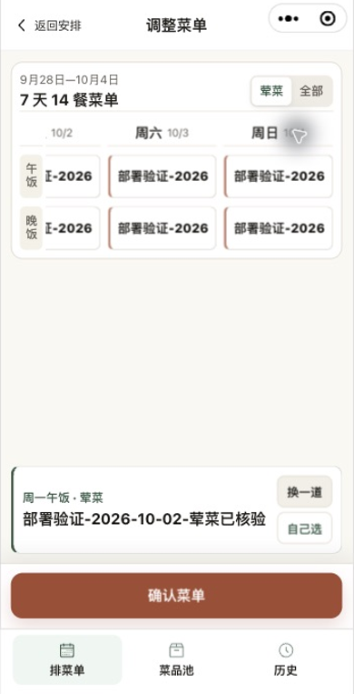
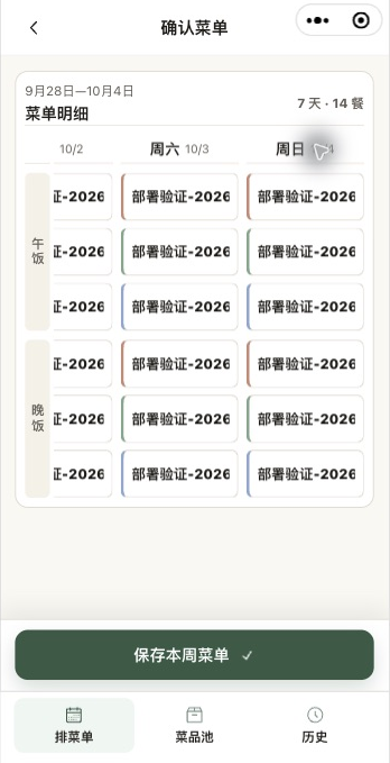

验证：新增1个Vitest回归测试、8个断言，覆盖末尾、邻近末尾、普通列、左右越界、无溢出和小数宽度；miniapp typecheck/lint、H5和WeApp构建通过。H5横向滑到末尾仍可显示完整周日。本轮未重跑全量E2E，未更新手机预览包；上述原生证据来自微信开发者工具模拟器，不等同于真机验收。
