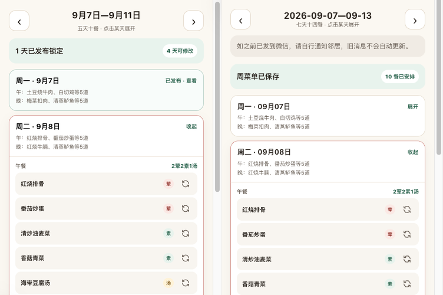
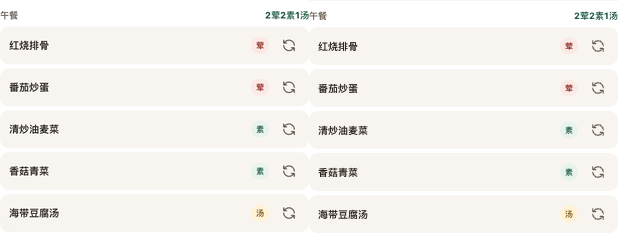

# #358 周菜单实现与原型对照

2026-09-21，PR8b/T017；代码与自检结果，未替代用户集中验收、微信真机或上线。

## 同尺寸视觉证据

来源：`ideal/docs/kith-inn/yao/prototype-implementation/prototype-taozi/index.html?step=plan`，固定提交 `cb71b2e84ac0665a288b1634096438c19b743918`。先观察生成前、逐日展开与候选面板，再复用源 CSS 数值和 RefreshCw 真实资源。未改原型文件，未引入手机外壳、系统栏、讲解区、订单或公布锁。

左原型、右实现，使用同一周二午餐菜名。原型以1280×720、DPR2完整PNG捕获，业务区x749.578125/y129.5/宽376；实现376×706、DPR1，裁掉58px H5标题栏。原型按CSS像素降采样，仅裁切合成，无内容修图。完整业务对照取376×500，排除原型外层讲解浮层。餐次对照取309×232.5（取整232）同内容区，避免新增业务状态造成纵向位移。

原始精确PNG：本机 `/tmp/kith-weeks-visual/reference-cdp.png`、`implementation-cdp.png`。最初便捷截图工具裁切发生缩放，已弃用这些中间图，改用CDP完整PNG和实测坐标。原型DPR2/实现DPR1使字符边缘存在轻微抗锯齿差异。

核对结果：内容15px内距、卡片13px圆角、7px间隔、日期12px/摘要9px、餐题9px、菜名10px、分类8px、原图标14px，保持原型配色与排列。独立审查打开两张最终成对图，未发现P1/P2视觉偏差。390×844和桌面1280px检查无横向溢出（小屏宽390/scrollWidth390，桌面业务宽最多480）。新增设置/历史/去汤及候选面板另在实际浏览器查看；不以这两张局部图证明不可见区域。

必要业务差异：七天十四位置；周末可不安排；统一数量可设置；已保存/已确认代替已发布锁定；再次编辑显示自行通知邻居提示；每餐去汤控件增加31px高度。菜名作为手选入口，旁边保留随机换菜图标。确认按钮单独吸底，其余保存/设置/取消随内容滚动，修复初版多个按钮占据底部遮挡菜位的问题。

## 行为和真实存取

- Node22.23.2、pnpm10.2.0、TZ=UTC；根 `pnpm verify` 包含42前端测试、93 API测试、37契约测试和H5/WeApp构建。API测试实际访问隔离PG17；根测试使用本任务专库，未清理共享或用户数据。
- 11条H5 E2E通过：原6条菜池加5条周菜单；跳餐/局部换菜/去汤/确认/历史重开、重排取消与不足菜失败留稿、响应丢失同键同体重试、冲突读取不覆盖直到明确载入、原汤失效重新选齐。采用受控HTTP和测试会话，日志 `/tmp/kith-weeks-e2e-final.log`。
- 真实API/PG浏览器联调：独立 `cfp_kith_weeks_browser_test`，48道菜；从菜池进入菜单，生成2026-09-21整周，周三午餐换菜并去汤，确认后数据库version1/confirmed=true/14位置/soupOmitted=true。历史入口和第二个独立测试会话读回相同结果，页面console error为0。
- 联调只替代微信身份与H5本地传输：`/tmp/kith-weeks-browser.mts`提供测试会话和HTTP桥接（3328→3330），不替代业务API或持久化；原型静态服务3327。上述端口均属于本任务，未操作用户3317/3319环境。第二测试会话不是微信双真机证据。
- 代码独立审查收敛：失效汤改用错误code判断；重登录保留草稿；跨页pending按类型与周恢复；随机/手选前刷新菜池。未保存稿只在页面内存保留，离开提示；关闭应用后不承诺草稿恢复。

复现自动化：配置新的本任务独立 `_test` 数据库运行 `pnpm verify`；`E2E_PORT=3326 pnpm --filter @cfp/kith-inn-miniapp test:e2e`使用空闲端口。真实联调脚本仅供本机测试，包含明确测试身份与独立库；重新使用应另建库，不能复制到生产。

## 下游接入

`pages/week/index.tsx` 中 `saved: WeekPlan|null` 是最近确认的服务器保存响应，`draft: MenuPreview|null` 是本地编辑；`dirty` 比較结构和14餐，`rebuild` 保留重排标记，保存使用原 `saved.version`。`save(confirm)`调用共享客户端后由`acceptWrite`收取完整保存结果；`adopt`只在初读、保存成功、明确放弃/载入时替换稿。#359应在此页面接入复制前GET，不能直接用saved缓存冒充最新；本片未添加复制UI或menu-text。

API提交 `4cdc392` 的服务层性能：1000菜、104周、3并发，各预热12次+102样本；p95读周1.38ms、列表1.21ms、生成37.43ms、写28.73ms。Apple M5/32GiB/macOS26.6.2、PG17.10 aarch64本地54325；不含HTTP/TLS/微信/公网/UI。脚本与原始输出：`/tmp/kith-weeks-perf.mts`、`/tmp/kith-weeks-perf-result.json`，#360可引用，不能算公网性能。

仍待集中产品验收、真实AppID/合法请求域名/桃子绑定、微信真机与真实跨设备验证。所有PR仅待审查，不等于已合并或上线。
