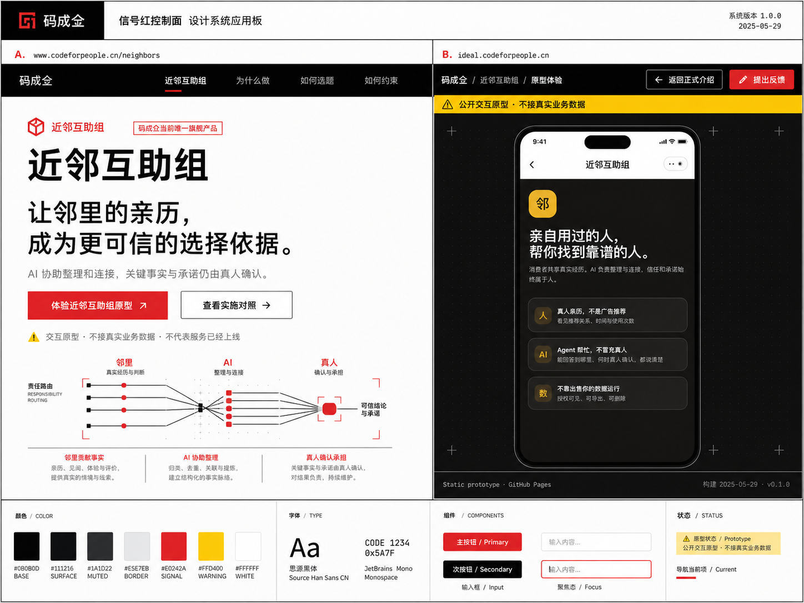

# 官网与原型承载页：设计系统方向评审

> 状态：视觉方向探索，尚未选型，不包含页面实现。

本评审用于选择一套跨主站与 `ideal` 原型区的科技公司设计语言。候选方向都假定最终以 shadcn/ui 和 Tailwind CSS 落地，但此处的图片仅表达视觉性格、信息层级和两个站点的关系，不是最终 token、组件规格或逐像素页面稿。

## 已确认的产品与部署边界

- 「码成仝」是组织与母品牌，「近邻互助组」是当前唯一旗舰产品。
- `www.codeforpeople.cn/neighbors` 承载近邻互助组唯一的正式产品介绍。
- `ideal.codeforpeople.cn` 只承载原型体验，继续通过 GitHub Pages 部署。
- 原型中手机视图内的 App 内容与交互保持不变；设计系统重构的是它外部的网页承载层。
- 两个站点共享品牌、token、组件语义、导航和状态表达，但正式介绍与原型体验必须清楚可辨。
- 首页保留问答首屏；矩阵继续保持高密度工具属性。

## 如何评审

请在 PR 中回答以下问题：

1. 哪个方向最像我们希望成为的科技公司，而不是媒体、公益组织或普通 SaaS 模板？
2. 哪个方向最能同时容纳官网首页、正式产品页、长文、矩阵和 ideal 原型舞台？
3. 正式产品介绍与原型体验的关系是否一眼可辨？
4. 哪些颜色、排版、圆角、边框或组件细节值得从其他方向组合进来？
5. 哪些特征应明确排除？

可以选择一个主方向，也可以用“以 A 为骨架，吸收 C 的配色和 D 的状态表达”这类方式反馈。

## A · 深空靛蓝系统

偏向 AI 基础设施与开发者工具：深色、精密、克制，通过靛蓝和青色表达技术信号。

**优势**：科技属性最强，正式页与深色手机原型容易形成整体舞台。

**风险**：若控制不好，可能偏开发者产品、降低普通访客的亲近感。

## B · 极昼白银系统

偏向明亮的企业软件与开发工具：白色和银灰为主，钴蓝负责动作和导航状态。

**优势**：清晰、稳定、适应长文和矩阵，shadcn/ui 落地成本较低。

**风险**：需要更强的品牌细节，避免成为通用 SaaS 模板。

## C · 钛绿协作系统

偏向以人为中心的 AI 与协作技术：钛白、石墨和深绿构成基础，薄荷绿与珊瑚色表达协助和责任。

**优势**：兼顾科技感与邻里产品的温度，正式内容和原型舞台都较自然。

**风险**：需要避免被理解为环保、健康或社区服务机构品牌。

## D · 信号红控制面

偏向系统软件与控制面：黑白高对比，以红色表示动作、路径和责任，黄色只用于原型警示。

**优势**：辨识度强，品牌状态、正式/原型边界和交互层级非常明确。

**风险**：需要控制攻击性，避免接近工业警示、政治宣传或媒体版式。

## E · 极光棱镜系统

偏向前沿 AI 与创意基础设施：珍珠白和午夜蓝为底，紫色与青色光谱只用于连接和状态。

**优势**：前沿、轻盈，能明显摆脱现有官网风格，同时保留技术可信度。

**风险**：渐变和透明层若使用过量，会显得概念化或落入常见 AI 品牌套路。

## F · 熔岩橙模块系统

偏向产品工程与软硬件结合：瓷白和碳黑形成结构，橙色负责激活，冰蓝与酸橙承担信息和成功状态。

**优势**：模块关系清楚、识别度高，适合展示“邻里事实—AI 整理—真人确认”的责任链。

**风险**：需要避免过度工业化，也要防止多种强调色互相竞争。

## 评审后再做什么

选定方向后，下一步先产出而不是直接改页面：

1. 固化语义 token、字体、间距、圆角、边框、阴影和交互状态；
2. 定义 shadcn/ui 组件变体与完整/紧凑公共壳层；
3. 补齐官网首页、`/neighbors`、矩阵和 ideal 原型承载页的桌面与移动视觉稿；
4. 再按任务逐项提交实现计划，确认后开始代码改造。

## 图片使用说明

这些图片由生成式工具制作，只用于方向评审。图片里的示意 logo、日期、少量文字、颜色数值和组件尺寸可能存在生成误差，不应直接当作产品事实或实现规格；最终内容以已经关闭的 Wayfinder 决策和后续设计系统规范为准。
