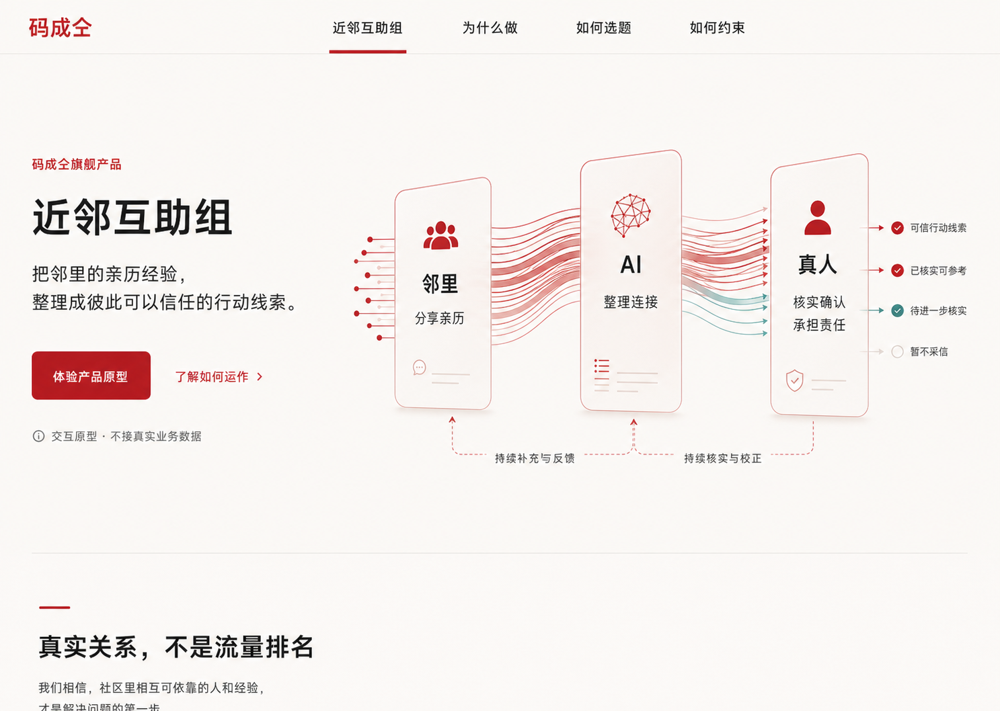

# 官网与原型承载页：设计系统方向评审

> 状态：视觉方向探索，尚未选型，不包含页面实现。

本轮根据评审反馈，收敛为三套“公益红”方向：用可信、克制的红色表达公共行动与责任，同时保留科技公司的信息秩序。三套方案都以近邻互助组正式介绍页的同一首屏内容为比较基准，并保留「邻里 → AI → 真人」的信息流可视化。

候选方向都假定最终以 shadcn/ui 和 Tailwind CSS 落地，但此处的图片仅表达视觉性格、信息层级和两个站点的关系，不是最终 token、组件规格或逐像素页面稿。

## 已确认的产品与部署边界

- 「码成仝」是组织与母品牌，「近邻互助组」是当前唯一旗舰产品。
- `www.codeforpeople.cn/neighbors` 承载近邻互助组唯一的正式产品介绍。
- `ideal.codeforpeople.cn` 只承载原型体验，继续通过 GitHub Pages 部署。
- 原型中手机视图内的 App 内容与交互保持不变；设计系统重构的是它外部的网页承载层。
- 两个站点共享品牌、token、组件语义、导航和状态表达，但正式介绍与原型体验必须清楚可辨。
- 首页保留问答首屏；矩阵继续保持高密度工具属性。

## 如何评审

请在 PR 中回答以下问题：

1. 哪个方向最像“有公共使命的科技公司”，而不是传统公益海报、媒体页面或普通 SaaS 模板？
2. 哪个方向最能同时容纳官网首页、正式产品页、长文、矩阵和 ideal 原型舞台？
3. 红色传达的是信任、公共行动与责任，还是危险、宣传或促销？
4. 「邻里 → AI → 真人」是否一眼可懂，是否清楚表达 AI 不替代真人承诺？
5. 哪些排版、信息流、圆角、边框或组件细节值得组合，哪些特征应明确排除？

可以选择一个主方向，也可以用“以 A 为骨架，吸收 C 的信息图密度”这类方式反馈。

## A · 克制公益红

白色与暖灰形成正式、安静的公共机构底色，深暖红承担品牌、行动与责任状态；信息图是首屏主角，但不抢走产品定义。

**优势**：最稳健，适合官网、长文和产品正式介绍；组件结构也最容易沉淀为通用设计系统。

**风险**：如果品牌细节不足，可能显得过于克制，公益组织的行动气质不够鲜明。

## B · 社区行动红

用一块强而温暖的红色叙事面承载产品定义，把邻里输入、AI 整理、真人确认画成汇聚与行动的连续过程。

**优势**：辨识度和公共行动感最强，能让邻里关系与技术机制同时被看见。

**风险**：需要收紧印章、纹理与大面积红色，避免落入活动海报或宣传视觉。

## C · 理性数据红

用技术网格、路径与检查点把责任链展开，红色表示未经真人确认的信息流，少量青绿只表示确认后的输出。

**优势**：科技属性最清楚，AI 的作用与真人责任边界表达得最具体，也适合延展到矩阵工具。

**风险**：信息密度最高，需要在后续移动稿中主动简化，避免把正式介绍页做成工程控制台。

## 评审后再做什么

选定方向后，下一步先产出而不是直接改页面：

1. 固化语义 token、字体、间距、圆角、边框、阴影和交互状态；
2. 定义 shadcn/ui 组件变体与完整/紧凑公共壳层；
3. 补齐官网首页、`/neighbors`、矩阵和 ideal 原型承载页的桌面与移动视觉稿；
4. 再按任务逐项提交实现计划，确认后开始代码改造。

## 图片使用说明

这些图片由生成式工具制作，只用于方向评审。图片里的示意 logo、日期、少量文字、颜色数值和组件尺寸可能存在生成误差，不应直接当作产品事实或实现规格；最终内容以已经关闭的 Wayfinder 决策和后续设计系统规范为准。
