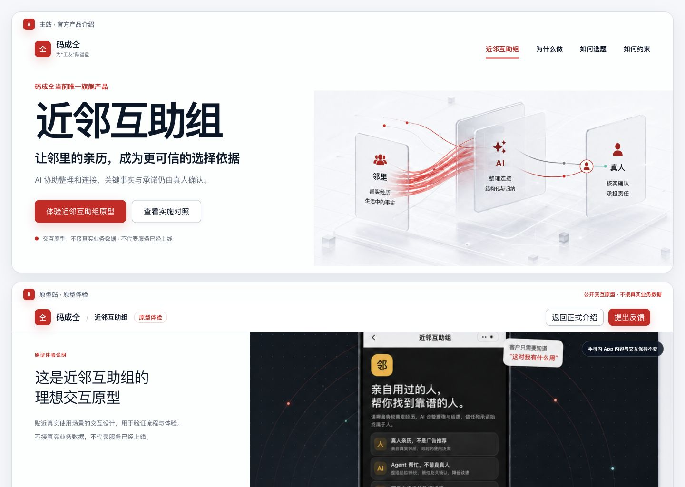
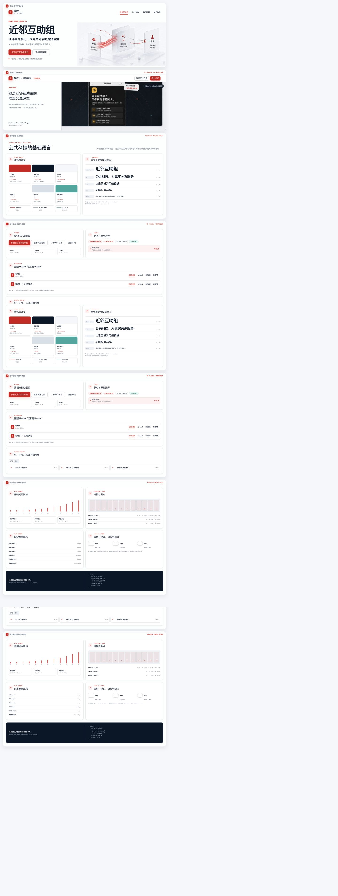
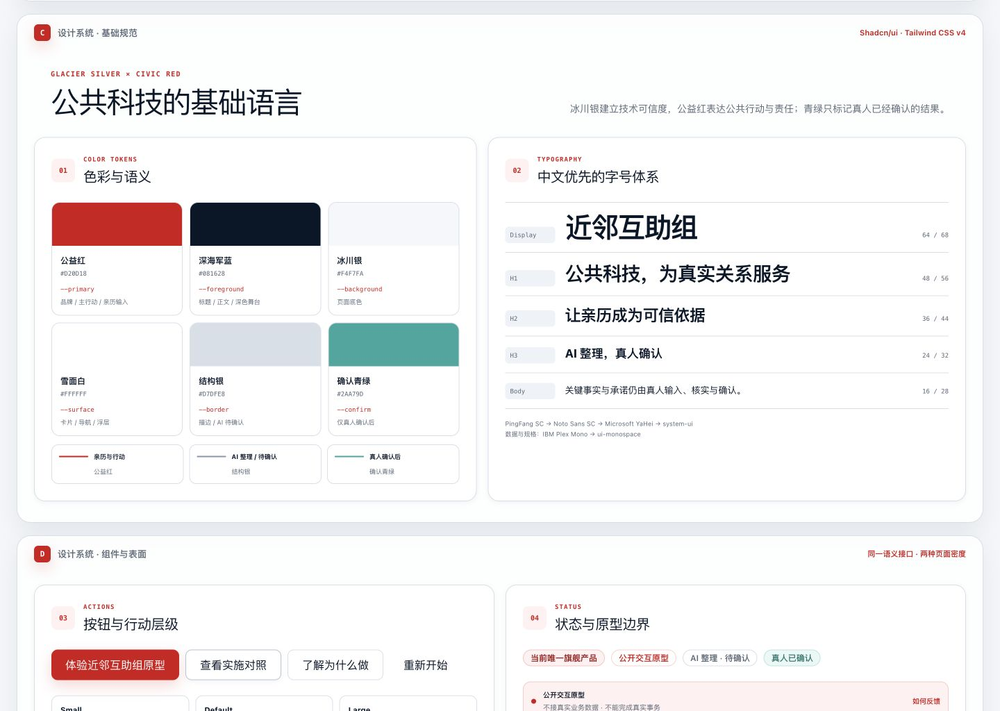
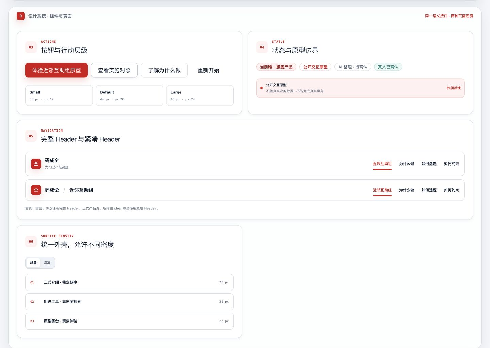
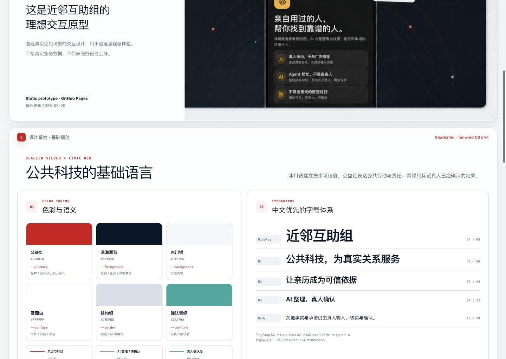
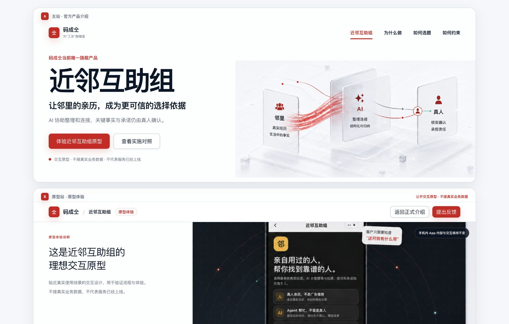
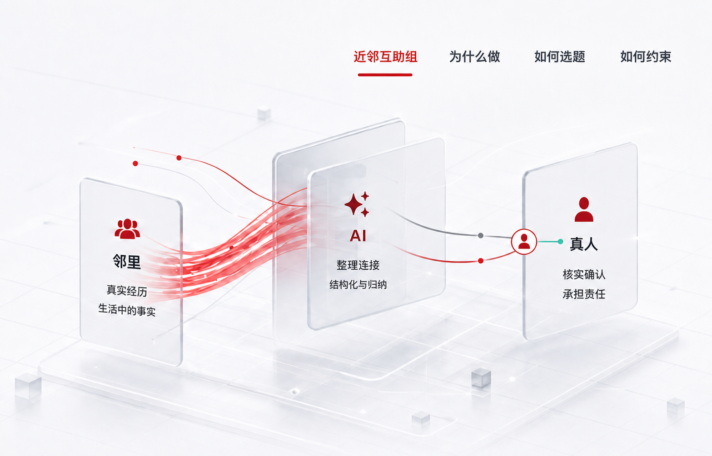

# 码成仝公共科技设计系统：已选定方向

> 状态：视觉方向与设计系统已确认，用于后续官网和 ideal 原型承载页实施；本 PR 不包含生产页面改造。

本目录只保留最终选定方案。此前的 Codex、Kimi 候选方向、颜色变体和信息流变体已从当前 PR 文件树移除。

## 最终方向

- 视觉基调：冰川银白表面、深海军蓝文字、克制的公益红、细银色结构线与轻量科技纵深。
- 公益红承担母品牌、主行动、亲历输入与待真人确认的责任，不被默认解释为错误状态。
- 「邻里 → AI」保留多源红色亲历线束；「AI → 真人」收束为银灰与暖红两条轨道；青绿只出现在真人确认之后。
- 主站承载近邻互助组正式介绍；ideal 子域继续通过 GitHub Pages 承载原型体验。
- ideal 重构的是手机 App 外部承载页；手机内既有内容与交互保持不变。
- 基础组件以 shadcn/ui 语义接口、Radix 行为、Tailwind CSS v4 与 CVA variants 落地。

## A/B 页面方向

上半部分 A 是官网正式产品介绍；下半部分 B 是 ideal 原型承载页。两者共享品牌、导航、状态和组件规则，但承担不同任务。

## 连续原型页面

原型不是独立的设计文档门户。A/B 页面之后继续在同一视觉系统中展示色彩、字体、组件、间距和响应式规格。

## 设计系统规格

### 色彩与字体

### 组件与页面表面

### 像素与响应式规则

### 320px 移动视图

## 最终 Banner

Banner 在本 PR 中仍是构图与色彩参考。生产实现必须导出不含栅格化导航和正文的插画资产，所有可读界面文字继续由 HTML 渲染。

## 规格与验证

- [完整设计系统规范](./DESIGN_SYSTEM.md)
- [视觉对照与 QA 记录](./design-qa.md)

## 实施边界

- 本 PR 只固定视觉方向、语义 token、组件规格、Banner 语法和主站/ideal 的应用关系。
- 不包含官网、Payload、矩阵或 ideal 生产代码改造。
- 不包含手机 App 内部 UI 改造、正式 logo 重绘或严格 WCAG 认证。
- 后续每个实现任务仍需在动手前提交独立实施计划并通过 review。

相关：#330、#338、#340
