# 官网与原型承载页：设计系统方向评审

> 状态：视觉方向探索，尚未选型，不包含页面实现。

本评审保留全部 13 张候选稿，按来源和轮次分为三组：Codex 第一轮 6 张、Codex 公益红第二轮 3 张、Kimi HTML + Tailwind 4 张。当前不删除任何方向，评审者可以选择单一方案，也可以组合不同方案的排版、配色和信息流表达。

所有方向都假定最终以 shadcn/ui 和 Tailwind CSS 落地。图片只表达视觉性格、信息层级和两个站点的关系，不是最终 token、组件规格或逐像素页面实现。

## 已确认的产品与部署边界

- 「码成仝」是组织与母品牌，「近邻互助组」是当前唯一旗舰产品。
- `www.codeforpeople.cn/neighbors` 承载近邻互助组唯一的正式产品介绍。
- `ideal.codeforpeople.cn` 只承载原型体验，继续通过 GitHub Pages 部署。
- 原型中手机视图内的 App 内容与交互保持不变；设计系统重构的是它外部的网页承载层。
- 两个站点共享品牌、token、组件语义、导航和状态表达，但正式介绍与原型体验必须清楚可辨。
- 首页保留问答首屏；矩阵继续保持高密度工具属性。

## 如何评审

请在 PR 中回答：

1. 哪个方向最像“有公共使命的科技公司”，而不是传统公益海报、媒体页面或普通 SaaS 模板？
2. 哪个方向最能同时容纳官网首页、正式产品页、长文、矩阵和 ideal 原型舞台？
3. 红色是否传达信任、公共行动与责任，而非危险、宣传或促销？
4. 「邻里 → AI → 真人」是否一眼可懂，是否清楚表达 AI 不替代真人承诺？
5. 哪些排版、信息流、圆角、边框或组件细节值得组合，哪些特征应明确排除？

可以选择一个主方向，也可以用“以 Kimi D 的排版为骨架，吸收 Codex R2 C 的信息图语义”这类方式反馈。

---

## Codex · 第一轮广泛探索

这一轮探索不同类型科技公司的视觉性格。它们继续保留在 PR 中，作为风格边界和可复用细节的对照。

### Codex R1 A · 深空靛蓝系统

偏向 AI 基础设施与开发者工具：深色、精密、克制，通过靛蓝和青色表达技术信号。

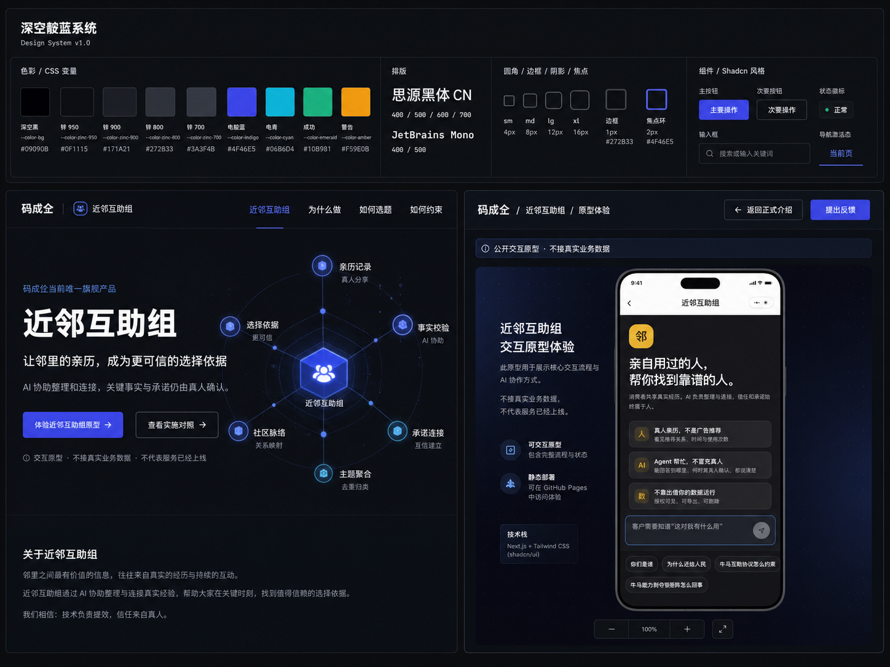

### Codex R1 B · 极昼白银系统

偏向明亮的企业软件与开发工具：白色和银灰为主，钴蓝负责动作和导航状态。

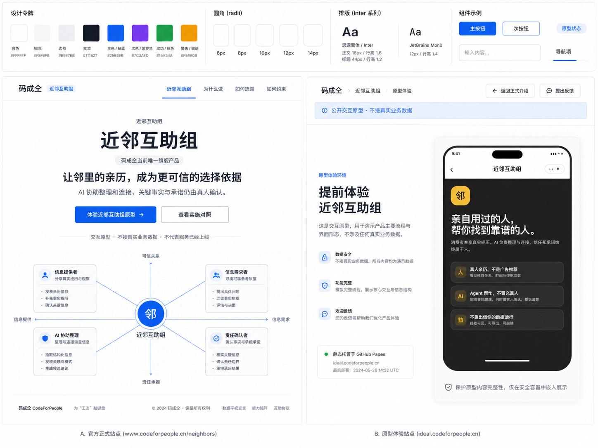

### Codex R1 C · 钛绿协作系统

偏向以人为中心的 AI 与协作技术：钛白、石墨和深绿构成基础，薄荷绿与珊瑚色表达协助和责任。

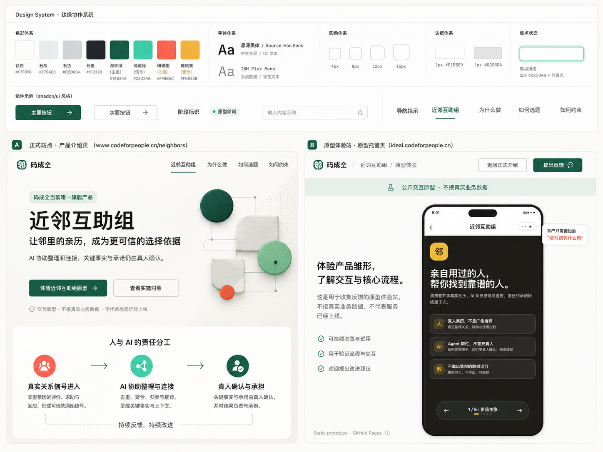

### Codex R1 D · 信号红控制面

偏向系统软件与控制面：黑白高对比，以红色表示动作、路径和责任，黄色只用于原型警示。

### Codex R1 E · 极光棱镜系统

偏向前沿 AI 与创意基础设施：珍珠白和午夜蓝为底，紫色与青色光谱只用于连接和状态。

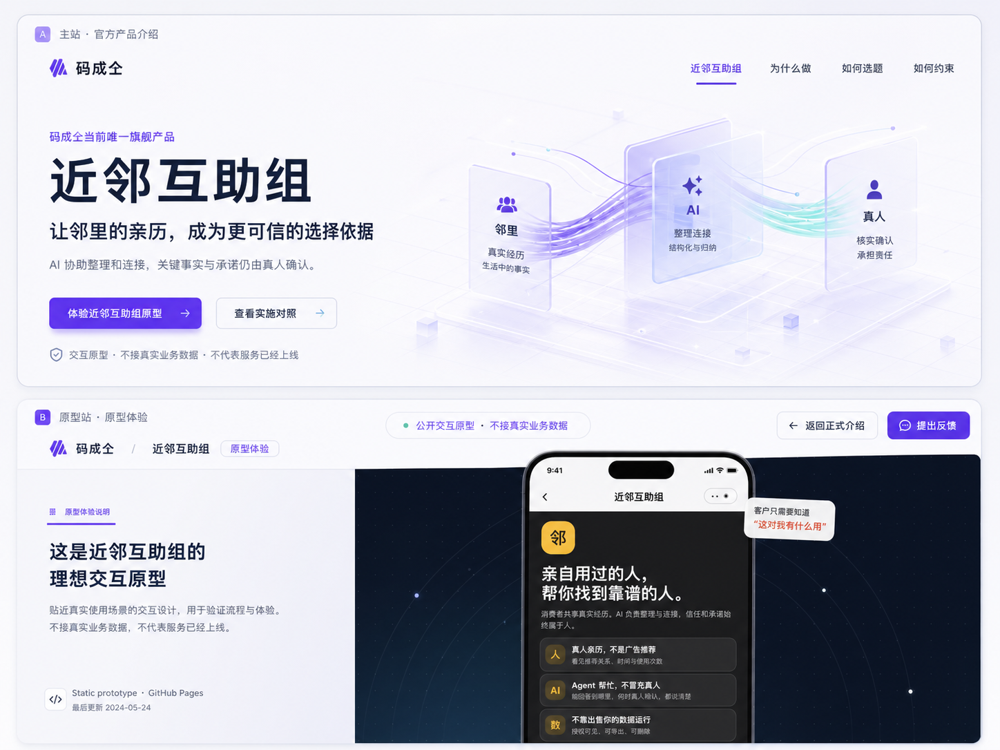

### Codex R1 F · 熔岩橙模块系统

偏向产品工程与软硬件结合：瓷白和碳黑形成结构，橙色负责激活，冰蓝与酸橙承担信息和成功状态。

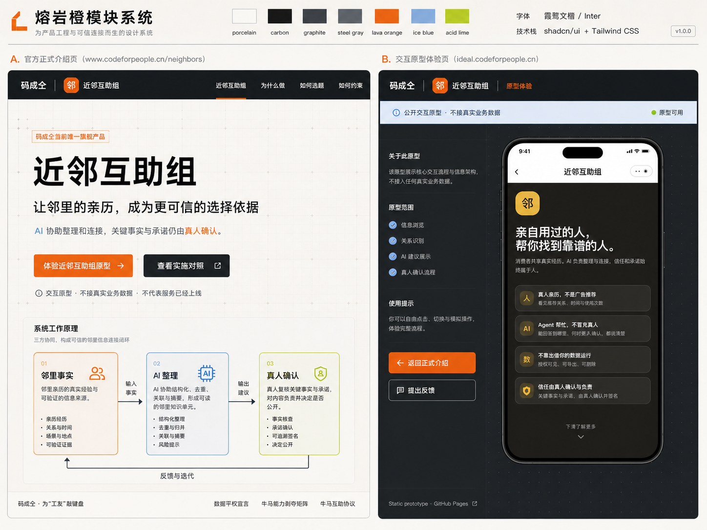

---

## Codex · 公益红第二轮

这一轮根据“公益类红色 + 保留信息流可视化”的反馈生成，三张图均以相同的正式产品介绍首屏作为比较基准。

### Codex R2 A · 克制公益红

白色与暖灰形成正式、安静的公共机构底色，深暖红承担品牌、行动与责任状态；信息图是首屏主角，但不抢走产品定义。

### Codex R2 B · 社区行动红

用一块强而温暖的红色叙事面承载产品定义，把邻里输入、AI 整理、真人确认画成汇聚与行动的连续过程。

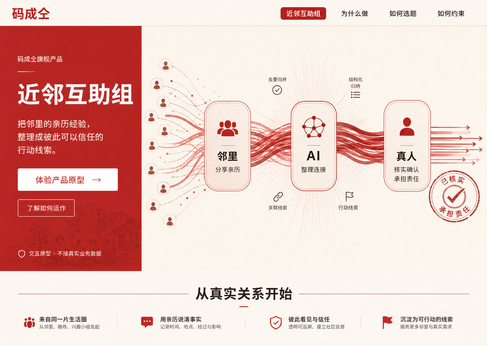

### Codex R2 C · 理性数据红

用技术网格、路径与检查点把责任链展开，红色表示未经真人确认的信息流，少量青绿只表示确认后的输出。

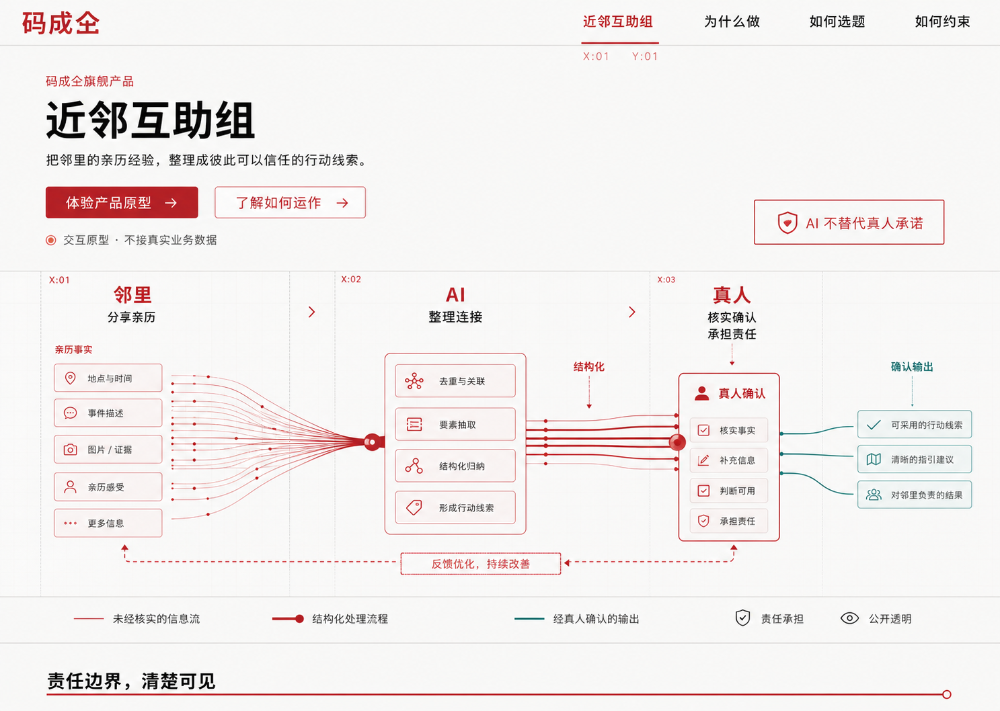

---

## Kimi · HTML + Tailwind 视觉探索

Kimi K3 本身没有图片输出能力，因此这一组由 Kimi 生成高保真 HTML + Tailwind 稿，再由 headless Chromium 渲染为 1440×1024 的 2× PNG。中文、栅格和组件均为真实网页排版，但这些 HTML 仍是临时视觉稿，不是官网实现；本 PR 只收录评审 PNG。

### Kimi A · 公共机构 × 科技产品

暖白底与瑞士网格，红色集中在品牌、CTA、当前导航和责任链；整体最安静稳健。

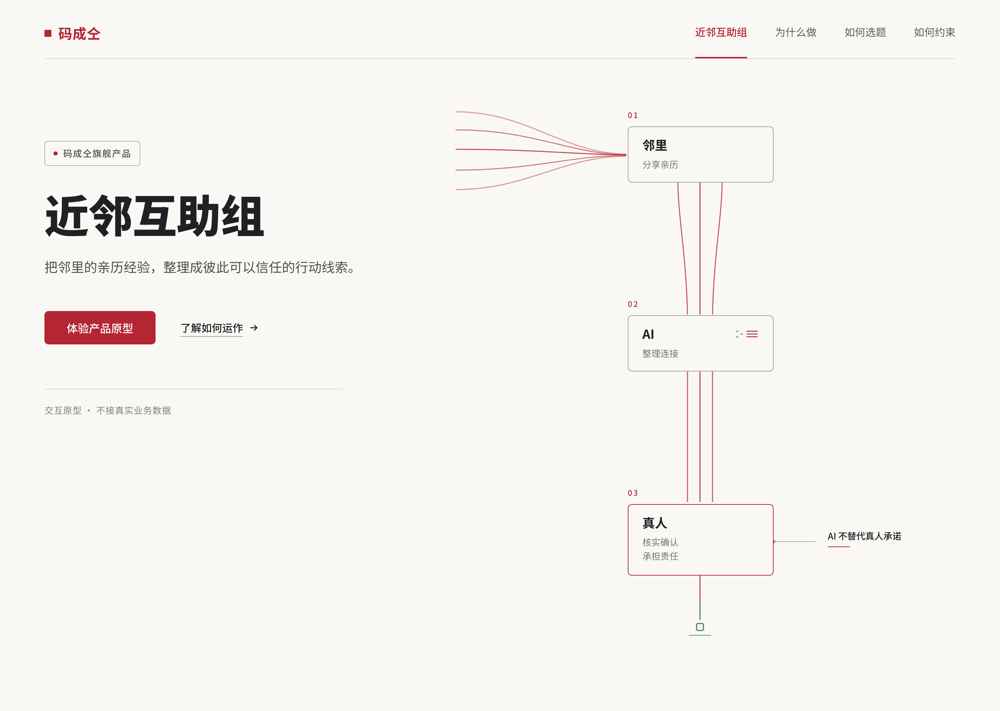

### Kimi B · 社区关系 × 行动汇聚

右侧大面积公益红承载信息流，白色线束从邻里输入汇聚到 AI 与真人确认；集体行动感与辨识度最强。

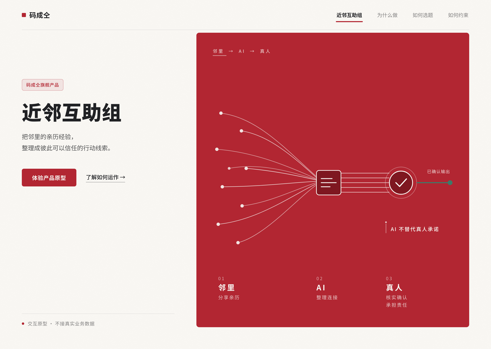

### Kimi C · 责任基础设施 × 数据透明

使用坐标网格、图例和检查点明确区分红色未确认信息与青绿确认输出；AI 与真人的责任边界最清楚。

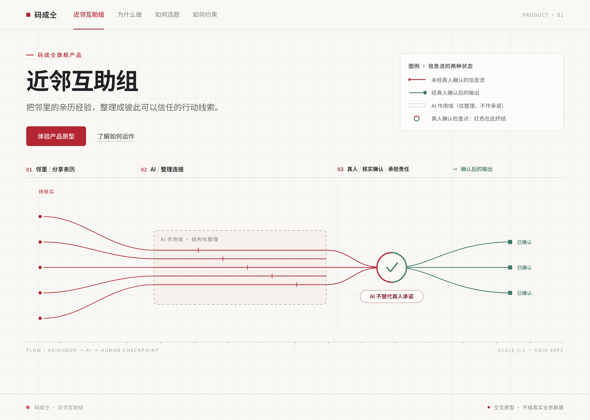

### Kimi D · 中国现代主义 × 公共叙事

用大比例中文标题、规则线和通栏线性信息流建立独特的中国品牌辨识度与公共叙事感。

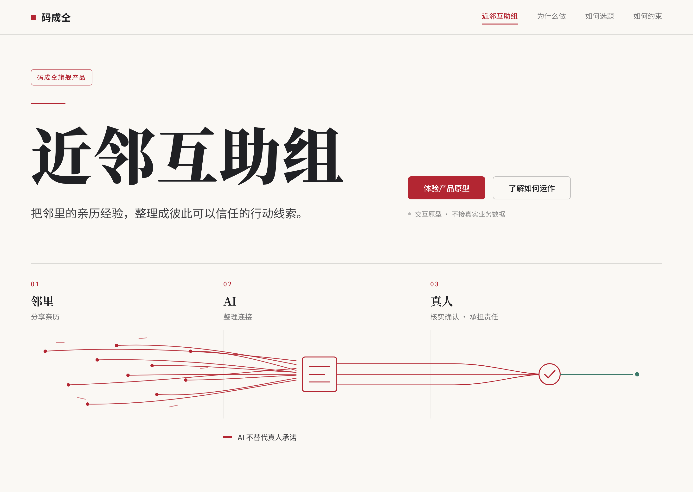

---

## Codex · 选定方向细化

在双层主站/原型站构图基础上，另有三张“科技感 × 公益红”色调方案和三张 banner 信息流方案。六张图放在独立目录中，不替换上述任何候选方向。

[查看六张 Codex 细化稿](./codex-refinements/README.md)

## 评审后再做什么

选定方向后，下一步先产出设计规格与页面视觉稿，而不是直接改页面：

1. 固化语义 token、字体、间距、圆角、边框、阴影和交互状态；
2. 定义 shadcn/ui 组件变体与完整/紧凑公共壳层；
3. 补齐官网首页、`/neighbors`、矩阵和 ideal 原型承载页的桌面与移动视觉稿；
4. 再按任务逐项提交实施计划，确认后开始代码改造。

## 图片使用说明

Codex 图片由生成式图片工具制作；Kimi 图片由 HTML + Tailwind 视觉稿渲染。全部图片只用于方向评审。示意文字、颜色数值和组件尺寸不应直接当作产品事实或实现规格；最终内容以已经关闭的 Wayfinder 决策和后续设计系统规范为准。
