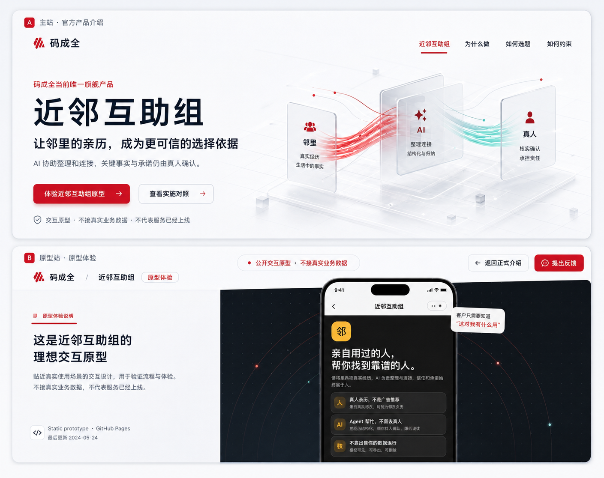
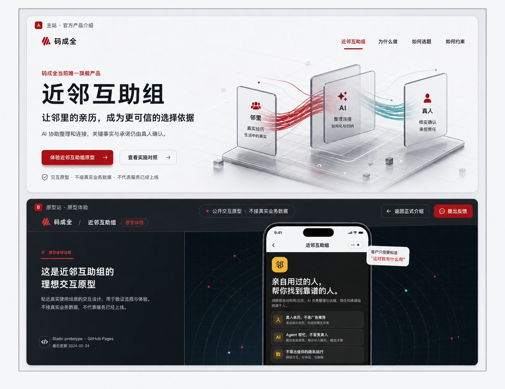
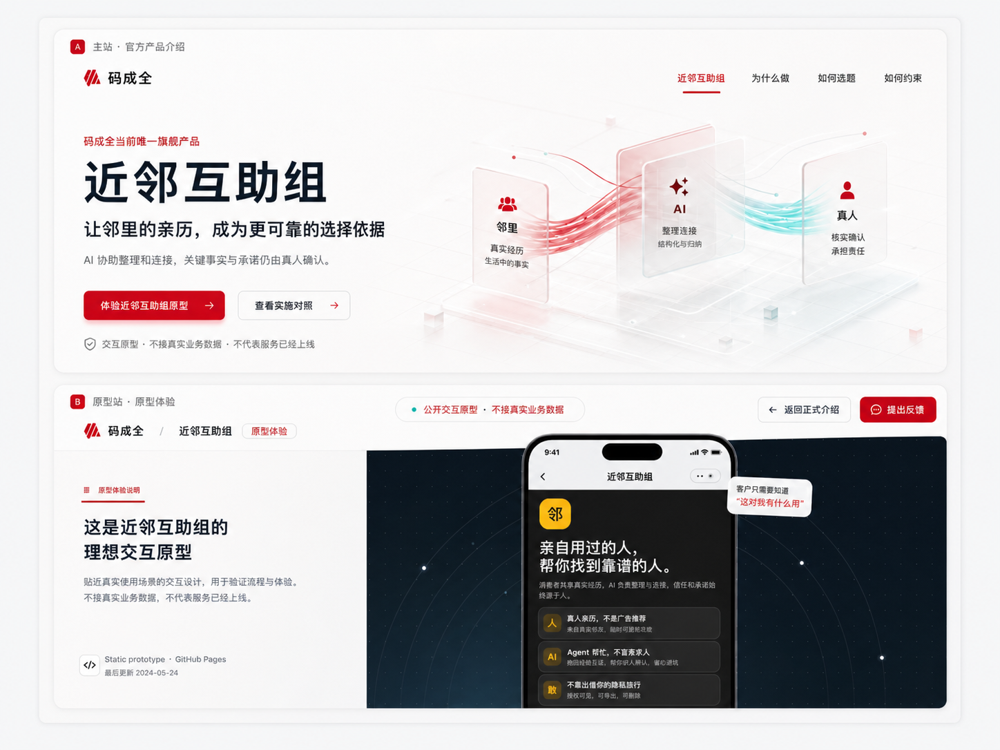
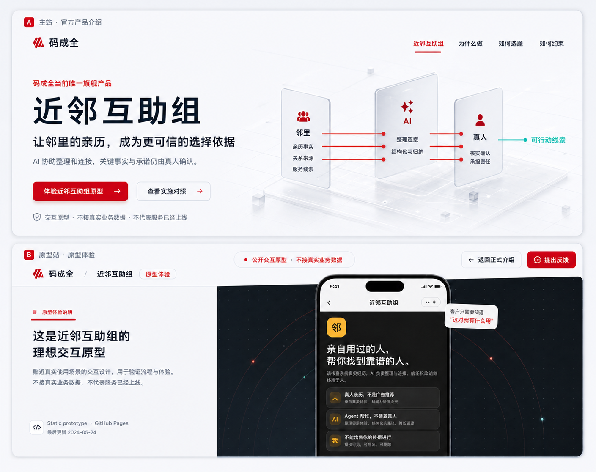
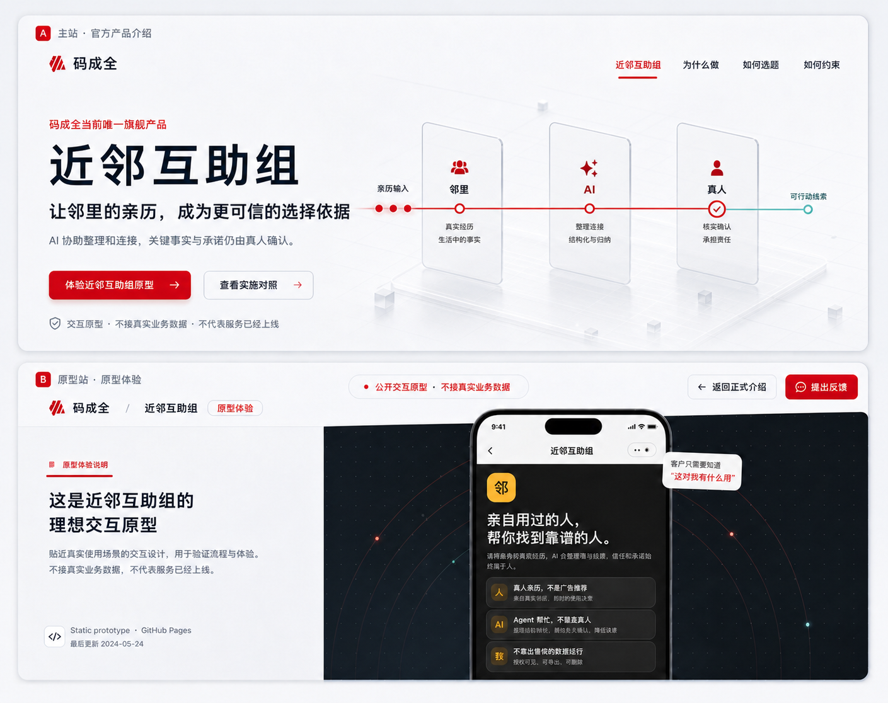

# Codex · 选定方向细化稿

> 状态：在同一双层主站/原型站构图上的视觉细化，尚未选型，不包含页面实现。

这一组共六张，分为三张色调方案和三张 banner 信息流方案。色调稿比较“科技感 × 公益红”的不同平衡；信息流稿统一使用“冰川银 × 公益红”底稿，只改变「邻里 → AI → 真人」的表达方式。

## 色调方案

### Color A · 冰川银 × 公益红

冷白和银灰建立科技底色，深暖红承担品牌、行动与责任，真人确认后的输出使用少量青绿。

### Color B · 石墨夜幕 × 绯红

主站保持明亮，原型承载区使用蓝黑石墨色；绯红负责品牌与交互路径，科技属性最强。

### Color C · 珍珠白 × 红青光谱

保留轻盈、通透的棱镜质感，以公益红替代紫色，青色仅表示经过真人确认后的状态。

## Banner 信息流方案

### Flow A · 三轨责任链

用「亲历事实 / 关系来源 / 服务线索」三条平行轨道通过 AI 整理，在真人确认后汇成一条可行动线索。

### Flow B · 邻里节点汇聚

四个邻里亲历节点汇入一个整理主干，经过 AI 后进入真人确认节点，再形成已确认输出。

### Flow C · 单线证据脉冲

用一条责任主线和三个阶段检查点表达状态变化：亲历输入、AI 整理、真人确认、可行动输出。

## 评审建议

色调和信息流可以分别选择，例如“Color B + Flow C”。选定组合后，再以同一规则补齐首页、正式产品页、长文、矩阵和 ideal 原型承载页的页面级视觉稿。

## 图片使用说明

六张图片均由 Codex 使用生成式图片工具制作，只用于方向评审。示意文字、颜色和尺寸不应直接当作实现规格。
