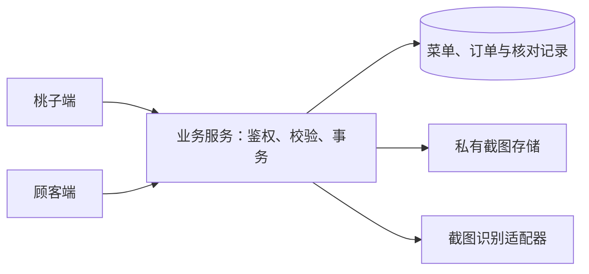

# 街坊味（Kith Inn）技术规格

版本：v0.2 · 更新时间：2026-09-13 · 依据：[PRD v0.5](PRD.md)、[用户故事 v0.2](USER-STORIES.md) · 状态：技术设计草案，待评审

本文说明如何承载新版需求。PRD 中已确认的业务规则是约束；本文的数据结构、事务和接口是建议方案，尚未实现或部署。第 10 节列出进入对应功能开发前需要完成的决定，不把旧工程、演示原型或本稿当成已经可用的系统。

当前把数据实体、业务规则、接口和工程方案写在同一份技术规格中。字段名与路径用于评审，物理表结构及接口 schema 在对应功能规格中落定；不复制归档中的数据模型。

本稿要解决的问题是：让桃子安排的一周菜单可靠保存，并让公布后的菜单、订餐份数、配送和核对记录保持一致。技术评审重点是写入一致性、访问归属、历史快照和失败恢复；首版业务范围沿用 PRD 第 3 节。

阅读时区分三层：PRD 已定规则必须满足；本稿标为“建议”的设计需要工程评审；Q／T 项必须按第 10 节完成对应决定。文档由工程实施方维护，产品取舍由发起人与桃子确认；具体实施负责人和评审人在首个功能规格中登记，不以本稿署名代替实际认领。

## 1. 当前工程事实

v0.1 发布时核对的 `origin/main` 基线为 `36bc8f2395dcf4463b1a8f8ae6cb4c4e1c0f26bc`，下表记录该次工程事实。v0.2 整理设计与评审意见，不重新声明线上工程或数据库状态；实际实施前须刷新目标分支和环境证据。

| 对象 | 证据与结论 | 对新版的影响 |
| --- | --- | --- |
| 仓库工具链 | [根 package.json](https://github.com/code-for-people-2026/cfp-mono/blob/36bc8f2395dcf4463b1a8f8ae6cb4c4e1c0f26bc/package.json) 使用 pnpm 10.2.0、Turborepo、TypeScript；提供 lint、typecheck、test、build 和 verify | 可以承接工程规范，不需要为文档阶段安装或升级依赖 |
| 已核对工程基线 | `origin/main` 已无旧 Kith 前后端和 CMS 源码；现有应用包括官网、社区做饭小程序及 Weekly Menu 后端 | v0.1 发布了新文档并归档三个旧原型；本稿继续沿用新版业务边界 |
| 可参考的现有工程 | [community-cooking 依赖](https://github.com/code-for-people-2026/cfp-mono/blob/36bc8f2395dcf4463b1a8f8ae6cb4c4e1c0f26bc/apps/community-cooking/package.json)提供 Taro + React 工程，[weekly-menu-be 依赖](https://github.com/code-for-people-2026/cfp-mono/blob/36bc8f2395dcf4463b1a8f8ae6cb4c4e1c0f26bc/apps/weekly-menu-be/package.json)提供另一产品的后端实现 | 仅评估构建及基础能力；其业务与部署不能作为新版 Kith 后台已经可用的证据 |
| 旧分支历史 | `33d4c27` 中的[旧前端](https://github.com/code-for-people-2026/cfp-mono/blob/33d4c275e96ae35d2799910516fc2ccc307bcb23/apps/kith-inn-fe/package.json)、[旧后端](https://github.com/code-for-people-2026/cfp-mono/blob/33d4c275e96ae35d2799910516fc2ccc307bcb23/apps/kith-inn-be/package.json)及[旧 CMS 配置](https://github.com/code-for-people-2026/cfp-mono/blob/33d4c275e96ae35d2799910516fc2ccc307bcb23/apps/cms/payload.config.ts)保留历史实现与两套旧 collections | 这些是固定提交的历史引用，旧状态、数据模型及 CMS 装配不作为实施基线 |
| 数据库清理记录 | 本地 2026-09-09 核对记录记载旧业务表已清理，官网数据和 CMS 基础表保留；该操作记录未随本次仓库发布 | 属历史讨论依据，不能代替当前环境核验；实施前只读确认真实表结构和迁移历史，不重跑旧清理脚本或重建旧表 |
| 排菜工具 | [menu-core](https://github.com/code-for-people-2026/cfp-mono/blob/36bc8f2395dcf4463b1a8f8ae6cb4c4e1c0f26bc/packages/menu-core/src/generator.ts)采用固定 `bigMeat / smallMeat / vegetable`，没有本版的可变荤素汤数量 | 不能直接拿它生成新版菜单；仅可参考随机源可注入、纯函数等组织方法 |
| 质量门禁 | [CI 配置](https://github.com/code-for-people-2026/cfp-mono/blob/36bc8f2395dcf4463b1a8f8ae6cb4c4e1c0f26bc/.github/workflows/ci.yml)使用 PostgreSQL 17、根 verify、部署契约检查与受影响应用 E2E | 实施时按目标分支运行门禁；通过仓库检查不代表新版业务已实现或经过真机验收 |

指定原型仅用于行为与页面对照。其内部数组、模拟状态及本地演示识别结果，不是持久化、鉴权或真实识别服务。

## 2. 建议的系统组成与取舍

建议采用一个微信小程序、一个承载业务规则的服务、一个事务数据库，以及私有截图存储。菜单、订餐、配送和核对先按服务内部模块组织，不因模块不同拆成多个后端服务。



| 层次 | 建议及职责 | 决策状态 |
| --- | --- | --- |
| 小程序 | 优先评估仓库已有的 Taro + React 构建能力；按角色展示页面。H5 可用于预览与部分自动化验证 | 框架、版本和承载目录待 T1，不直接恢复旧前端 |
| 业务服务 | 统一执行权限、状态流转、金额计算和写入校验；只有服务端可决定业务写入是否成功 | 服务边界为本稿建议；是否使用 Payload 承载，或采用其他已有服务基础，待 T1 |
| 数据库 | 建议使用 PostgreSQL 的事务和唯一约束维护份数、订单归属及状态一致性 | 数据库版本、命名空间、访问层和迁移工具待 T1 |
| 图片与识别 | 原图私有保存；识别只返回候选信息，经过服务端校验后更新截图项 | 存储位置、识别供应方及数据处理条件待 T4、T5 |

Taro 的多端支持可参考[官方介绍](https://docs.taro.zone/docs/)；是否选用它仍须结合目标分支和微信真机验证。本稿不指定新的云资源、域名或数据库连接。

下表是工程评审的起点，不是已经完成的选型。每个推荐都要以目标分支证据和最小验证支持；不满足条件时回到相应 T 项调整。

| 设计问题 | 当前建议及理由 | 对照方案与代价 | 定稿所需证据 |
| --- | --- | --- | --- |
| 服务如何组织 | 一个业务服务内组织模块，让容量、订单及退款记录共用写入边界 | 独立服务需要另外设计跨服务一致性和故障恢复；目前尚无必须独立部署的需求 | T1 核对现有承载能力、维护方式及部署边界 |
| 是否复用既有框架 | 先评估已有 Taro + React 工程和后端基础，减少新建装配工作 | 新建原生小程序或独立后端也是候选；要比较关键页面验证、可复用代码和迁移维护工作量 | T1 提交候选比较；T2 验证登录、分享、文件选择与恢复，不能只看 H5 |
| 连续订餐何时形成明细 | 生效时一次形成至多 180 个单餐明细，使容量和取消统一从明细计算 | 按需或分批形成明细也可评估，但需额外说明未来容量如何预留，以及补建、重试如何避免漏算 | Q4 明确冲突政策后，用真实事务验证整批生效与失败回滚 |
| 截图识别如何执行 | 先保存原图和待处理项，再调用识别适配器，失败保留人工核对入口 | 独立队列可用于异步任务，但会增加任务运行和监控的维护内容；是否需要由实际等待和失败情况决定 | T3、T4 测量单图及批量耗时，验证中断、重试和旧结果晚到 |

数据库访问层、凭据与识别供应方尚无足够比较证据，由 T1、T2、T4 产出具体选择；本稿不把列出的候选写成既有依赖。

## 3. 角色与订单访问

### 3.1 识别与业务身份分开

使用内部 `subjectId` 表示已识别的访问主体，使用 `customerId` 表示桃子认识的顾客档案。称呼、手机号和地址都是业务信息，不能作为身份凭据。未关联的代下档案可以先存在，但不会因此允许任何卡片接收人查看详情。

首版只有桃子一个经营账号。经营权限必须由服务端授予，顾客请求不能自行传入角色或提升权限。顾客自助创建订单时，所属顾客从会话解析，不接受客户端任意指定订单所有者。

具体登录和恢复方式尚未选定。微信小程序登录标识与服务端会话可作为候选，也可以评估其他可恢复的访问凭据；不把 OpenID、手机号验证或实名注册写成已经确认的方案。任何持久访问标识都按用户关联数据保护。T2 须在账户与订单功能开发前确定。

### 3.2 权限表

| 对象或动作 | 桃子 | 顾客／订单卡接收人 |
| --- | --- | --- |
| 菜品池、内部周菜单、截图原图与经营核对清单 | 可按业务规则操作 | 不开放 |
| 已公布餐次菜单 | 可查看 | 可以从预订入口查看；页面不返回订单名单或收餐信息 |
| 普通自助订单 | 可查看并按权限调整 | 本人可查看；仅本人直接创建且未截止时可自助修改或取消 |
| 代下订单 | 可创建、关联及按权限调整 | 确认关联前不可看详情；确认后本人可查看，修改仍联系桃子 |
| 连续订餐 | 可代建、审核、确认付款、生效与调整 | 本人可申请和查看，不能自行批量停止 |
| 退款项 | 可查看；连续订餐误点确认可更正 | 仅本人可查看并确认收到 |

请求入口、单条详情、列表、统计、图片读取和写接口均须执行权限校验，不能只隐藏前端按钮。无权访问时不回传顾客是否存在、地址、金额或截图等详情。

顾客侧餐次响应按 PRD 5.3 返回日期、午晚餐、已公布菜品、单价、截止时间和精确剩余份数；不能为了隐藏内部统计而擅自改成余量档位。建议按允许字段构造响应，不直接序列化经营对象：其他人的订单、收餐信息、自家份数和截图不返回；顾客人数、订单数、已订总份数未被列为顾客展示要求，不额外透出。必要时新增聚合字段应先补产品用途与访问规则，不能把份数等同于人数。

### 3.3 代下关联

订单卡只携带发起关联所需的不可猜测引用，不携带地址、电话或可直接读取详情的访问令牌。顾客提交关联请求后，桃子确认该请求与代下顾客档案的对应关系，再建立访问关联。卡片本身不能成为授权依据。

确认时再次检查档案当前归属，防止并发请求覆盖已确认关联；保留确认人、时间和关联对象。重复档案合并、错误关联的纠正方式依赖 Q5，冲突时不得静默合并或向另一主体开放数据。

## 4. 数据结构建议

### 4.1 通用约定

- 标识使用不含称呼、手机号等信息的内部 ID。业务日期保存为日期值，操作时间保存为带时区时间；建议按 `Asia/Shanghai` 解释供餐日与截止时间，随 T1 核定。
- 金额以整数分保存、以元展示；单价在订单形成或连续订餐生效时保存快照，不使用浮点金额或把原型中的 30 元写成常量。
- 份数为正整数，自家份数可为 0。连续天数和每餐份数按 PRD 的 4—90、1—20 校验；普通份数上限仍依赖 Q6。
- 可变记录携带 `version`，用于发现旧页面覆盖新修改。取消和业务更正保留必要记录；数据退出、删除和保留期限另按 T5 处理，不承诺无限保留。

### 4.2 逻辑实体

下列是逻辑关系建议，不要求逐项拆成独立表；嵌入字段、索引和物理命名在选定访问层后确定。

| 实体 | 主要字段 | 关键关系与约束 |
| --- | --- | --- |
| 访问主体 `Subject` | `id`、凭据关联、经营角色、会话状态 | 只承担识别与授权；具体凭据和会话结构待 T2 |
| 顾客档案 `Customer` | `id`、`displayName`、`phone?`、收餐位置、`ownerSubjectId?` | 可先由桃子代建；手机号为空合法，称呼和手机号均不设身份唯一约束 |
| 关联请求 `OrderClaim` | `id`、卡片引用、`customerId`、请求主体、确认状态、确认人和时间 | 只有桃子确认才能建立归属；不能用请求中的顾客 ID 绕过卡片与权限校验 |
| 菜品 `Dish` | `id`、`name`、`category`、`active` | 分类仅荤、素、汤；业务内容不增加主料或配方，历史菜单保存展示快照 |
| 周菜单 `WeekPlan` | `id`、目标周、`structure`、供餐餐次选择、`confirmedAt?`、`version` | 每周一套荤素汤数量，覆盖七天午晚餐；不把确认周菜单作为餐次公布标记 |
| 餐次 `Meal` | `id`、日期、午／晚餐、`weekPlanId?`、菜单项、去汤记录、公布与接单状态、截止、容量、单价、自家份数、`deliveryStartedAt?`、`version` | 日期与午晚餐唯一；公布后菜单快照锁定；未来连续明细可引用无菜单餐次；配送开始字段为 5.5 的待评审建议 |
| 单餐订单 `Order` | `id`、`mealId`、`customerId`、创建来源、份数、单价及收餐快照、`recurringBookingId?`、取消记录、配送进度、线下收款记录 | 同一顾客同一餐次至多一笔有效订单；创建来源后续不可改写；配送和收款分别记录 |
| 连续订餐 `RecurringBooking` | `id`、顾客、开始日期、天数、午晚餐份数、收餐快照、单价、状态、审核及付款确认记录 | 申请不是单餐订单；生效后与对应单餐明细关联，不能与明细重复汇总 |
| 截图项 `ReceiptItem` | `id`、私有文件引用、识别状态与尝试编号、姓名／金额／时间结果、候选订单及匹配依据、划掉状态与来源、`version` | 识别成功与划掉是独立状态；失败仍有原图；人工划掉不要求补字段或理由 |
| 退款项 `RefundItem` | `id`、受影响订单、取消份数、单价与金额快照、停餐原因、顾客确认状态、确认及更正记录 | 同一取消事项不能重复生成退款项；顾客确认不等于平台核实微信转账 |

业务更正记录建议随对象保存操作人、时间、动作和必要的前后值，先覆盖退款确认更正、订单变更及归属确认；不为首版引入事件溯源系统。

普通订单的线下收款字段用于表达桃子记录的事实。截图勾销只改变核对清单；记录订单已收款的动作、字段和更正方式由 5.6、T4 收敛，不能由技术实现擅自把任何勾销都转成已收款。连续订餐已付款的依据来自桃子明确标记生效的操作。

### 4.3 有效份数与连续明细

建议连续订餐生效时，按约定日期和午晚餐一次性形成单餐明细，最多为 90 天 × 2 餐。未来未公布菜单的餐次只创建必要标识和履约明细，不虚构菜品，也不因此开放普通报名。

生效前不生成占用容量的有效明细；生效后统一从单餐明细汇总，不再把连续订餐主记录加一次。菜单公布只补充并锁定餐次菜单，不重复创建明细。此为本稿的实现建议，依赖 Q4 的不供餐日期及冲突政策完成后定稿。

```text
有效顾客份数 = 该餐未取消的有效自助、代下、连续明细份数之和
制作份数     = 有效顾客份数 + 自家份数
顾客可订余量 = max(餐次容量 - 有效顾客份数, 0)
应退金额     = 本次取消的已付款份数 × 对应订单单价快照
```

送达进度改变不删除供餐统计；取消才退出当前有效份数。连续订餐与普通单相撞、桃子代下超量、自家份数与容量的设置关系仍分别受 Q4、Q6 约束。

## 5. 状态与关键写入

### 5.1 周菜单和餐次

周菜单保存与确认独立于餐次公布。餐次至少区分未公布、已公布可接单、已停止接单和已取消；未安排、明确不供餐的呈现由 Q1、Q4 补齐。到达截止或余量为零可阻止新单，但不取消已有单，也不解锁菜单。

生成建议作为无副作用的纯函数：输入周结构、目标餐次、可用菜品和现有安排，返回候选菜单及缺口；保存才持久化。优先选择本周未使用的同类菜，无法避免重复时优先选择距离上次出现较远的菜，同餐始终排除已选菜。随机源可注入，便于验证。

去汤建议保留该餐被移除的汤菜单项，恢复时只处理本餐；不修改周结构、荤素或价格。候选不足、汤恢复时菜品已停用及修改周结构的处理需依 Q1、Q2 补齐，不能自动填入失效菜。

所有换菜、去汤、保存、整周重生成和结构变更入口都在服务端检查公布锁。保存使用版本校验；若其他操作已经公布或修改，返回冲突，保留页面待保存内容供用户核对。

公布操作必须把最终菜品快照、接单条件及公布标记作为一次一致写入。这个操作与“复制”和实际发群的页面顺序依赖 Q3，系统不推断微信消息是否发送。

### 5.2 普通订单和份数变更

建议所有影响某餐容量的写操作采用同一事务顺序：锁定餐次 → 校验接单条件、权限和当前有效份数 → 创建或更新订单 → 提交结果。数据层另设有效订单唯一约束，不能只依赖按钮禁用或先查后写。

两人同时订最后一份时，后获得锁的请求重新计算余量并返回明确的余量不足结果。顾客对同餐追加份数应更新原单；重复提交使用同一幂等键返回既有结果，不能累加两次。桃子操作也必须经过同一写入边界，是否允许超量仍待 Q6。

实现 PostgreSQL 行锁时可使用 `SELECT ... FOR UPDATE`；相关锁持续到事务结束，详见 [PostgreSQL 17 锁文档](https://www.postgresql.org/docs/17/explicit-locking.html)。批量操作按稳定的餐次顺序取得锁，并在有界重试耗尽后明确返回失败，不能长期占用事务。

### 5.3 连续订餐生效

```text
待审核 → 待付款 → 生效中
   └──→ 已拒接
```

建议“桃子确认微信付款并标记生效”在一个数据库事务内完成：校验申请仍待付款，读取约定范围，依 Q4 检查不供餐日期、容量及已有订单，写入全部单餐明细和付款确认，最后标记生效。

重复执行不重复生成明细。出现冲突或写入失败时，不得只启用部分餐次；返回具体未完成项，保留可重试入口。实际微信付款不会随数据库失败回滚，失败提示不能声称顾客未付款。冲突后如何调整约定或处理实际付款依赖 Q4，不自动取消、退款或放行超量。

到期不续订；某餐取消只取消对应明细。整段剩余餐次的调整操作须在 Q4 确定后补齐，不能通过批量删除抹去已履约记录。

### 5.4 停餐和退款确认

停餐前先生成影响预览。正式确认时重新读取餐次版本和订单，按稳定顺序加锁，将取消状态、受影响明细及已付款退款项一致写入；预览后新增订单或变更份数时需重新核对，不能使用过期金额直接确认。

公告由提交成功后的结果生成。重复点击不能重复取消份数或生成退款任务；未付款取消只取消履约。实际微信退款在事务外由桃子完成，系统不调用支付退款接口。

退款确认状态为待确认、已确认收到。本人确认或桃子更正均检查当前版本；更正只将已付款连续订餐对应退款恢复待确认，并追加更正记录，保留原确认。并发确认或更正冲突时重新读取，不能覆盖另一方刚发生的操作，也不能重新生成退款任务。

### 5.5 配送进度的承接方案

PRD 5.6 要求查看待配送、配送中和已送达进度，但没有明确状态粒度及开始动作。其引用的[配套用户故事 US-F02](https://github.com/code-for-people-2026/ideal/blob/cb71b2e84ac0665a288b1634096438c19b743918/docs/kith-inn/yao/user-stories.md#L434)描述“整个餐次开始配送”；[配套决策 PD-018](https://github.com/code-for-people-2026/ideal/blob/cb71b2e84ac0665a288b1634096438c19b743918/docs/kith-inn/yao/product-decisions.md#L607)区分餐次进度和单笔送达。这些资料中的历史决策标签不代替本轮确认。

**建议采用餐次开始、逐单送达的模型，交配送功能评审确认后同步 PRD 5.6。** 对照方案是给每单增加“配送中”；后者需要逐单维护额外状态，目前未见相应操作需求。

| 层级 | 建议状态或记录 | 产生与更新方式 |
| --- | --- | --- |
| 餐次 | 待配送／配送中／配送完成，以及开始时间和操作人 | 桃子对整餐执行开始配送后记录开始；该餐有效且需配送的订单全部送达后显示完成 |
| 顾客订单 | 待送达／已送达，以及送达时间和操作人 | 桃子逐单或按组标记；组操作逐项更新所选订单，不额外保存一套可冲突的分组状态 |
| 汇总 | 当前需配送数、已送达数 | 从该餐有效顾客订单计算，自家和已取消订单不计入；取消餐次展示停餐结果，不视作配送完成 |

开始配送采用餐次版本校验和幂等写入，重复操作不重复开始，也不改变接单状态、订单份数或收款。送达操作重新核验订单归属餐次及有效性，与订单变更共用餐次写入锁，返回更新后的汇总。

开发前与 Q6 一起确认：未开始能否直接标记送达、无有效配送订单时如何展示，以及开始后合法新增或取消订单怎样影响完成状态。评审产出需包含这些场景、页面动作与返回字段；在确认前保留上述候选方案，不把“缺少开始接口”直接解释成必须增加逐单按钮。

### 5.6 普通订单收款记录的评审方案

要闭合的是“桃子在哪里记录收到款、如何更正，以及该记录如何支持提醒与退款判断”。T4 已登记此项，下面明确要产出的方案，而不将它视为已完成。

| 方案 | 如何操作 | 需要验证的取舍 |
| --- | --- | --- |
| A：订单上单独记录收款（优先验证） | 桃子在订单上明确记录收到微信付款，截图作为可选核对依据；划掉截图保持独立 | 状态来源清楚，但增加一次操作；须用实际对账流程验证是否给桃子增加负担 |
| B：匹配核对时显式记录订单收款 | 在已明确关联订单的核对结果中，由桃子执行含义清楚的收款确认 | 可集中处理，但须分清划掉、关联与收款确认；无匹配或仅人工划掉不能自动记录某订单已收款 |

建议评审的最小记录包括订单引用、桃子是否已记录收款、记录人和时间，以及可选截图引用和更正记录。“未记录”不能被界面解释成平台已证实顾客没有付款。金额、部分收款、同一笔转账涉及多餐等情形若需支持，先与 PRD 业务范围对齐，不从字段设计反推新增功能。

T4 定稿须提交：选定操作与页面示例、收款状态及数据契约、截图关联与重复处理规则、提醒清单如何更新、停餐如何识别已付款订单，以及误记更正的权限与记录。误记、已履约或已收款更正同时依赖 Q6。普通订单付款记录与连续订餐的付款生效记录分清来源；实际转账始终在微信完成。

## 6. 接口契约草案

以下按业务动作列出建议 HTTP 契约，统一前缀暂记为 `/api/kith-inn`。这些不是当前已经提供的接口，最终路径随 T1 落定；含 Q／T 依赖的行不能作为全部功能已可开工或完整估算的依据。故事列沿用 US 组编号，组内拆分见用户故事。个人列表由服务端按会话过滤；经营接口仅桃子可调用。

| 接口（前缀省略） | 调用者与主要输入 | 输出及写入边界 | 故事 |
| --- | --- | --- | --- |
| `POST /dishes/preview`；`POST /dishes` | 桃子；逐行菜名／确认后的菜名与分类 | 前者只预览，后者确认入池 | US-01 |
| `GET /dishes`；`PATCH /dishes/:id` | 桃子；名称、分类、可用状态及版本 | 返回当前池；修改不改历史菜单 | US-01 |
| `GET /weeks/:key`；`POST /weeks/:key/generate` | 桃子；目标周、结构、供餐选择与现有版本 | 返回菜单／生成预览及缺口 | US-02 |
| `PUT /weeks/:key`；`POST /weeks/:key/confirm` | 桃子；菜单、结构、餐次版本／确认版本 | 保存或确认后返回完整周视图；检查所有已公布餐次 | US-02、US-03 |
| `GET /meals/:id/candidates`；`PATCH /meals/:id/menu` | 桃子；目标菜位／换菜或去汤、恢复汤动作及版本 | 候选及修改后的餐次；候选入口时机依 Q2 | US-03 |
| `POST /meals/:id/announcement`；`POST /meals/:id/publish` | 桃子；待公布内容及版本 | 文案预览／锁定后的餐次；页面调用顺序依 Q3 | US-04 |
| `GET /meals/:id`；`GET /orders`；`GET /orders/:id` | 顾客或桃子；餐次与本人订单范围 | 顾客只读已公布菜单及本人获权订单；不同角色返回不同字段 | US-04、US-05、US-06 |
| `POST /orders` | 顾客；餐次、份数和收餐信息；桃子代下另传目标档案 | 返回有效订单；来源由角色和入口决定，容量与唯一性在事务内保证 | US-05、US-06 |
| `POST /order-claims`；`POST /order-claims/:id/confirm` | 顾客；卡片引用／桃子；关联请求及版本 | 待确认结果不含订单详情；确认后建立访问关联 | US-06 |
| `PATCH /orders/:id`；`POST /orders/:id/cancel` | 本人或桃子；修改内容及版本 | 检查来源、截止和余量；返回新订单及份数摘要 | US-07 |
| `POST /recurring-bookings`；`GET /recurring-bookings` | 本人或桃子；日期、天数、分餐份数及收餐信息 | 返回申请及金额摘要／本人可访问的申请记录 | US-08 |
| `POST /recurring-bookings/:id/approve`、`/reject`、`/activate` | 桃子；版本，拒接理由或微信付款确认 | 审核、拒接或事务生效；不接受顾客直接指定生效状态 | US-08 |
| `GET /meals/:id/preparation`、`/delivery`；`POST /meals/:id/deliveries/complete` | 桃子；目标订单 ID 列表及版本 | 返回制作、配送汇总；逐单或按组标记，不修改收款 | US-09 |
| `POST /meals/:id/delivery/start`（5.5 待评审） | 桃子；餐次版本及幂等键 | 按候选方案记录整餐开始，返回配送进度；不改每单送达状态或收款 | US-09 |
| `PATCH /meals/:id/household-quantity` | 桃子；自家份数及版本 | 更新制作摘要；具体录入页面依 Q6 | US-09 |
| `POST /receipt-items`；`GET /receipt-items`；`GET /receipt-items/:id/image` | 桃子；截图文件／筛选条件／图片项 ID | 私有文件与待处理项／清单／经鉴权的图片读取 | US-10 |
| `POST /receipt-items/:id/recognize`；`PATCH /receipt-items/:id/check` | 桃子；识别尝试／划掉或恢复及版本 | 返回逐图结果或新状态；不要求人工补字段、理由 | US-10 |
| `POST /orders/:id/payment-reminder` | 桃子；目标订单 | 返回可发送文案，不代发、不变更收款 | US-10 |
| `POST /meals/:id/cancellation-preview`、`/cancel` | 桃子；餐次版本、停餐原因与已核对的影响范围 | 影响摘要／取消结果、公告及退款项；金额由服务端计算 | US-11 |
| `GET /refunds`；`POST /refunds/:id/acknowledge`、`/correct` | 本人查看并确认／桃子查看并更正；对象版本 | 权限过滤后的退款与确认状态；保留更正记录 | US-11 |

未定契约单列为工作项：会话创建／恢复依 T2；普通收款记录／更正及截图关联依 5.6、T4、Q6；剩余餐次批量调整依 Q4；归属纠正依 Q5；截止后更正依 Q6。相应决定完成后补接口，不以缺少路径表示这些工作被排除。

写请求建议携带 `Idempotency-Key` 和被修改对象版本。幂等键按访问主体与动作隔离，重复同键同内容返回既有结果，同键不同内容返回冲突；保留时长在 T3、T5 中明确。

错误响应包含稳定错误码、可展示说明、请求标识及必要的当前版本。至少区分输入不合法、未识别、无权访问、菜单已锁定、订餐已关闭、余量不足、版本冲突和识别失败。识别业务失败仍能读取原截图及待核项，不能丢成一条无可操作对象的通用报错。

## 7. 截图处理与失败恢复

每张图有自己的文件引用、识别尝试和核对状态。建议先成功保存原图及截图项，再调用识别适配器；一张失败不回滚其他图片。服务中断后可以查到未完成项并重试，首版不预设必须引入独立消息队列。

识别服务返回的数据不可信，须校验字段类型、金额和时间格式；不得执行图片内文字或外部服务返回的指令。只有达到已定匹配条件且候选唯一时才自动划掉并保存依据。低可信、缺字段、多个候选或无候选保持待核；完全失败明确显示失败。

手工划掉和恢复独立于识别任务。每次重新识别带新的尝试编号；旧任务晚返回时不能覆盖较新结果，识别启动后桃子已手动处理的记录也不能被自动结果覆盖。勾销、订单线下收款和连续订餐生效分别处理。

T4 须确定姓名、金额、日期的匹配口径，以及同一转账涉及多餐、重复截图等情况如何保持待核或关联证据；不能凭“候选只剩一个”推断其必然正确。失败后始终保留 PRD 已定的人工处理路径。

截图只允许桃子读取；上传检查实际文件类型、大小及数量，具体限额随 T3、T4 确定。图片不生成永久公开地址，应用日志不记录原图、完整收餐位置、手机号或登录凭据。使用外部识别服务前，需明确数据发送范围、保存期限与删除方式，纳入 T5。

## 8. 保存、运行与数据恢复

服务端成功持久化后才能返回保存成功；超时后前端保留待提交内容并用原幂等键重试，或重新查询结果，不提示用户重新下另一笔订单。跨设备访问依赖同一主体恢复及服务端记录，不能只存本机缓存。

建议记录菜单保存、下单、连续生效、停餐和识别操作的请求标识、耗时、结果码和冲突数，不在日志中复制业务正文。性能验证分别测普通读写和图片识别；不能让慢识别长时间占用订餐事务。

容量与性能目标目前没有真实规模依据，不预填并发人数或成功率。T3 需要确定首批顾客数量、峰值下单请求、每次截图数量及大小，并据此给出普通页面响应、写入响应、识别等待和恢复时间的验收值。

上线前按 PRD 5.9 明确数据库和图片的一致备份范围、频率、可接受数据损失窗口、恢复时间及验证方法。须在隔离环境演练恢复菜单、订单和核对项，核对引用完整性；“有备份文件”不等于验证过恢复。

退出与删除方案须覆盖在线记录、原图、外部识别服务副本、日志及备份中的个人信息。明确执行期限和备份恢复后如何避免重新带回已删除数据，并说明仍需处理的履约事项；这些由 T5 落定，不默认为软删除或无限保留。

## 9. 验证与实施前检查

| 验证层 | 必要场景 | 对应故事／验收 |
| --- | --- | --- |
| 排菜与输入规则 | 只录菜名分类；按周结构；同餐不重复；整周重复退让；逐餐去汤、恢复及公布保护 | US-01～US-04；AC-01～05、AC-10～11 |
| 真实数据库事务 | 抢最后一份；重复提交；重复生效；跨餐次生效中途失败回滚；停餐预览后订单改变；重复停餐不重复退款 | US-05、US-07、US-08、US-11；AC-08、AC-09、AC-12、AC-15、AC-18～19 |
| 权限与历史 | 手机号空值；首单直接成立；卡片误转发；确认前后访问；他人订单和图片拒绝读取；创建来源不变；退款更正保留记录 | US-05～US-08、US-11；AC-06～07、AC-09、AC-20～21、AC-23 |
| 汇总及核对 | 自家只计制作；连续份数只算一次；配送与收款独立；截图完全失败、人工划掉与恢复；旧识别结果不覆盖新操作 | US-09、US-10；AC-13～14、AC-16、AC-22 |
| 配送与收款方案定稿后 | 整餐重复开始、分组送达、开始后订单变化、零配送订单；记录及更正收款后提醒和退款判断一致，划掉不冒充收款 | US-09～US-11；5.5、5.6 的评审场景，按定稿同步 PRD 验收 |
| 联合与真机 | 用户故事第 3 节三条路径；小程序入口、分享、识别入口与返回；退款确认只影响目标餐次 | 全部故事；特别核对 AC-17 |
| 恢复与退出 | 写入失败重试、服务重启后读取、会话恢复、备份恢复、退出删除及备份重新恢复后的处理 | PRD 5.9、7.2 |

逻辑测试使用可控随机源与模拟识别结果；容量和原子性用真实 PostgreSQL 测试，不能以 SQLite 或全 mock 测试替代并发验证。H5 验证不代替微信真机的登录、分享和文件选择验证。

进入代码实施时，按仓库要求建立相应功能规格、划分可独立验证的改动，并执行目标分支的质量门禁。部署前另核对目标环境、迁移历史、旧模块装配、域名与小程序配置；只迁移新版获准范围，不通过启动旧 CMS 自动恢复旧业务表。

以上业务测试是实施时的验证要求。v0.2 只修订文档，文档检查不代表这些业务场景已通过；本轮没有执行新版业务实现、数据库迁移或恢复。

### 9.1 建议的实施与试用顺序

下表用于安排验证依赖，不是已排定工期或 PR 清单，也不缩减 PRD 的首版范围。完整首版试用须覆盖三条联合路径。

| 顺序 | 可验证的结果 | 开工条件 |
| --- | --- | --- |
| 1. 技术起点与周菜单 | 桃子能建立菜品池，生成、调整、保存并再次查看一周安排 | T1、桃子访问所需 T2，以及本次涉及的 Q1、Q2；自动分类依 T4 对应部分 |
| 2. 公布、普通与代下订餐 | 顾客从餐次入口下单，桃子代下后可受控关联，份数与修改权限一致 | Q3、Q5、订餐涉及的 Q6 与完整顾客访问 T2 |
| 3. 连续订餐、制作配送与核对 | 生效明细只计一次，配送进度可更新，普通收款有明确记录来源 | Q4、配送涉及的 Q6、5.5 与 T4 收款方案；各功能可按其已满足依赖分别推进 |
| 4. 停餐退款与完整试用 | 受影响订单、退款和更正记录一致；三条联合路径及恢复、退出场景可验证 | 收款依据明确、退款相关 Q4／Q6 完成；T3 验收值、T5 运行安排落定 |

每个功能规格按能展示的用户结果选择子故事，再划分实现任务和可独立验证的 PR；避免把一个故事组直接当作一个大 PR。

### 9.2 发布与回退要求

具体环境、部署步骤和执行人随 T1、T5 落定。试用前先在隔离环境验证新服务、迁移、权限与三条联合路径，确认已有菜单、订单和图片引用能恢复，再由桃子核对实际流程后开放获准范围。

发布计划须写明触发停止的现象、暂停入口、回退版本与数据兼容条件。若出现越权、漏单、重复计数或退款金额不一致，应按故障类型暂停受影响的读取或写入入口，并保留记录与请求标识；不删除订单重做。仅在旧版本能读取当前数据且不会错误写入时回退应用，否则保持受影响入口暂停，修复后再开放。数据库恢复另按 T5 演练并核对恢复点之后的业务记录，不把代码回退当成业务数据自动回滚。

## 10. 需要完成的决定

### 10.1 PRD 已列业务问题

| 来源 | 对技术设计的影响 | 必须补齐的时间 |
| --- | --- | --- |
| Q1 | 周结构变化与已有菜单如何协调，重新编辑及默认继承 | 周菜单编辑功能开发前 |
| Q2 | 缺菜提示、候选轮换、手选入口、失效候选检查 | 排菜与换菜功能开发前 |
| Q3 | 公布事务由哪个页面动作触发，未来日期范围 | 餐次开放功能开发前 |
| Q4 | 连续日期排除、订单与容量冲突、剩余餐次调整 | 连续订餐生效和批量调整开发前 |
| Q5 | 重复档案与错误关联纠正，防止归属调整泄露数据 | 代下关联功能开发前 |
| Q6 | 截止、容量、普通数量上限、位置字段、自家份数、分组、失联配送与其他更正权限；配送状态承接方案见 5.5，收款更正见 5.6 | 各自涉及的订餐、制作配送或更正功能开发前；配送评审时同步确认 PRD 5.6 的状态含义 |

业务答案仍写回 PRD；本表只说明技术依赖，不维护第二套答案。

产品整理方先查指定原型与既有决定，将仍有分歧的具体场景交发起人与桃子确认；工程实施方提供实现影响和验证方式。每个问题的结果写回 PRD 原编号，并同步受影响故事与本稿。无需为推进某一功能而提前决定全部无关 Q 项。

### 10.2 技术选择与补齐项

| 编号 | 待完成的决定 | 现有建议或约束 | 确定阶段 |
| --- | --- | --- | --- |
| T1 | 实施起点、应用目录、框架与版本、数据库访问层及迁移方式 | 先核对目标分支与实际环境；评估 Taro + React、单业务服务、PostgreSQL；不恢复旧产品架构 | 技术评审、建立首个功能规格前 |
| T2 | 桃子与顾客的凭据、会话、失效和跨设备恢复 | 保护订单归属，不要求实名或手机号验证；角色授予仅在服务端，卡片不是详情凭证 | 账户及订单功能开发前 |
| T3 | 实际规模、普通请求与识别的性能目标、上传限额、重试与幂等保留窗口 | 先收集试用规模并测量，不把演示数据当容量目标 | 技术设计阶段，性能验收前明确数值 |
| T4 | 菜名分类与截图识别；普通订单收款状态、记录／更正入口、截图关联、提醒与退款读取契约，产出要求见 5.6 | 自动分类须可改；识别失败人工兜底；划掉、记录普通收款及连续生效分别处理 | 菜品录入及收款对账相应功能开发前 |
| T5 | 图片存储、外部识别数据处理、保留与退出删除、备份恢复安排 | 遵守 PRD 5.9；先确定恢复与删除方案，再验证运行流程 | 存储与数据处理设计时确定方案，上线前完成验证 |

T1～T5 是技术工作清单，技术实现选择由工程评审确定；涉及实际经营取舍时再带具体场景讨论。原型与外部文档分享时的版本和可达性仍按 PRD 7.2 检查。

| 决定 | 推进与确认角色 | 需要的证据与交付物 |
| --- | --- | --- |
| T1 | 工程实施方提出并组织技术评审 | 目标分支与环境清单、可复用部分、候选比较、最小构建验证；写回第 1、2 节及功能规格 |
| T2 | 工程实施方验证，发起人与桃子确认恢复体验 | 平台文档与真机登录／分享／恢复验证、角色授予和访问测试；写回第 3、6 节及会话契约 |
| T3 | 桃子提供实际使用规模，工程实施方测量 | 请求与图片规模、耗时和失败结果、容量及恢复验收值；写回第 8、9 节及测试计划 |
| T4 | 工程实施方准备样例，桃子核对操作，发起人确认业务变化 | 分类／识别样例、匹配失败处理、5.6 两种方案的操作比较与选定契约；写回第 4～7 节，业务变化先回 PRD |
| T5 | 工程与运行维护方提出，发起人核对数据承诺 | 数据流与保存范围、恢复演练、退出删除验证、发布和回退步骤；写回第 7～9 节及运行说明 |

以上是职责分工，具体承担人需在功能规格中认领。每项以“决定、理由、证据、影响文件”结束，只有写了待定项或方案建议不算已经完成。

## 11. 来源与变更

产品规则来自 [PRD](PRD.md) 及其中指定的原型，故事追踪见 [USER-STORIES.md](USER-STORIES.md)。工程引用固定到第 1 节记录的基线；旧 Kith 代码另用旧分支的固定提交，只作为历史参考。后续变更起点时须重新核对工程事实。

v0.1 编写时查阅了 Taro 官方介绍和 PostgreSQL 17 锁文档；当时未能读取微信官方登录文档，因此未冻结登录契约，T2 仍需核对平台文档和实际小程序条件。

v0.2 的组织方式参考 [HashiCorp RFC 模板](https://www.hashicorp.com/en/how-hashicorp-works/articles/rfc-template)的背景、方案与责任信息，以及 [Rust RFC 模板](https://github.com/rust-lang/rfcs/blob/master/0000-template.md)的取舍、替代方案和分阶段待定项；它们用于改进评审结构，不替代本项目业务决定或指定技术栈。

| 版本 | 变化 |
| --- | --- |
| v0.1 | 根据 PRD v0.5 建立工程事实、系统边界、数据关系、关键事务、接口草案及验证要求，明确 Q1～Q6 与 T1～T5 的依赖 |
| v0.2 | 补方案取舍、顾客返回字段边界、餐次配送状态承接及普通收款评审方案；增加实施试用顺序、发布回退要求和待定项责任与证据，继续标明未定内容 |
