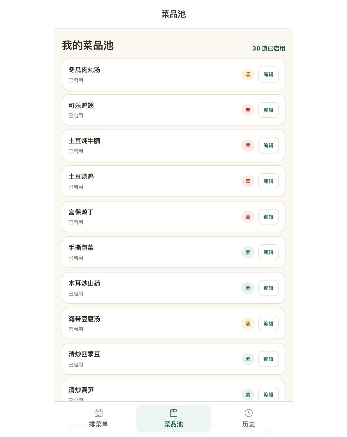
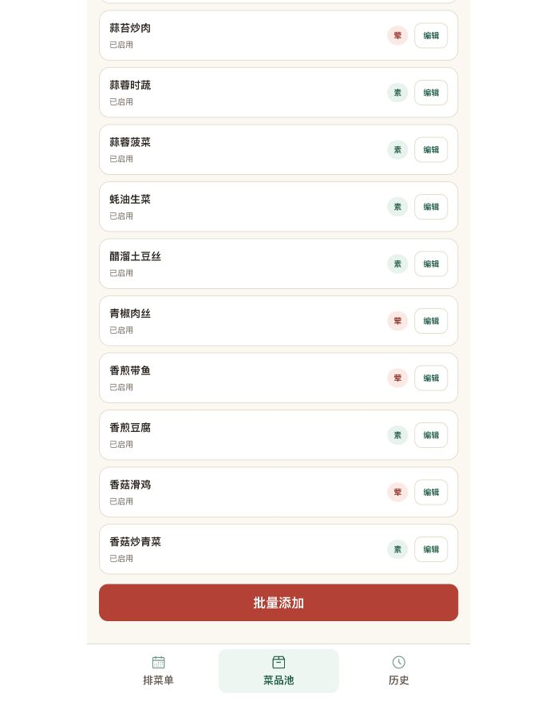
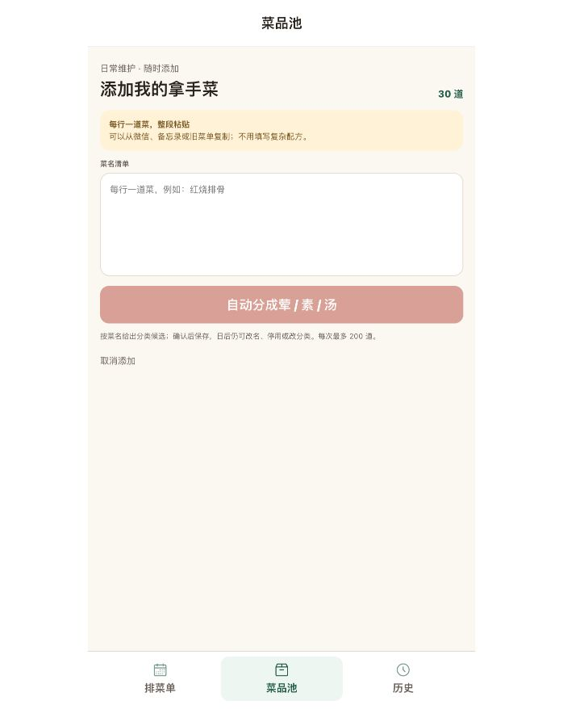

# 菜品池添加入口调研与检查

日期：2026-09-22。范围：当前本地菜品池的列表 → 添加入口 → 添加表单；仅调研，未改动产品代码或菜品数据。

## 当前流程证据

本轮在 698×878 视口重新截取并查看保存文件。当前有 30 道已启用菜品。

1. **列表首屏：入口难发现。** 能看到标题、数量和编辑按钮，没有新增入口。DOM 读取显示“批量添加”顶边在文档起始视口 y=2266.5px，position 为 static。
   
2. **列表末尾：入口可用，但依赖列表长度。** 添加按钮排在最后一道菜后面，底部三项导航固定。问题是唯一入口的位置，菜品越多滚动越长。
   
3. **添加表单：可以复用，入口名称可以更直白。** 点击后进入现有多行菜名录入。源码 previewDishes 接受 1～200 行非空菜名，单道菜同样适用。“批量添加”可能让只想补一道菜的人犹豫；这是措辞风险判断，未做用户测试。未输入或保存数据，检查后取消返回列表。
   

## 官方案例

| 应用与来源 | 官方资料支持的做法 | 对本页的启发 |
| --- | --- | --- |
| [Paprika 3 iOS 官方指南](https://www.paprikaapp.com/help/ios/#recipes) | 菜谱页面右上角 + 添加新菜谱 | 新增入口放在页面工具栏，不排在最后一个条目后面 |
| [AnyList 官方教程](https://help.anylist.com/articles/recipe-copy-paste/) | Recipes 顶部工具栏 +，再选择 Create Recipe；教程提供 iOS、Android 截图 | 页面级添加动作和列表内容分开 |
| [Samsung Food 官方说明](https://support.samsungfood.com/hc/en-us/articles/18369261226644-Getting-Started-with-Samsung-Food-Create-and-Edit-Recipes) | Saved 页面右下角 +，再选择 Create new recipe | 右下角是另一种明确的新增入口位置 |

Samsung Food 说明更新于 2025-10-03。Paprika 页面明确适用于 iOS 第 3 代；Paprika、AnyList 未注明本页所对应的小版本或更新时间。这是官方资料调研，不声称已登录并实测各应用最新版本，静态截图不证明滚动固定行为。添加完整菜谱与本产品添加菜名并非相同业务，仅比较入口位置。

## 对本产品的建议（待用户选择）

- 唯一入口不应放在菜品列表末尾。优先复用已有底部操作区，在三项导航上方固定“添加菜品”，列表独立滚动，首屏和滚动中都可操作。
- 用“添加菜品”覆盖单道与多道；点击直接进入现有输入页，不额外增加“单个/批量”选择步骤。
- 输入处只需一条必要提示：“每行一道，可一次添加多道”。这是建议，尚未改动。
- 列表末尾的重复入口可移除；固定操作区需留足内容底部空间，避免遮住最后一道菜，并保留键盘、读屏可访问的按钮名称。

## 可访问性与范围限制

当前添加入口具有明确 button 语义和文字名称；截图不能代替完整键盘、读屏或对比度测试。入口位于所有编辑按钮之后，长列表会增加寻找与键盘导航成本。没有测试保存、分类准确率、异常恢复或微信真机；这些不属于本轮“入口在哪里”的问题。
