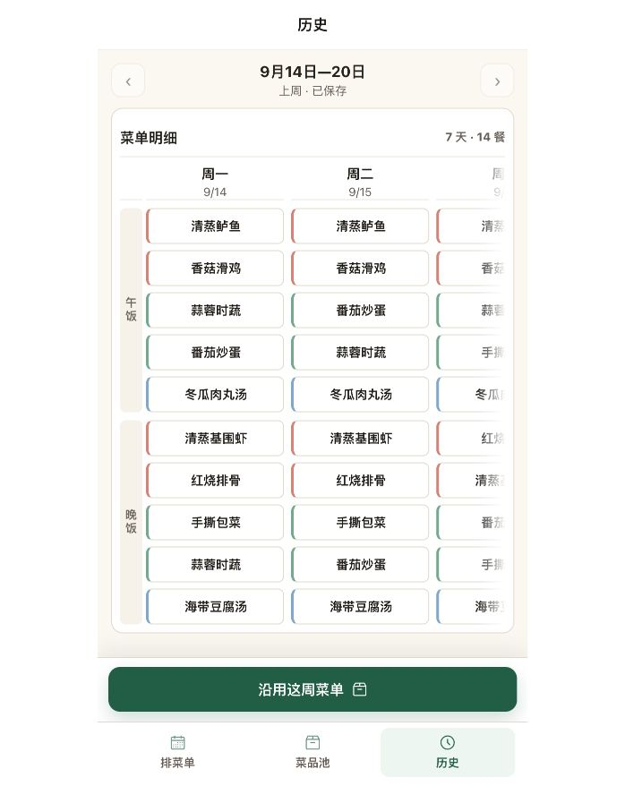
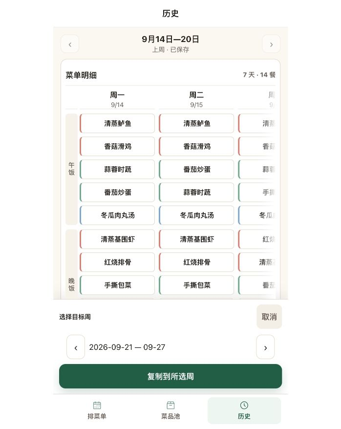

# 历史菜单页面审查（2026-09-22）

范围：本轮只研究用户四条标注，不改页面代码。现场在 698×878 浏览器视口查看现有历史页，并打开目标周选择后取消；没有提交复制或保存菜单。竞品研究见 [研究笔记](../history-menu-ux-research-2026-09-22.md)。

## 1. 查看历史周：可读，辅助信息重复

- 当前周范围清楚，午晚餐分组明确，两天半与右侧渐变提供横向滑动线索。
- 每天的“周一／9/14”有定位作用；历史记录和跨月周比纯模板更需要具体日期。建议保留，保持日期为次要层级，而不是让用户根据顶部范围心算。
- “7 天·14 餐”是统计摘要，不是操作说明；对历史页的查看与复用没有必要的决策作用，建议移除。若将来需要查漏餐，优先明确标出对应的“不安排”状态。
- “上周·已保存”混合了相对时间和存储状态。标题已说明历史，日期范围已说明哪一周，历史又只展示已保存记录，故建议移除该副行。跨年份时范围应显示年份，不用增加一条说明。
- “菜单明细”本轮未要求删除，可先保留，以控制调整范围。

## 2. 选择复制目标周：流程成立，入口措辞不直接

- 入口点击后已出现目标日期范围、前后周按钮、取消和“复制到所选周”，这与用户期待的先复制再选目标一致。
- “沿用”没有直接表达复制动作，建议入口改为“复制这周菜单”。不推荐“复制本周菜单”：当前查看 9/14—20，当前日历周却是 9/21—27，“本周”容易指错对象。
- 选择面板标题可用“复制到哪一周？”，明确来源日期与目标日期；选定后主按钮用“复制到 9月21日—27日”，比“所选周”更容易核对。
- 历史菜单保留，复制结果进入目标周草稿。目标周已有菜单时继续保留覆盖前确认；不以文案改动改变保存边界。

## 证据与可访问性边界

以上截图在本轮通过用户当前的内置浏览器捕获，保存后重新打开核对。首次打开未刷新或导航离开用户页面；检查后收起目标选择恢复原态。

视觉上辅助日期和状态颜色较弱，字号缩小不能无限压缩，具体对比度需测量。右侧渐变仅应覆盖用于提示的半列，完整列应保持可读；本轮不测试键盘横向导航、读屏顺序、跨年日期或数据写入，因此不据此宣称可访问性或完整流程验收通过。

研究结论用于支持取舍，不代表竞品全部采用相同界面，也没有用户测试证明新文案必然更好。
