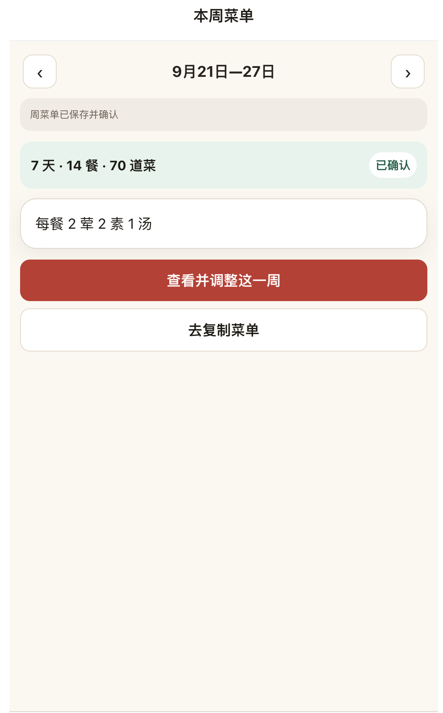

# 本周菜单首页：菜单预览与信息密度

2026-09-22。初次审计范围仅为用户本轮提供的首页截图；用户随后授权实施一餐预览替换统计卡，现已实施并通过本地验证，待用户验收。

## 1. 查看本周菜单首页

状态：日期切换与两个入口明确可见，但缺少菜品内容，复制目标不明确。

- 优点：周范围清楚，主要操作可见，页面留有足够空间。
- 问题：保存成功提示和“已确认”重复；“7天·14餐·70道菜”和“每餐2荤2素1汤”各占整块，却不能回答今天吃什么、下一步复制哪一餐。空白本身不是必须填满的缺陷。
- 可见的可访问性风险：复制入口缺乏日期、餐次上下文。截图不足以验证读屏、键盘、焦点和实际文字对比度，本轮不作合规结论。

## 建议（已实施并通过本地验证，待用户验收）

用一张当天菜单卡替换统计卡和搭配卡，而非在现有内容后追加：日期清楚显示，午餐/晚餐切换，一次只显示一餐；菜名按荤、素、汤三行紧凑展示，长名称正常换行。周范围旁保留一个小状态，保存成功反馈短暂出现。保留整周调整入口作为次要操作。

复制入口跟随所选餐次，例如“查看并复制午餐菜单”，进入现有预览页时保持同一日期和餐次。首页预览取已保存菜单，下一页仍核对最新保存内容；不能把未保存草稿展示成可复制结果。所选周不包含今天或今天停餐时，显示实际所选日期，不错误标注“今天”。

## 现有行为核对

初次审计时，源码 openCopy 默认选所选周内今天的首个已安排餐，否则该周首个已安排餐。“去复制菜单”进入预览，尚未操作剪贴板；实际复制由下一页“复制菜单文字”触发。previewCopy 重新读取保存内容，未保存调整先处理。本条来自初次源码核对，当时未进行完整浏览器流程或可访问性测试。

本轮只调整“一餐预览替换统计卡”。主线程已完成类型检查和 33 项菜单流程回归，并查看本地 3319 首页截图；选择 9 月 22 日晚餐后进入复制页，日期、餐次及菜名一致。当前状态为“已实施并通过本地验证，待用户验收”，仍需用户比较信息量和复制目标是否更清楚；不以本地验证代替用户验收或上线。
